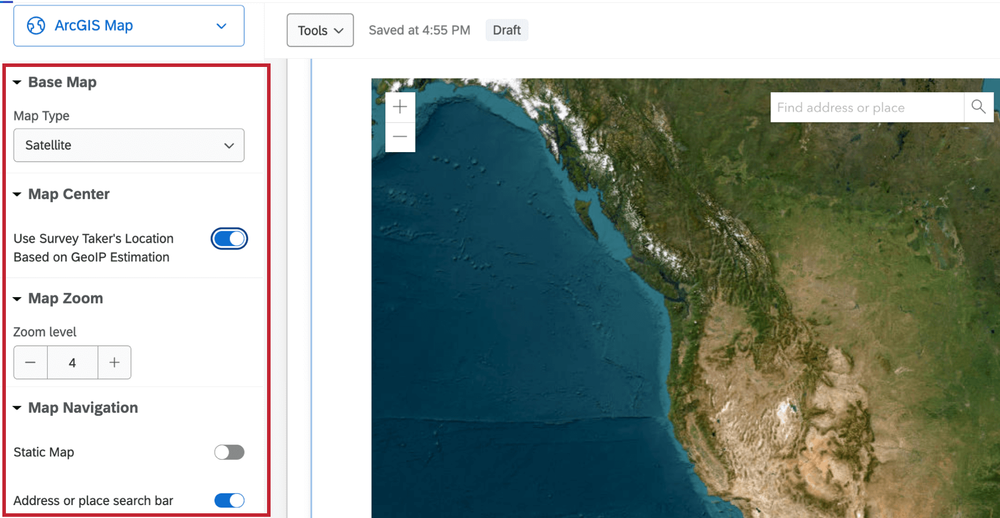

# ArcGIS Map Question

## [](#About)About ArcGIS Questions

The ArcGIS question type allows survey respondents to select a location from a map. This location point can be shared with ArcGIS through the [Update ArcGIS Task](https://www.qualtrics.com/support/integrations/update-arcgis-task/).

[](https://www.qualtrics.com/m/assets/support/wp-content/uploads//2024/06/arcgis-question-1.png)

**Attention:** Each ArcGIS question in your survey must be linked to a separate [Update ArcGIS Task](https://www.qualtrics.com/support/integrations/update-arcgis-task/).

* * *

Was this helpful?

YesNo

* * *

## [](#Options)Map Options

[](https://www.qualtrics.com/m/assets/support/wp-content/uploads//2024/06/arcgis-question-2.png)

ArcGIS questions have 4 adjustable options.

-   **Base Map:** Select the type of map displayed to the respondent. Options include, Satellite, Oceans, Terrain, and more.
-   **Map Center:** When enabled, this option centers the map based on the GeoIP estimation of the respondent’s location.
    
    **Qtip:** When this option isn’t enabled, you can set the latitude and longitude of the location the map will default to.[](https://www.qualtrics.com/m/assets/support/wp-content/uploads//2024/06/arcgis-question-3.png)
    
-   **Map Zoom:** Select a zoom level of the map. The value must be within 1-23.
-   **Map Navigation:** Enable or disable the static map and search bar within the map. When static map is disabled, respondents cannot move the location of the map. When the search bar is disabled, respondents cannot search for an address or place.

* * *

Was this helpful?

YesNo

* * *

## [](#Data)Data Analysis

Data from your ArcGIS Map questions will be in the following format:

```markup
{"geometryType":"point","geometry":[{"x": <point-here>,"y":<point-here>}]}
```

To use this data in ArcGIS, you need to set up an Update ArcGIS Task within the Workflows tab of your survey. See the [Update ArcGIS Task](https://www.qualtrics.com/support/integrations/update-arcgis-task/) support page for more information.

* * *

Was this helpful?

YesNo

* * *