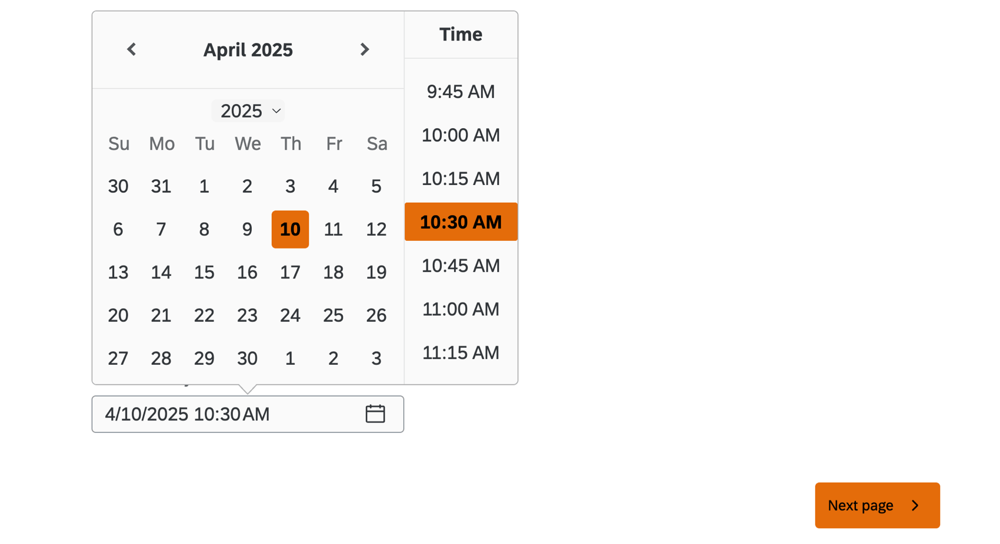
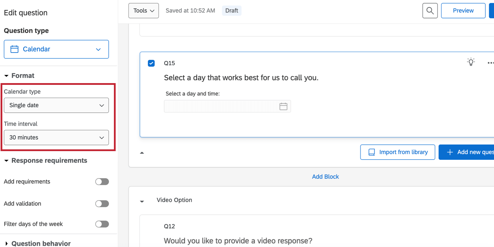
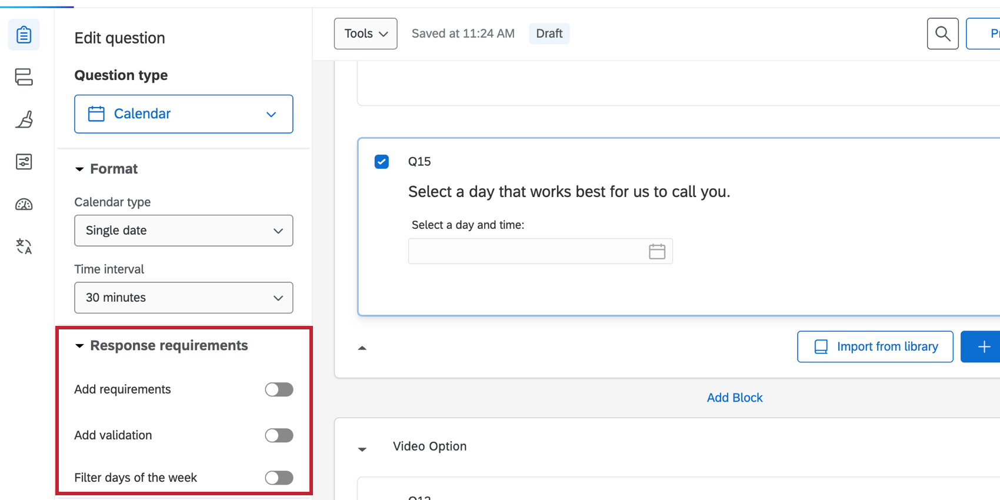
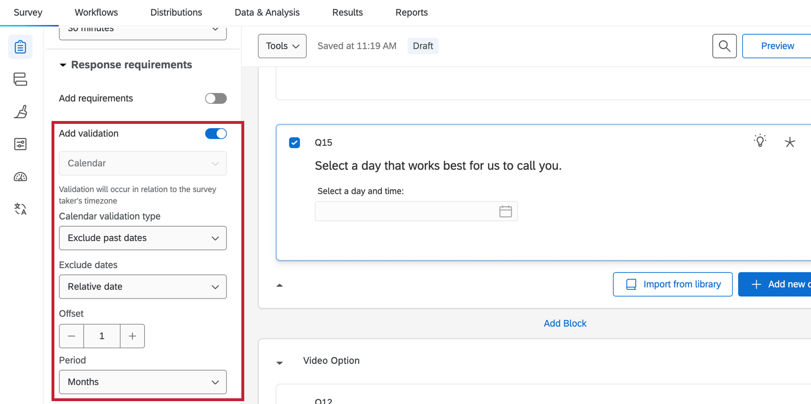
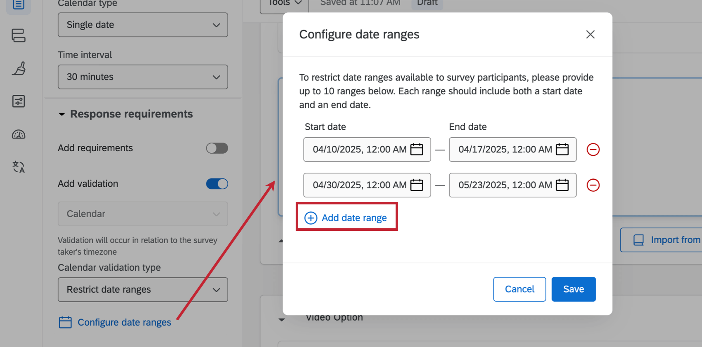
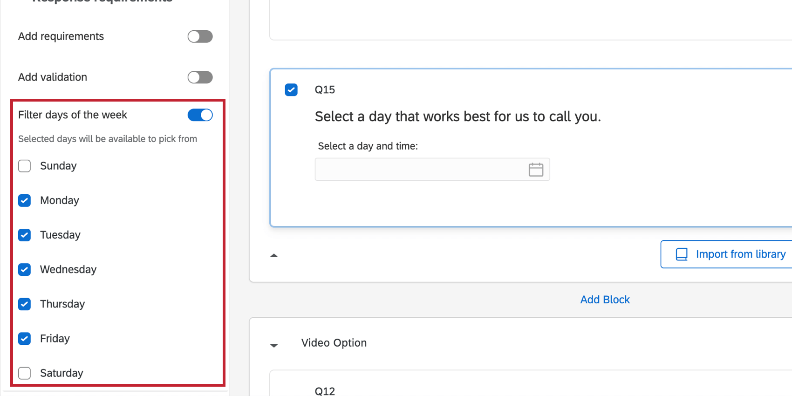
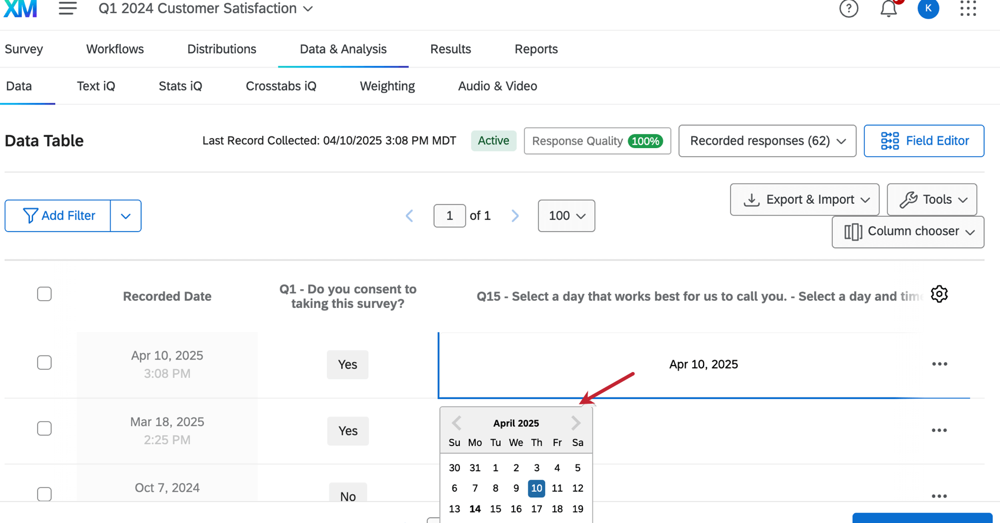

# Calendar Question

## About Calendar Question

**Attention**: This question type is only available in the [New Survey Taking Experience](https://www.qualtrics.com/support/survey-platform/survey-module/look-feel/simple-layout/).

The calendar question allows users to input a date and time using a calendar in the survey.

**Qtip**: See [Creating Questions](https://www.qualtrics.com/support/survey-platform/survey-module/editing-questions/creating-questions/?parent=p0030) for more information on setting up a survey question.

* * *

Was this helpful?

YesNo

* * *

## Calendar Format Options

You can change the format of the calendar question by using the options under **Format** in the question editing pane.

-   **Calendar type:** Select whether respondents can enter a single date or a date range.
-   **Time interval**: Select whether respondents can select times in 15 minutes, 30 minutes, or 1 hour intervals.
    
    **Qtip**: Respondents can type any time into the text box, regardless of the interval displayed.
    

**Qtip**: The format of the date (for example, dd/mm/yyyy) is displayed to respondents according to their browser settings.

* * *

Was this helpful?

YesNo

* * *

## Calendar Response Requirement Options

You can set response requirements to define how respondents must enter their date and time when using the calendar question.

-   **Add requirements**: Enable [force response](https://www.qualtrics.com/support/survey-platform/survey-module/editing-questions/validation/#ForceResponse) or [request response](http://qualtrics.com/support/survey-platform/survey-module/editing-questions/validation/#RequestResponse).
-   **Add validation**: Select if you want to exclude or restrict date options in the **Calendar validation type** Then, use the dropdowns to set up that validation.  
    
    
    **Qtip**: If you set the calendar validation type to **Restrict date ranges**, click **Configure date ranges** to select what dates are available for respondents to select. You can add multiple ranges by selecting **Add date range.  
    **
    
-   **Filter days of the week**: Select which days of the week respondents can choose from.  
    

* * *

Was this helpful?

YesNo

* * *

## Data Analysis

Once your responses have been collected, Qualtrics offers various methods to create reports both in and out of the platform. In the [Results](https://www.qualtrics.com/support/survey-platform/reports-module/results-dashboards/results-dashboard-overview/?parent=p002090) and [Reports](https://www.qualtrics.com/support/survey-platform/reports-module/reports-section/paginated-reports-overview/) sections, you can view aggregate data with pre-made reports as well as create your own. From the [Data & Analysis](https://www.qualtrics.com/support/survey-platform/data-and-analysis-module/data-and-analysis-overview/) tab, you can view and manipulate your survey responses on an individual basis.

**Qtip**: The date entered by the respondent is converted to the [time zone](https://www.qualtrics.com/support/survey-platform/managing-your-account/research-core-account-settings/#UserSettings) of your account.

### Data and Analysis Tab

You can edit the data by clicking on the answer for the calendar question then selecting a new date.

### Widgets and Visualizations

The [field type](https://www.qualtrics.com/support/vocalize/dashboard-settings-cx/dashboard-data/data-compatibility/#FieldTypes) for calendar questions is **Date**. See [Field Types & Widget Compatibility](https://www.qualtrics.com/support/vocalize/dashboard-settings-cx/dashboard-data/data-compatibility/) for information on which widgets and visualizations are compatible.

* * *

Was this helpful?

YesNo

* * *

## FAQs

[What kind of project can I use this type of question in?](#faq-975) ×

For a full list of questions and their project compatibilities, see [this table.](https://www.qualtrics.com/support/survey-platform/survey-module/editing-questions/question-types-guide/question-types-overview/#Compatibility)