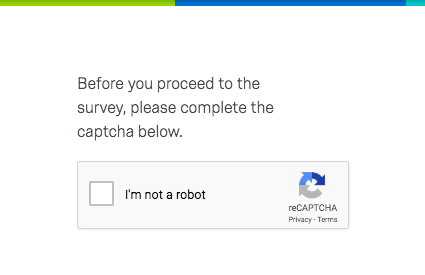
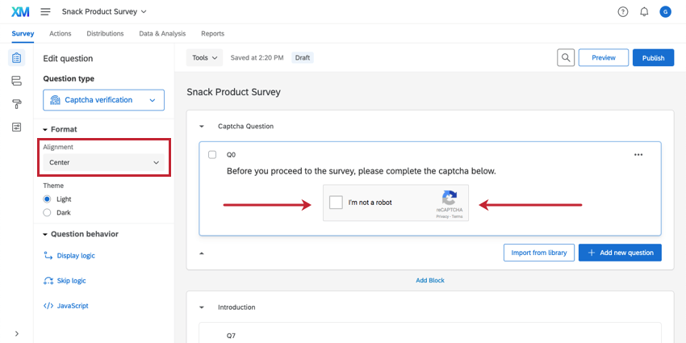
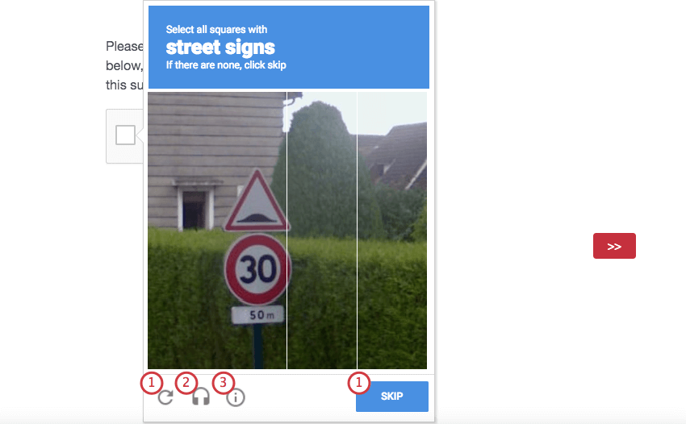
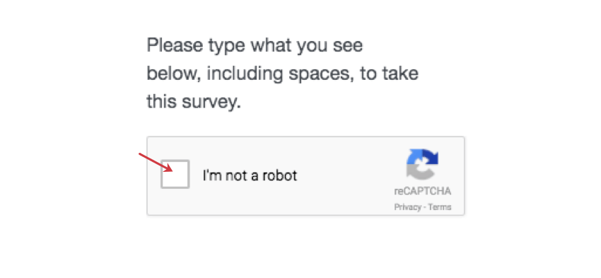

# Captcha Verification Question

## About Captcha Verification

Captcha verification (or Completely Automated Public Turing Test to tell Computers and Humans Apart) is a common web technique used to help ensure that your respondents are real humans and not a program written to spam your survey. In a captcha verification, the respondent is presented with a picture (or “challenge”) of words or characters, and the respondent must correctly type out those characters to proceed.

Though most humans find this task easy, spam programs have a much more difficult—nearly impossible—time. This preventative measure can be important when you are offering monetary or other incentives to take your survey.

**Qtip:** We recommend placing your captcha verification question on its own page at the beginning of your survey so that respondents don’t have to redo the captcha if they fail validation on another question.

Captcha is a third-party service provided by Google. No respondent information is sent to Google as part of this service. Visit Google’s [reCAPTCHA](http://www.google.com/recaptcha) page to learn more. It’s also important to note that not all languages are supported by this feature, and that supported languages are owned and decided upon by Google. See [Google’s documentation](https://developers.google.com/recaptcha/docs/language) for more details.

**Qtip:** Captcha doesn’t prevent respondents from taking the survey multiple times. Consider using features like [authenticators](/support/edit-survey/survey-flow/advanced-elements/authenticator/authenticator-overview/ "Authenticator Overview") or [individual links](/support/distributions/email-distribution/emails/emails-overview/ "Emails Overview") to prevent multiple survey attempts from the same individual.

* * *

Was this helpful?

YesNo

* * *

## Captcha Options

### Captcha Version

The V2 captcha verification is the default and only option. When respondents select **I’m not a robot**, they’ll be asked to identify objects in a series of images before they can proceed through the survey.

**Qtip:** V1 captchas have been deprecated in compliance with industry standards. No data is affected by this change, and all V1 captchas will automatically change to V2.

### Alignment

You can align your captcha in the center of the question by selecting **Center**.

### Theme

You can change the theme of your captcha. By default, the theme is Light. Below, the Dark theme is pictured.

* * *

Was this helpful?

YesNo

* * *

## Respondent Experience

V1 and V2 captchas have a different respondent experience.

### V2 Captcha

To complete a V2 captcha, click inside the box.

Sometimes this is enough, but sometimes you’ll need to complete an additional challenge.

The symbols at the bottom allow you to:

1.  If you’re having trouble understanding the challenge or have been assigned an impossible task, click the refresh icon or the **Skip** button to get a new one.
2.  Respondents who are visually-impaired can use the audio icon to have the challenge and its options read aloud to them.
3.  For respondents who are confused, the information icon will explain the challenge in more detail.

**Qtip:** Data on passing or failing the captcha verification question isn’t recorded. Instead, individuals who fail the captcha verification won’t be able to proceed in the survey, and will either remain an [incomplete survey response](https://www.qualtrics.com/support/survey-platform/survey-module/survey-options/partial-completion/) or a [response in progress](https://www.qualtrics.com/support/survey-platform/data-and-analysis-module/data/responses-in-progress/).

### Privacy & Terms

If the respondent would like to learn more about the Google’s privacy features and terms of service, they can click [Privacy & Terms](http://www.google.com/intl/en/policies/).

* * *

Was this helpful?

YesNo

* * *

## FAQs

[What kind of project can I use this type of question in?](#faq-975) ×

For a full list of questions and their project compatibilities, see [this table.](https://www.qualtrics.com/support/survey-platform/survey-module/editing-questions/question-types-guide/question-types-overview/#Compatibility)