# Constant Sum Question

## About Constant Sum Questions

Constant sum questions provide respondents a way to enter numeric data. Each numeric entry is added together into a total. The total can then be displayed to the respondent, so long as the question isn’t in the slider or bars format.

[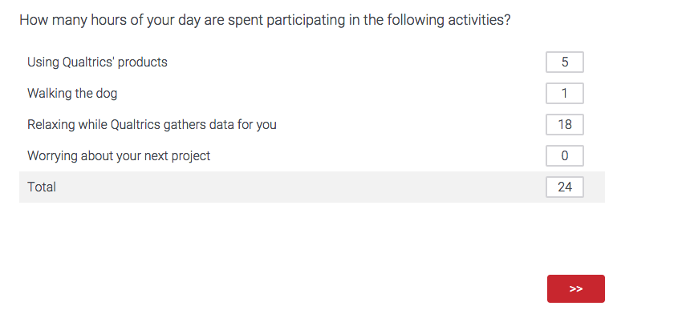](https://www.qualtrics.com/m/assets/support/wp-content/uploads/2015/04/image0317.png)

**Example:** You can ask respondents how many hours they dedicate to certain activities in a given day and require that their answers add up to 24.

**Qtip:** Constant sum questions can be used in surveys and 360 projects, but no other [Employee Experience](https://www.qualtrics.com/support/employee-experience/projects/creating-a-project-ex/#TypesofEXProjects) projects. Constant sum questions are not compatible with [scoring](https://www.qualtrics.com/support/survey-platform/survey-module/survey-tools/scoring/).

* * *

Was this helpful?

YesNo

* * *

## Answer Types

There are 3 variations available for the constant sum question: choices, bars, and sliders. You can access these variations under **Answer type** in the question editing pane.

### Choices Constant Sum

With the choices variation, respondents type their answers into text boxes.

[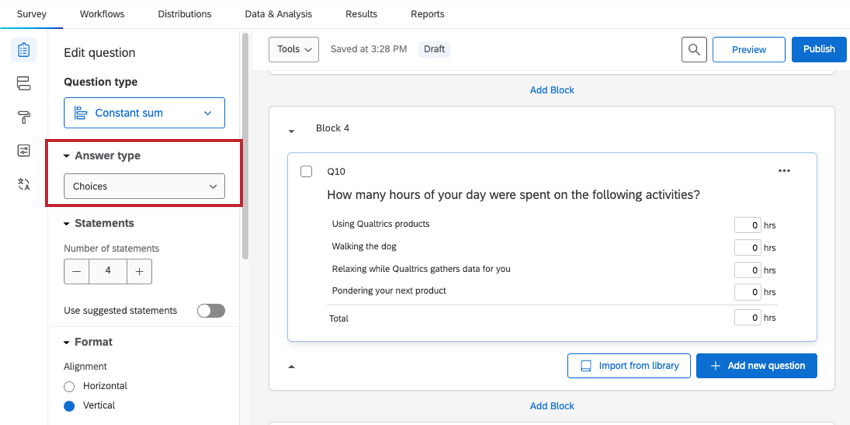](https://www.qualtrics.com/m/assets/support/wp-content/uploads//2015/04/constant-sum-1.png)

The choices constant sum has several customizable options, found in the editing pane under **Format:**

-   **Alignment:** Switch the layout of the text boxes from a vertical format to a horizontal format.
    
    **Qtip:** This is what a horizontal version of the same question looks like.  
    [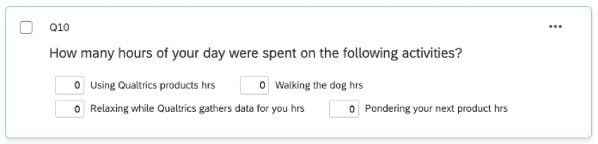](https://www.qualtrics.com/m/assets/support/wp-content/uploads//2015/04/constant-sum-3.png)
    
-   **Add total box:** Display a total box at the bottom of the question so respondents can keep track of their total as they are entering data (only available when in vertical alignment).
-   **Add symbol:** Place a symbol before or after each text box (e.g., include “hrs” after each text box if an answer is expected in hours). You have a limit of 4 characters.

The choices constant sum also has a custom **Response requirement**, called **Add range requirement**. Once enabled, you can set a range of valid numbers for each item (e.g., for hours in a day, “0” would be an appropriate minimum and “24” would be an appropriate maximum).

[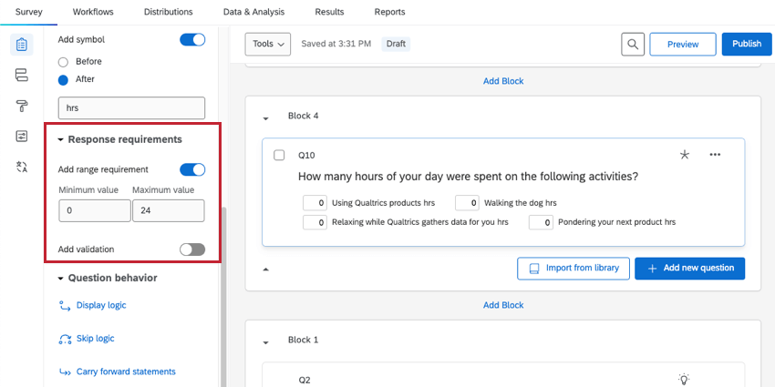](https://www.qualtrics.com/m/assets/support/wp-content/uploads//2015/04/constant-sum-4.png)

### Bars Constant Sum

With the bars variation, respondents drag a bar to select a number for each item. If a maximum sum is set for the question, bars can’t be dragged above this sum.

[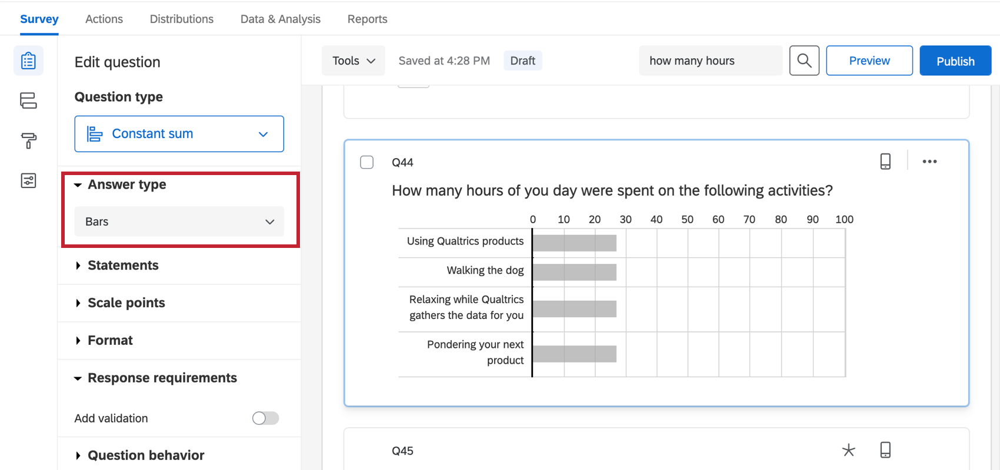](https://www.qualtrics.com/m/assets/support/wp-content/uploads//2021/04/constant-sum-5.png)

The bars constant sum has several customizable options, found in the editing pane:

-   **Custom Start Position:** Start respondents on a particular value (by default, sliders and bars will start at 0). To use this feature, check the box, and then drag the bar to the position you’d like it to start at.  
    [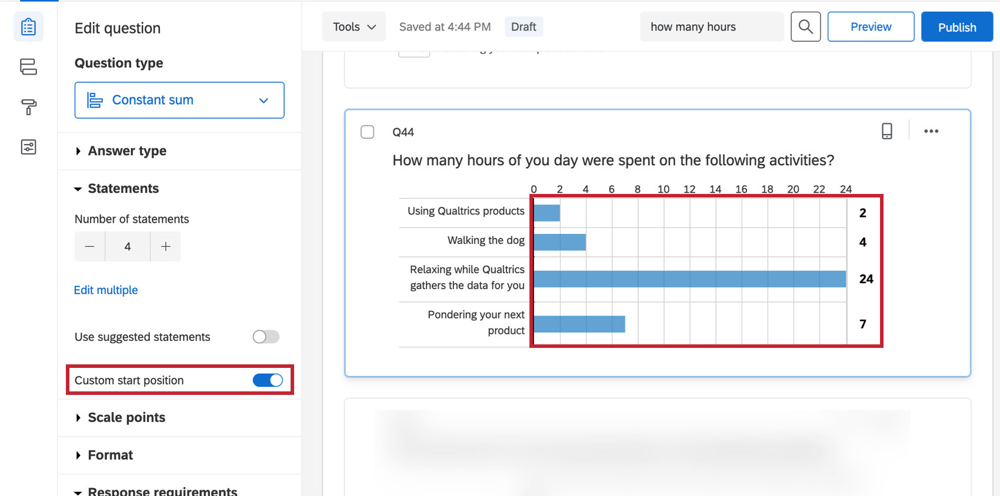](https://www.qualtrics.com/m/assets/support/wp-content/uploads//2021/04/constant-sum-6.png)
-   **Scale points settings:** Specify the number of grid lines, minimum values, maximum values, and decimals that will be shown.  
    [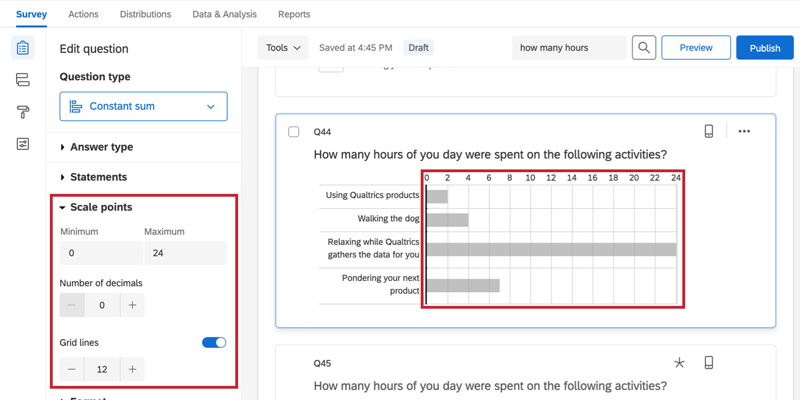](https://www.qualtrics.com/m/assets/support/wp-content/uploads//2021/04/constant-sum-7.png)
-   **Labels:** Place additional text along the top of your question. These can be enabled by selecting **Add labels** under **Format**.  
    [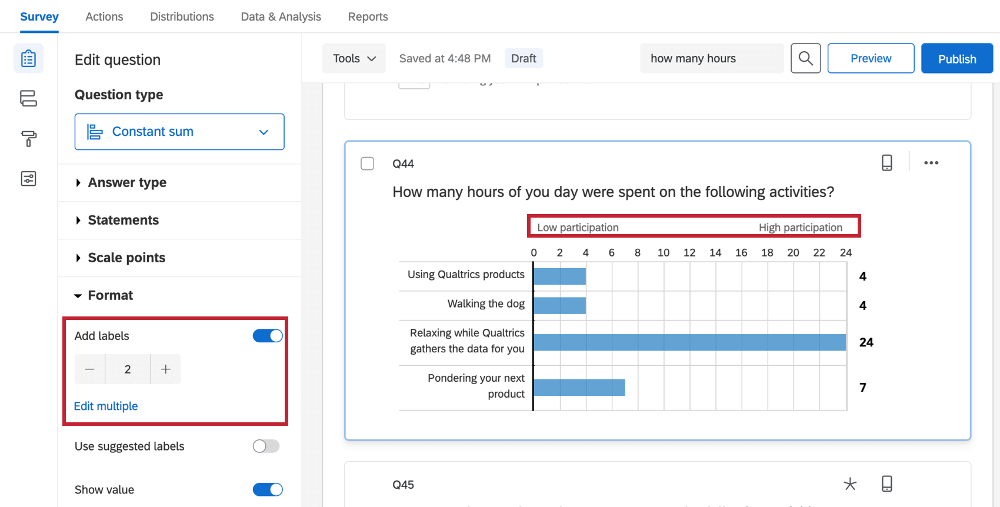](https://www.qualtrics.com/m/assets/support/wp-content/uploads//2021/04/constant-sum-8.png)
    
    **Qtip:** If you’d like to select from pre-written labels, try enabling **Use suggested labels**. To learn about the options available, see [Suggested Choices](https://www.qualtrics.com/support/survey-platform/survey-module/editing-questions/formatting-answer-choices/#AutomaticChoices).
    

-   **Show Value:** Opt to show the respondent the exact number the slider is currently on. These can be enabled under **Format**.  
    [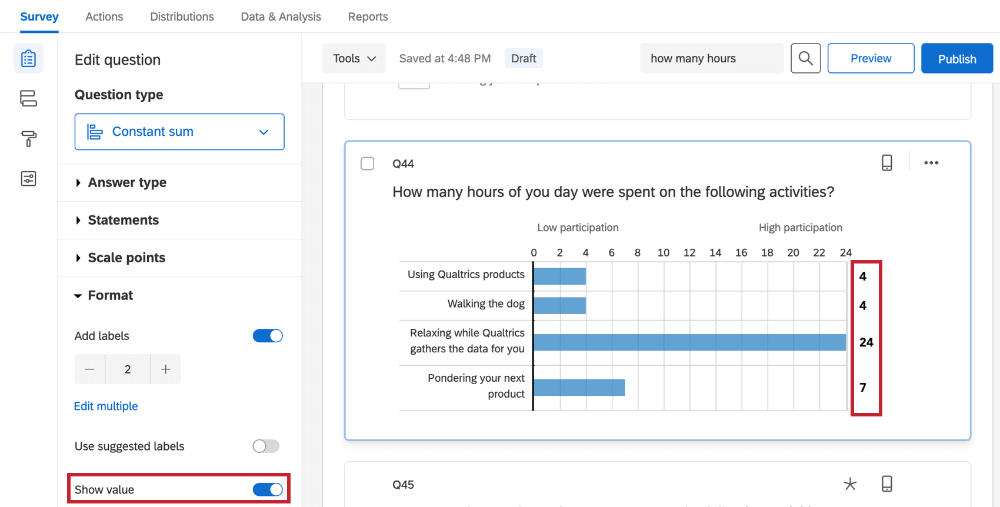](https://www.qualtrics.com/m/assets/support/wp-content/uploads//2021/04/constant-sum-9.png)

### Slider Constant Sum

The slider variation is similar in function to the bars constant sum. Respondents drag a slider handle for each statement to select a number. If a “must total” validation is set for the question, slider handles cannot be dragged above this sum.

[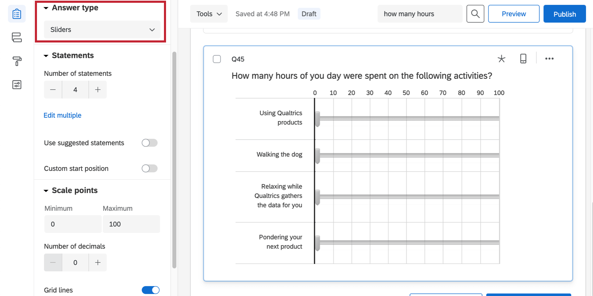](https://www.qualtrics.com/m/assets/support/wp-content/uploads//2021/04/constant-sum-10.png)

The slider constant sum has the same options as the bars constant sum. See the above section for more information on these options.

* * *

Was this helpful?

YesNo

* * *

## Response Requirements

You can require that the answers entered into a constant sum total a chosen value. Respondents won’t be able to move past the question until the total is matched.

[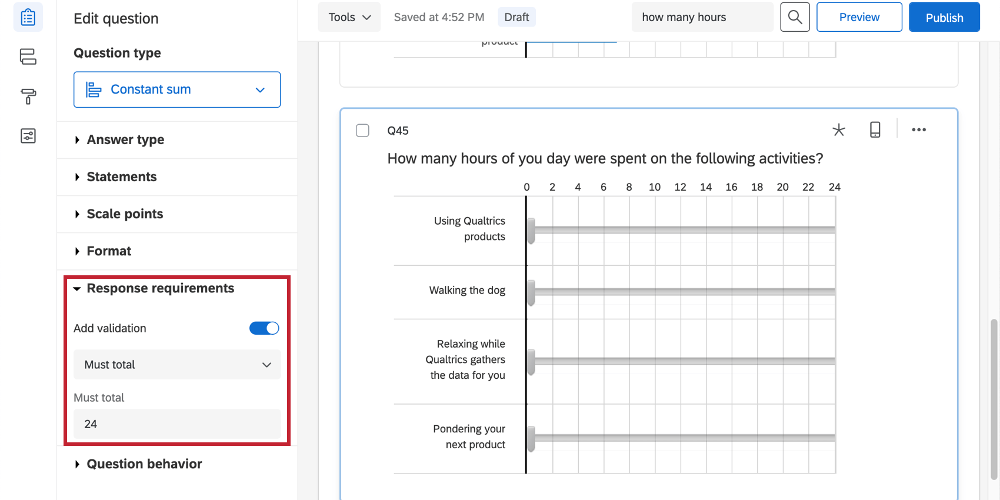](https://www.qualtrics.com/m/assets/support/wp-content/uploads//2021/04/constant-sum-11.png)

* * *

Was this helpful?

YesNo

* * *

## Data Analysis

Once your responses have been collected, Qualtrics offers various ways you can analyze your response data. From the [Reports tab](https://www.qualtrics.com/support/survey-platform/reports-module/results-vs-reports/), you can view aggregate data in pre-made reports as well as create your own reports from scratch. From the [Data & Analysis](https://www.qualtrics.com/support/survey-platform/data-and-analysis-module/data-and-analysis-overview/) tab, you can view and manage individual respondents’ data.

### Results Visualizations

In the [Results Dashboards](https://www.qualtrics.com/support/survey-platform/reports-module/results-dashboards/results-dashboards-widgets/) section of the Reports tab, there are several widgets that can display the data from a constant sum question.

The [gauge chart](https://www.qualtrics.com/support/vocalize/widgets/chart-widgets/gauge-chart-widget/ "gauge chart") is a great visualization for the constant sum question. The gauge’s length is dictated by a maximum value. Then, each item in the constant sum is its own gauge, with a colored bar representing how close to the maximum the value is.

**Example:** This gauge chart displays the average hours a day spent on each activity. The metric is mean and the maximum is set to 24, since there are 24 hours in a day.

[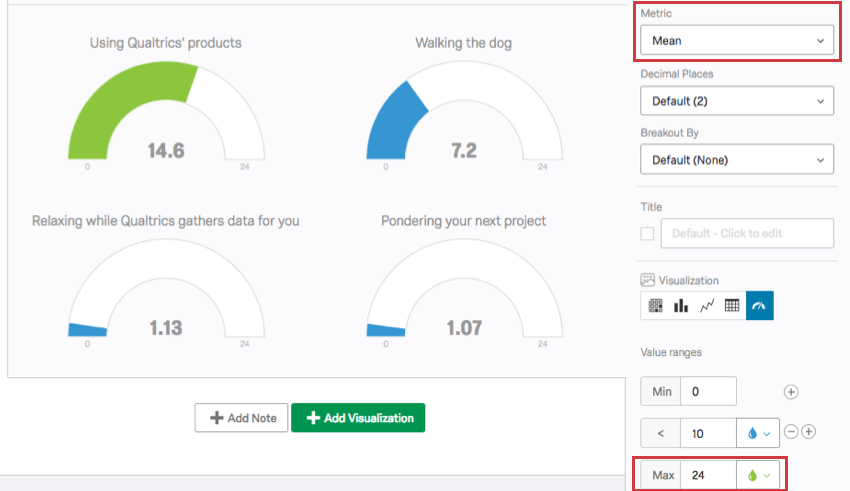](https://www.qualtrics.com/m/assets/support/wp-content/uploads/2017/12/constant-sum-14.png)

Other visualizations that can display constant sum data include [vertical bars](https://www.qualtrics.com/support/vocalize/widgets/chart-widgets/line-and-bar-chart-widgets/?parent=p00734) and [lines](https://www.qualtrics.com/support/vocalize/widgets/chart-widgets/line-and-bar-chart-widgets/?parent=p00734). These work best when the metric is set to mean.

### Reports Visualizations

In the [Reports](https://www.qualtrics.com/support/survey-platform/reports-module/reports-section/paginated-reports-overview/) section of the Reports tab, the compatible visualizations are the statistics table, the bar chart, and the line chart.

In this case, the gauge chart will only be compatible if “Use All Choices” is **not** set as the data source.

[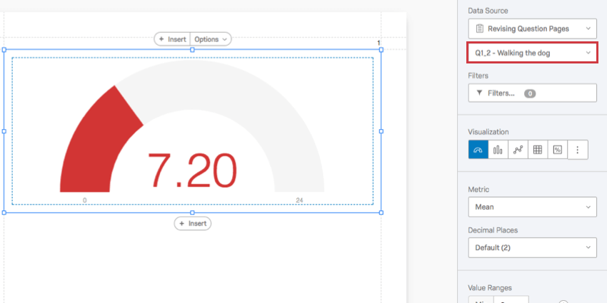](https://www.qualtrics.com/m/assets/support/wp-content/uploads/2017/12/constant-sum-15.png)

### Downloaded Data Format

The downloaded dataset includes a column for each item in the constant sum question with the value each participant entered.

[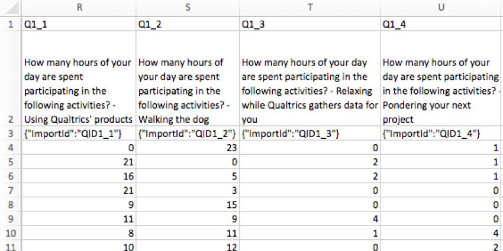](https://www.qualtrics.com/m/assets/support/wp-content/uploads/2017/12/constant-sum-16.png)

Each column title contains the entire question, and then ends with the specific item.

* * *

Was this helpful?

YesNo

* * *

## FAQs

[What kind of project can I use this type of question in?](#faq-975) ×

For a full list of questions and their project compatibilities, see [this table.](https://www.qualtrics.com/support/survey-platform/survey-module/editing-questions/question-types-guide/question-types-overview/#Compatibility)