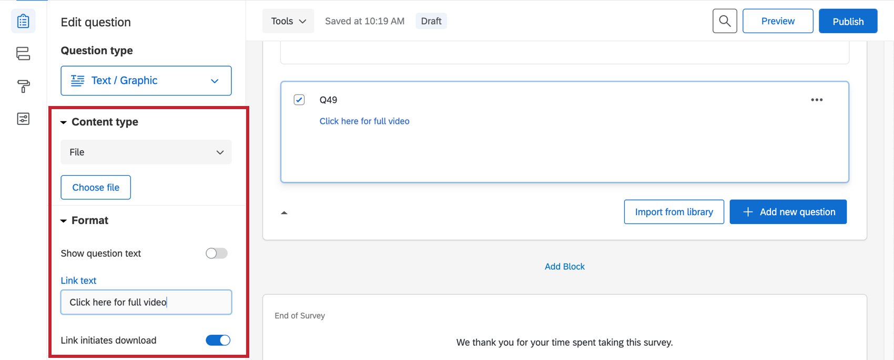

# Text / Graphic Question

## About Text / Graphic Questions

The text / graphic question type lets you add content to your survey without asking a question. This question type can be used as an introduction to the survey or as instructions for a specific section. You can also use this question to add stand-alone images to your survey.

* * *

Was this helpful?

YesNo

* * *

## Content Type

There are 3 variations of the text / graphic question: text, graphic, and file. You’ll find these variations under **Content type** in the question editing pane, located to the left of the question.

### Text

The text variation is best for instructions or any other written information you’d like to display to your respondents (e.g., a disclaimer or thank you at the beginning of a study).

### Graphic

The graphic content type allows you to insert a stand-alone image into your survey. Click **Choose graphic** to select an image from your [Qualtrics library](https://www.qualtrics.com/support/survey-platform/account-library/graphics-library/). You can upload a new image from your computer or a URL if needed.

Qualtrics accepts most image file types, though we recommend saving your images as a PNG rather than a JPG.

You can also add text to your graphic by selecting **Show question text**.

**Example:** You want to randomize the images shown to respondents, but ask the same set of questions about each image. Post each image separately as a text / graphic question, then [randomize](https://www.qualtrics.com/support/survey-platform/survey-module/block-options/question-randomization/) them [while keeping your other questions consistent](https://www.qualtrics.com/support/survey-platform/survey-module/block-options/question-randomization/#AdvancedRandomization).

**Qtip:** Images can be similarly attached to any other question type by using the [rich content editor](/support/survey-platform/edit-survey/editing-questions/rich-content-editor/rich-content-editor-overview/ "Rich Content Editor Overview").

**Qtip:** Want respondents to give feedback on an image? Consider using the [hot spot](/support/edit-survey/editing-questions/question-types-guide/hot-spot/ "hot spot") or [heat map](https://www.qualtrics.com/support/edit-survey/editing-questions/question-types-guide/heat-map/) question types, both of which allow respondents to interact with the image.

### File

You can use the file variation to provide a file for respondents to download to their computer. In addition to selecting the file, look for options on the question editing pane to show question text, to change the link text, or to set the file to download (rather than simply open) when selected.

**Qtip:** A file can be similarly attached to any other question type by using the [rich content editor](/support/survey-platform/edit-survey/editing-questions/rich-content-editor/rich-content-editor-overview/ "Rich Content Editor Overview").

* * *

Was this helpful?

YesNo

* * *

## FAQs

[What is the max file size I can upload to my Library?](#faq-18) ×

The max file size for all files in the Library is 16 MB.

[Why can’t I copy a survey or add a graphic to my libraries?](#faq-21) ×

This inability to copy is likely because you do not have sufficient user permissions to manage that library. Contact your [Brand Administrator](https://www.qualtrics.com/support/survey-platform/getting-started/help-and-feedback/#QualtricsAdministrator) to request access to manage these libraries if appropriate.

[How do I change the header/footer on my survey?](#faq-62) ×

These can both be edited in the Advanced tab of the **Look and feel** menu. See our [Header](https://www.qualtrics.com/support/survey-platform/survey-module/look-feel/general-look-feel-settings/#AddFooterHeader) and [Footer](https://www.qualtrics.com/support/survey-platform/survey-module/look-feel/general-look-feel-settings/#AddFooterHeader) support pages for more details.

[How do I add a consent form to my survey?](#faq-65) ×

It depends how complex your survey is. See the [Building a Consent Form](https://www.qualtrics.com/support/survey-platform/common-use-cases-rc/building-a-consent-form/) support page for detailed instructions for 2 different versions of a consent form.

[How do I insert a video and make sure it works on all browsers?](#faq-73) ×

The best way to insert a video is to let an outside source host the video (e.g., [YouTube](https://www.youtube.com/) or [SoundCloud](https://soundcloud.com/)) and then insert the video via an iframe. Most media hosting companies will provide the HTML code for the video’s iframe (usually found by clicking on the page’s “Share” button and looking at the available sharing options), though if it doesn’t, there are many online iframe generators. Once you have the iframe HTML code,

1.  Click on the question text where you would like to insert the video.
2.  **Click [HTML View](https://www.qualtrics.com/support/survey-platform/survey-module/editing-questions/formatting-questions/#EditingQuestionType)**[.](https://www.qualtrics.com/support/survey-platform/survey-module/editing-questions/formatting-questions/#EditingQuestionType)
3.  Paste in the iframe HTML code.

[How do I change the dimensions of a graphic once it is uploaded?](#faq-225) ×

Click the image in the Library and select the 3 bars icon in the top-right corner. This will open a menu that allows you to edit the dimensions of the image. To learn more about Library Graphics, visit the [Library Graphics](https://www.qualtrics.com/support/survey-platform/account-library/graphics-library/) support page.

[How do I add a logo to my survey?](#faq-748) ×

You can add a logo in your survey's Look and feel. See [Survey Theming](https://www.qualtrics.com/support/survey-platform/survey-module/look-feel/applying-survey-themes/#SurveyLogo).

[How can I randomize images in my survey?](#faq-749) ×

Try adding each possible image as a [Graphic Question](https://www.qualtrics.com/support/survey-platform/survey-module/editing-questions/question-types-guide/static-content/descriptive-text-and-graphic/), then [randomizing your questions](https://www.qualtrics.com/support/survey-platform/survey-module/block-options/question-randomization/).

[Is there a limit to how many characters I can include in my question text?](#faq-771) ×

The limit is 20,000 characters.

[What kind of project can I use this type of question in?](#faq-975) ×

For a full list of questions and their project compatibilities, see [this table.](https://www.qualtrics.com/support/survey-platform/survey-module/editing-questions/question-types-guide/question-types-overview/#Compatibility)