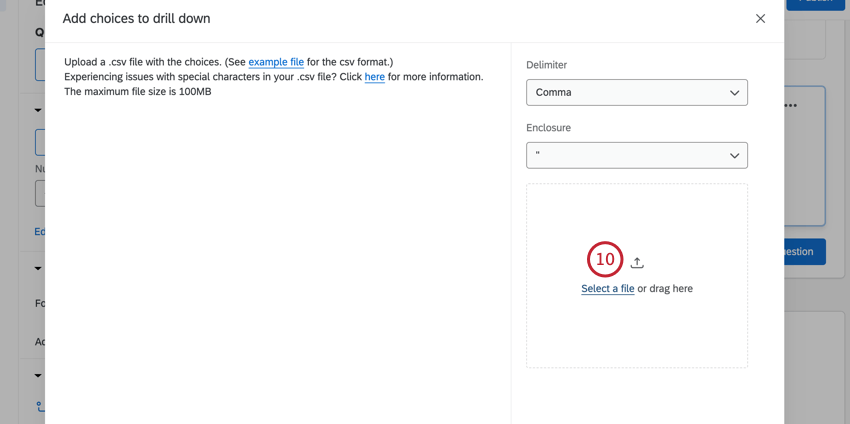

# Drill Down Question

## About Drill Down Questions

The drill down question is used to help respondents choose from a long list of options. Respondents first pick from a general dropdown list, and from their answers, are presented with specific follow-up lists to “drill down” to their answer.

**Example:** To make the selection of a particular car make and model, have the user first select the year and then the make. From there, the applicable models will be displayed.

* * *

* * *

## Setting Up a Drill Down Question

**Qtip:** Want to download an example file? Here’s a link to the file used for this page: [Car Make and Model Example](https://www.qualtrics.com/m/assets/support/wp-content/uploads//2015/04/DDExample1-1.csv.zip).

1.  Open a new spreadsheet in Excel or another similar program.
2.  Include a column for each dropdown menu you would like included in your drill down question. Do **not** include a header row, or the headers will be treated as answers in the dropdowns.  
    
3.  Include a row for each possible combination of choices for the dropdown menus. This might result in repeated values.  
    
    
    **Example:** Because there were 9 models available in 1997, there are 9 rows that start with 1997.
    
    **Attention:** The CSV/TSV file for each drill down **question** can have a maximum of 10,000 cells. The maximum number of drill down cells per **survey** is 30,000. Your survey will warn you when you’ve exceeded this, including any drill downs you may have sitting in your [trash](https://www.qualtrics.com/support/survey-platform/survey-module/survey-tools/saving-and-restoring/#TrashUnusedQuestions). You will not be able to [import survey files](https://www.qualtrics.com/support/survey-platform/survey-module/survey-tools/import-and-export-surveys/#ImportingASurvey) with more than 30,000 drill down cells.
    
4.  Save this file as a CSV (Comma Separated Values) or a TSV (Tab Separated Values) file.
5.  In Qualtrics, return to the survey where you want to add a drill down.
6.  Click **Add a new question.  
    **
7.  Select **Drill down**.
8.  Change the choice text to the categories for each dropdown menu.  
    
    
    **Qtip:** Make sure you have the correct number of groups (categories – eg., Year, Make, Model). If you upload more or less columns in your file than there are groups, you’ll need to adjust this number.  
    
    
9.  Click **Import choices**.
10.  Click **Select a file** and choose the file that contains your drill down answer choices.  
    
11.  Select the **Delimiter** for the file, which is the character that separates entries in your file. 
    
    **Qtip:** CSV files usually have the comma as a delimiter, and TSV files often use Tab.
    
12.  Choose the **Enclosure** character for your file.
13.   Review your choices to make sure everything is correct.
    
    **Qtip:** See the [CSV & TSV Upload Issues support page](https://www.qualtrics.com/support/survey-platform/contacts/csv-upload-issues/) for troubleshooting tips.
    
14.  Click **Import**.
15.  [Preview your question](https://www.qualtrics.com/support/survey-platform/survey-module/preview-survey/#OtherPreviewModes) to check your dropdown menus.  You can also click on the **Preview** button to view the drill down within the entire survey.
    
    **Warning:** You **cannot update the answer choices after you have collected responses** without invalidating the previously collected data. Two possible workarounds include creating a copy of the survey before you update the answer choices to avoid invalidating any data, or creating a new drill-down question with the updated answer choices and using [display logic](https://www.qualtrics.com/support/survey-platform/survey-module/question-options/display-logic/) or [advanced question randomization](https://www.qualtrics.com/support/survey-platform/survey-module/block-options/question-randomization/#AdvancedRandomization) to hide the previous question.
    

**Qtip:** Editing drill downs can hurt or invalidate data. However, in cases where you want to make superficial edits to drill down choices (such as for reporting purposes), you will need to save the answer choices as [embedded data](https://www.qualtrics.com/support/survey-platform/survey-module/survey-flow/standard-elements/embedded-data/) in the [survey flow](https://www.qualtrics.com/support/survey-platform/survey-module/survey-flow/survey-flow-overview/), before you send out your survey. You would create an embedded data element for each drill down category (eg., Year, Make, Model) with their values set to the [piped text](https://www.qualtrics.com/support/survey-platform/survey-module/editing-questions/question-types-guide/specialty-questions/drill-down/#OtherPartsofthePlatform) of each of those categories. You are then able to export the data or report on these embedded data fields rather than the actual question, meaning even if you make changes to your drill down answer choices, the embedded data field will not be invalidated.  

* * *

* * *

## Editing Drill Downs

Before you collect any responses, it is okay to reupload your drill down file with edits. This includes adding rows and columns, removing rows and columns, and changing the wording of choices.

However, after you collect data, you should **never change a drill down’s file**. This includes data collected by [previewing the survey](https://www.qualtrics.com/support/survey-platform/survey-module/preview-survey/).

If you find after collecting data that you need to change choices in your drill down, you’ll need to **hide your old drill down** and **create a new one**. The easiest way to hide a question is by adding [display logic](https://www.qualtrics.com/support/survey-platform/survey-module/question-options/display-logic/) to the old question, and using [true – false logic](https://qualtrics.atlassian.net/browse/DIS-57627). See the linked support pages for steps.

**Qtip:** You are responsible for combining the data of the 2 drill down questions if they need to be analyzed together. Qualtrics’ [response editing](https://www.qualtrics.com/support/survey-platform/data-and-analysis-module/data/response-editing/) feature can help, allowing you to manually change the answers to questions. You can edit multiple responses at a time.

* * *

* * *

## Drill Downs in Other Parts of the Platform

Drill downs can be used with other features of the platform, including piped text, display logic, and carry forward.

**Attention:** If your drill down file contains more than 2,000 answers, you will not be able to use the drill down question in piped text, display logic, or carry forward. Answers are defined as the number of permutations that are possible based on the file uploaded. To see this with an example, download the sample file in the [Setting Up a Drill Down Question](https://www.qualtrics.com/support/survey-platform/survey-module/editing-questions/question-types-guide/specialty-questions/drill-down/#SettingUpADrillDownQuestion) section. This file has 41 answers. The first answer is “1997,” the second is “1997 – Ford,” the third is “1997 – Ford – Taurus,” and so on.

You can also see the number of answers by opening the [QSF](https://www.qualtrics.com/support/survey-platform/survey-module/survey-tools/import-and-export-surveys/#ExportingaSurveyasaQSF) of your survey in a text editor and searching for your drill down question. See the below image of the example drill down question in a QSF. The first three answers for the drill down question are outlined in red. and the entire list of answers is highlighted in blue.  

### Piped Text

Piped text allows you to insert respondents’ information, such as answers to previous questions, other places in the survey.

With most questions, the piped text called “Selected Choices” allows you to display what the respondent previously answered in the survey. However, drill downs are a little different. Selected choices only tell you which categories you answered, not what those answers were.

However, if you select the name of a category from the Piped Text menu, you can then pipe in that category’s answer. To use the example on this page, if you wanted to display the Year someone selected, you would select **Year** from the Piped Text menu.

Below, you can see how the piped text becomes the selected year, make, and model.

For further questions, visit the [piped text](https://www.qualtrics.com/support/survey-platform/survey-module/editing-questions/piped-text/piped-text-overview/) page.

### Display Logic

Display logic allows you to hide or reveal questions based on previous information gathered in the survey.

Display logic based on drill downs allows you to hide or reveal questions based on the topmost category (for example, Year) or by a specific combinations (such as specific Makes or Models).

For example, the display logic below will display the question if **any** Ford model from 1997, 1998, or 1999 is selected.

But you could also create display logic based on a specific car (for example, if 1998 ~ Ford ~ Taurus is Selected) or a whole year (if 1997 is Selected).

**Warning:** In-page display logic cannot be based on a drill down question.

**Warning:** [Answer choice display logic](https://www.qualtrics.com/support/survey-platform/survey-module/question-options/display-logic/#SettingAnswerChoiceDisplayLogic) can’t be used with drill down questions.

For further questions, see the [display logic](https://www.qualtrics.com/support/survey-platform/survey-module/question-options/display-logic/) support page.

### Carry Forward

Carry forward allows you to make answers from a previous question possible answers to another question. For example, you can ask people what products they use, and then from those selected products have them choose a favorite.

Much like with piped text, carrying forward “Selected Choices” can result in the categories (eg., Year, Make, Model) and not the answers themselves (eg., 1997 Ford Taurus) being carried forward. To insert the exact Year, Make, or Model instead, you would carry forward the **Selected Answers** of that category.

**Qtip:** You cannot carry forward multiple categories at a time For example, you can carry forward selected Year, but not selected Make and Year.

For more on [carry forward](https://www.qualtrics.com/support/survey-platform/survey-module/question-options/carry-forward-choices/), visit the linked support page.

* * *

* * *

## Data Analysis

Once your responses have been collected, Qualtrics offers various ways you can analyze or report on your data.

### Compatible Visualizations

Visualizations are the graphs and tables you use in the Reports tab. When drill down data is displayed in visualizations, there is often a separate table for each category. Using the example repeated on this page, that would mean Year, Make, and Model data is presented in 3 separate tables.

In the [Reports](https://www.qualtrics.com/support/survey-platform/reports-module/reports-section/paginated-reports-overview/) section of the Reports tab, there are 8 visualizations for drill down questions: [data table](https://www.qualtrics.com/support/survey-platform/reports-module/reports-section/reports-visualizations/table-visualizations/data-table-visualization/), [results table](https://www.qualtrics.com/support/survey-platform/reports-module/reports-section/reports-visualizations/table-visualizations/results-table-visualization/), [bar chart](https://www.qualtrics.com/support/survey-platform/reports-module/reports-section/reports-visualizations/chart-visualizations/bar-chart-visualization/), [line chart](https://www.qualtrics.com/support/survey-platform/reports-module/reports-section/reports-visualizations/chart-visualizations/line-chart-visualization/), [pie chart](https://www.qualtrics.com/support/survey-platform/reports-module/reports-section/reports-visualizations/chart-visualizations/pie-chart-visualization/), [breakdown bar](https://www.qualtrics.com/support/survey-platform/reports-module/reports-section/reports-visualizations/chart-visualizations/breakdown-bar-visualization/), [statistics table](https://www.qualtrics.com/support/survey-platform/reports-module/reports-section/reports-visualizations/table-visualizations/statistics-table-visualization/), and [gauge chart](https://www.qualtrics.com/support/survey-platform/reports-module/reports-section/reports-visualizations/chart-visualizations/gauge-chart-visualization/).

In results dashboards, you can report on individual drill down categories in many widgets, such as [bar and line widgets](https://www.qualtrics.com/support/vocalize/widgets/chart-widgets/line-and-bar-chart-widgets/?parent=p00734), [breakdown bars,](https://www.qualtrics.com/support/vocalize/widgets/chart-widgets/breakdown-bar-widget/) [donut / pie charts](https://www.qualtrics.com/support/vocalize/widgets/chart-widgets/pie-chart-widget/), and [tables](https://www.qualtrics.com/support/vocalize/widgets/table-widgets/table-widget/).

### Downloaded Data Format

On the Data and Analysis tab, you can [export a spreadsheet](https://www.qualtrics.com/support/survey-platform/data-and-analysis-module/data/download-data/export-data-overview/) containing each respondent’s answers. With this kind of data, there are 2 [export options](https://www.qualtrics.com/support/survey-platform/data-and-analysis-module/data/download-data/export-options/#ExportOptionsDataTable) to familiarize yourself with: export labels and export values.

-   **Export Labels**: If you are looking for a more readable data output, we strongly encourage selecting labels when downloading drill down data. With this option selected, the text of the choices respondents selected are displayed in the downloaded file rather than the numeric coded value of each choice.  
    
-   **Export Values**: With values selected, your dataset will include a column for each dropdown menu in the drill down question, and the numeric value of each choice.  
    

### Drill Down Numeric Values

Each possible combination of answers that can be selected within a drill down question is given its own coded value, according to the numbering scheme below.

The recode values of drill downs can’t be edited and viewed like with standard question types, and they can’t be exported in a Word document like most question types. That means the best way to find each coded value is to download the file that would be sent to translators if you were running a multi-language survey. This file can be retrieved in the survey editor by following these directions:

1.  Click **Survey options**.  
    
2.  Click **Translations**.
3.  Clicking the download file icon.  
    
4.  Change the format to **Unicode** **CSV or Unicode TSV**.  
    
    
    **Qtip:** This step isn’t required, but it makes the file easier to read.
    
5.  Click **Download**.
6.  In the file you downloaded, look at the **Answer** row and the corresponding number to find the recode value of the combination. 

**Example:** One respondent chose 1999 for Year, Ford for Model, and Taurus for Model.

If we look at the translation key, we see that 1999 is Answer28, 1999 ~ Ford is Answer29, and 1999 ~ Ford ~ Taurus is Answer30.

When we export our data with values and look at our respondent who chose the 1999 Ford Taurus, we see that their Year column says 28, Their Make column says 29, and their Model column says 30.

And here is the labels version of the same file (where we can tell by the row number and ResponseID that this is the same person):

* * *

* * *

## FAQs

[What kind of project can I use this type of question in?](#faq-975) ×

For a full list of questions and their project compatibilities, see [this table.](https://www.qualtrics.com/support/survey-platform/survey-module/editing-questions/question-types-guide/question-types-overview/#Compatibility)