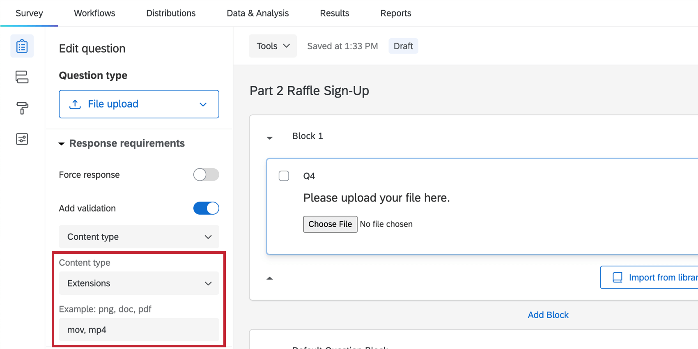
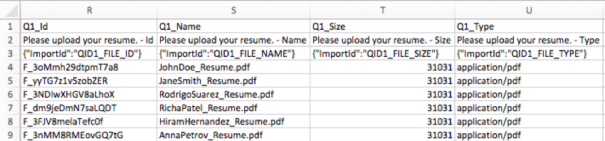

# File Upload Question

## About File Upload Questions

**Qtip:** File upload is an add-on feature not included in the standard Qualtrics license. Please contact your Qualtrics [Account Executive](https://www.qualtrics.com/support/survey-platform/getting-started/help-and-feedback/#AEsandCSMs) if you are interested in getting access.

The file upload question type allows respondents to upload a file along with their survey response. File uploads allow you to collect data that may not be available through standard survey questions.

You can have as many file upload questions in your survey as you would like, however each question can accept only 1 uploaded file. Uploaded files can be up to 50MB. For security reasons, executable files (such as those ending in .exe) aren’t permitted.

**Qtip:** Respondents can upload multiple files through a single file upload question if the files are compressed into a ZIP file before uploading.

* * *

* * *

## File Upload Options

File upload questions are fairly straightforward, with the option to restrict the type of file respondents upload. For example, if you are asking for a photo, you may want to restrict respondents from uploading spreadsheets.

To set this requirement, select **Add validation** in the question editing pane and choose the appropriate content type.

Content options are **PDF, Document** (DOC, DOCX, TXT, ODT), **Spreadsheet** (CSV, XLS, XLSX, ODS), or **Graphic** (JPG, PNG, GIF). You can also choose **Extensions** and type in your own custom allowed file extensions. Custom file extensions should not include the period before the file name and need to be separated by a space or a comma.

**Example:** To limit uploads to video files, you could type “mov, mp4” into the extensions field. These file types aren’t case-sensitive, so “MOV, MP4” would also work.

### File Upload Logic

When using the file upload question, you can add special logic conditions related to the upload in [display logi](https://www.qualtrics.com/support/survey-platform/survey-module/question-options/display-logic/)c, [skip logic](https://www.qualtrics.com/support/survey-platform/survey-module/question-options/skip-logic/), [branch logic](https://www.qualtrics.com/support/survey-platform/survey-module/survey-flow/standard-elements/branch-logic/), [custom validation](https://www.qualtrics.com/support/survey-platform/survey-module/editing-questions/validation/), and other areas. You can add logic based on the following:

-   **File:** Logic based on whether a file was uploaded or not.
-   **File Size:** Logic based on the number of bytes the uploaded file contains.
-   **File Type:** Logic based on the type of file that was uploaded (PDF, Document, Spreadsheet, Graphic, Custom Extensions).

**Example:** In the image below, [display logic](https://www.qualtrics.com/support/survey-platform/survey-module/question-options/display-logic/) has been applied so that the form only appears if someone didn’t upload a resume in the previous question.

**Attention:** Once a file is uploaded, it can only be removed by a respondent if the survey uses the [New Survey Taking Experience](https://www.qualtrics.com/support/survey-platform/survey-module/look-feel/simple-layout/). Otherwise, the respondent won’t be able to remove the file. Regardless of the layout you use, a respondent can always replace the file with a different file.  

* * *

* * *

## Data Analysis

**Warning:** If you delete a response that contains an uploaded file, the file will be permanently deleted and unrecoverable after 30 days. The file will no longer be available even if the response has been imported into the dataset of a different survey.

Qualtrics offers various ways you can analyze your response data once your responses have been collected. From the [Reports tab](https://www.qualtrics.com/support/survey-platform/reports-module/results-vs-reports/), you can view aggregate data in pre-made reports as well as create your own reports from scratch. From the [Data & Analysis tab](https://www.qualtrics.com/support/survey-platform/data-and-analysis-module/data-and-analysis-overview/), you can view and manage individual respondents’ data.

### Results Visualizations

In the [Results](https://www.qualtrics.com/support/survey-platform/reports-module/results-section/reports-overview/) section of the Reports tab, the default table for a file upload is the paginated table. This table contains the following:

-   **Name**: The name of the file. Click the name to preview the file.
-   **Size:** The size of the file.
-   **Type:** The type of the file.
-   **File icon:** Click the icon to export the individual respondent’s answers to the other questions in the survey.
-   **Download button:** Click **Download all files** to download all uploaded files.

**Qtip:** If you create a [public report](https://www.qualtrics.com/support/survey-platform/reports-module/results-section/exporting-and-sharing-results/sharing-reports/) and post it online, you can decide if you want people to just view the file information, or be able to download it themselves. Under the [Security tab in Survey Options](https://www.qualtrics.com/support/survey-platform/survey-module/survey-options/survey-protection/#SecureParticipantsFiles), deselect **Require permission to view uploaded files** to create download links on the report. Keep **Require permission to view uploaded files** selected to prevent report viewers from downloading these files.

If you select a data source other than (the file’s) **Name** or **Thumbnail** for your visualization, you can use other visualization types, but you won’t be able to link to the uploaded files.

### Reports Visualizations

In the [Reports](https://www.qualtrics.com/support/survey-platform/reports-module/reports-section/paginated-reports-overview/) section of the Reports tab, you can’t create links to your file upload questions. However, you can still create a [Results table](https://www.qualtrics.com/support/survey-platform/reports-module/reports-section/reports-visualizations/table-visualizations/results-table-visualization/) that displays the different information for the file upload (size, type, etc.) altogether.

**Qtip:** Although this table is called a results table, it is a [Reports](https://www.qualtrics.com/support/survey-platform/reports-module/reports-section/paginated-reports-overview/) table and can’t be found under the Results section.

1.  Click **Insert**.  
    
2.  Select **Questions**.
3.  From the list, highlight your file upload question.
4.  Select **Name**.
5.  Make sure your new table is highlighted. You can tell if the visualization editing pane appears on the right.  
    
6.  Click **Add Field**.
7.  Highlight your file upload question.
8.  Select the field you want to add a column for. In the image, the Id is displayed.
9.  Repeat steps 5-8 for as many columns as you want to include.

For more information on editing a [Results Table](https://www.qualtrics.com/support/survey-platform/reports-module/reports-section/reports-visualizations/table-visualizations/results-table-visualization/), please visit the linked support page.

### Downloaded Data Format

In the Data and Analysis tab, you can [export a spreadsheet](https://www.qualtrics.com/support/survey-platform/data-and-analysis-module/data/download-data/export-data-overview/) containing each respondent’s answers.

For file upload questions, there are 4 columns: the Id, Name, Size, and Type of file.

### ZIP Download

Rather than downloading your uploaded files in spreadsheet form, you can download a ZIP file with all the files uploaded by your respondents. When exporting your data in Responses, just choose the User Submitted Files format.  

**Qtip:** Depending on the number of files that have been uploaded, this ZIP file may be quite large and could take a while to download. If your file is too large to download or takes too long to download, try [filtering your responses](https://www.qualtrics.com/support/survey-platform/data-and-analysis-module/data/filtering-responses) by recorded date to divide your dataset into smaller batches. When you export your data with the filter applied, only the filtered responses will attempt to export.

### Data Section

You and [any collaborators with access to the data](https://www.qualtrics.com/support/survey-platform/my-projects/sharing-a-project/) can easily download uploaded files in the Data section.

1.  In the Data & Analysis tab, click **Column chooser**.
2.  Hover your cursor over the file upload question.
3.  Select **Id**.  
    
4.  Click the hyperlinked Id to download the file.

* * *

* * *

## Previewing Uploaded Files in Results Dashboards

**Qtip:** The functionality described in this section is only set up automatically in [results dashboards](https://www.qualtrics.com/support/survey-platform/reports-module/results-dashboards/results-dashboard-overview/). For other types of dashboards, you can add this widget, but will have to [follow a few steps to set it up](https://www.qualtrics.com/support/vocalize/record-table-widget/#DisplayingFileLinksWidget).

If you have a survey with a file upload question, your automatically generated [results dashboard](https://www.qualtrics.com/support/survey-platform/reports-module/results-dashboards/results-dashboard-overview/) will contain a [record table widget](https://www.qualtrics.com/support/vocalize/record-table-widget/). This widget displays information about the uploaded files, and allows you to view and download the files.

Images are visible directly within the widget, and can be opened in a new browser tab by clicking on the image. Other uploaded files (documents, spreadsheets, etc.) can be downloaded to your computer by clicking the **Download file** link.

* * *

* * *

## Inserting Uploaded Image Files into an Email Task

It’s possible to include uploaded image files in an [email task](https://www.qualtrics.com/support/survey-platform/actions-module/email-task/) by modifying the email HTML. This will require a bit of coding, but can be accomplished by following the below steps.

**Qtip:** It is only possible to insert uploaded **image files**. Other file types aren’t supported using this method.

**Attention:** To insert uploaded images into your email tasks, you must disable **[Require permission to view uploaded files](https://www.qualtrics.com/support/survey-platform/survey-module/survey-options/survey-protection/#SecureParticipantsFiles)** in your Security [**Survey Options**](https://www.qualtrics.com/support/edit-survey/survey-options/survey-options-overview/).

1.  Insert any image into the email task’s [rich content editor](https://www.qualtrics.com/support/edit-survey/editing-questions/rich-content-editor/rich-content-editor-overview/).  
    
2.  Get the **p****iped text** for the uploaded file URL. Copy this code for later use.  
    
    
    **Qtip:** Always generate piped text for your file URL from the workflow, as shown above. Be careful not to [copy file URL piped text from the survey editor](https://www.qualtrics.com/support/survey-platform/survey-module/editing-questions/piped-text/piped-text-overview/#PipingFromAPreviousQuestion) into an email, since this URL is temporary and will not work the same way.
    
3.  Access the **Source** view of the rich content editor to view the image’s HTML.  
    
4.  Replace the image source (text between the **quotation marks** and after **src=**) with the **p****iped text** for the uploaded image URL.

* * *

* * *

## Screen Capture

**Attention:** Screen Capture is available in Website / App Insights projects. These are a separate product from the Survey Platform. To use the screen capture feature, Website / App Insights projects must be enabled/purchased for your account.

Screen capture allows respondents to attach a screenshot of the site they are viewing when taking a survey through a [Website / App Insights project](https://www.qualtrics.com/support/website-app-feedback/getting-started-with-website-app-feedback/getting-started-with-website-feedback/). This question type is only available to users that have purchased access to Website / App Insights projects. The screen capture question type allows respondents to illustrate where on the site they are referring to and highlight and blackout certain parts of their image. This makes it possible to see exactly what your website visitors are seeing when they give feedback on the site.

For more information, please visit the [Screen Capture](https://www.qualtrics.com/support/website-app-feedback/common-use-cases/screen-capture/) support page.

* * *

* * *

## FAQs

[What kind of project can I use this type of question in?](#faq-975) ×

For a full list of questions and their project compatibilities, see [this table.](https://www.qualtrics.com/support/survey-platform/survey-module/editing-questions/question-types-guide/question-types-overview/#Compatibility)