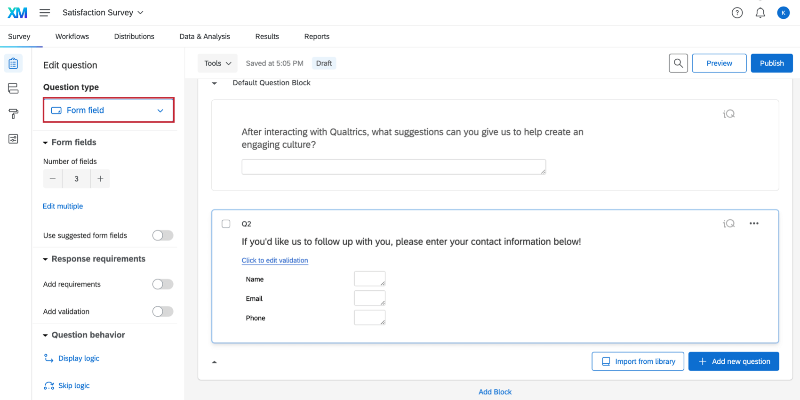
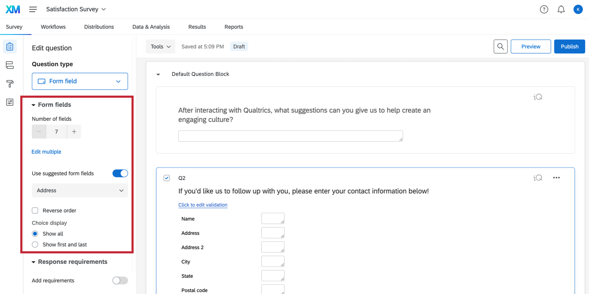
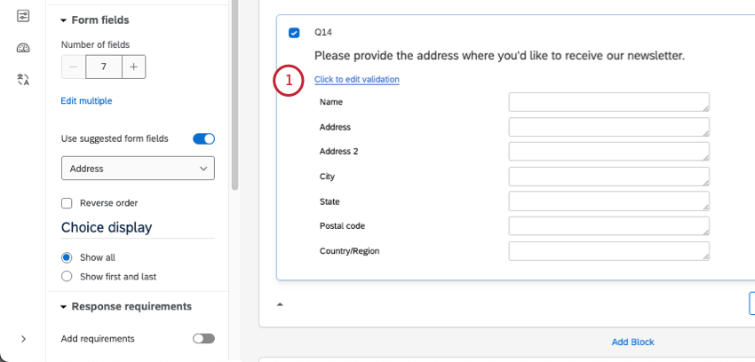
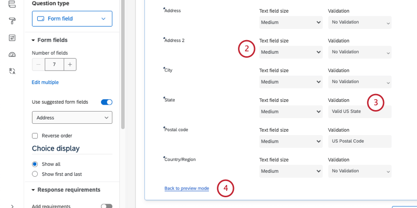
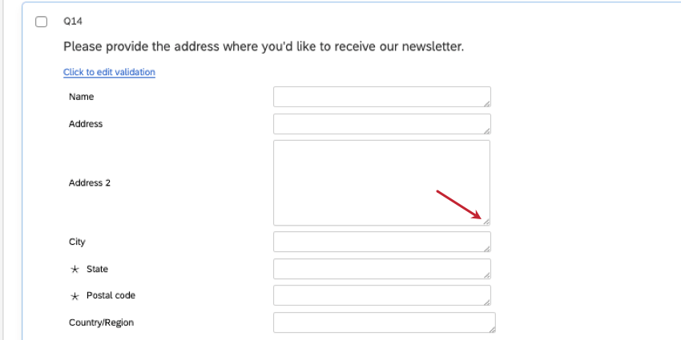
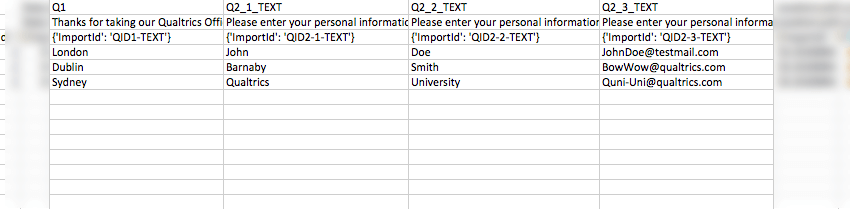

# Form Field Question

## About Form Field Questions

The form field question provides respondents with multiple, separate [text entry](https://www.qualtrics.com/support/survey-platform/survey-module/editing-questions/question-types-guide/standard-content/text-entry/) boxes. This format is most often used to gather contact information from respondents. 

* * *

Was this helpful?

YesNo

* * *

## Variations

The form field question has several variations that change the numbers and content of the form fields. You can access these variations under **Form fields** in the question editing pane. 

-   **Number of fields:** Set how many form fields you want to appear on your question. You can use **Edit multiple** to list fields, each separated by a single line break. You can also click directly on a field to edit its name, and click Enter / return on your keyboard to add more fields.
-   **Use suggested form fields:** Right now, the only option is address. When you select this, your question will automatically gain common address fields, like name, city, state, post code, and country/region. To learn more about how to edit and format suggested choices, see [Suggested Choices](https://www.qualtrics.com/support/survey-platform/survey-module/editing-questions/formatting-answer-choices/#AutomaticChoices).

**Qtip:** Form fields cannot be used with [autocomplete](https://www.qualtrics.com/support/survey-platform/survey-module/editing-questions/question-types-guide/standard-content/autocomplete-questions-supplemental-data/?parent=p001132) or [supplemental data](https://www.qualtrics.com/support/survey-platform/survey-module/editing-questions/question-types-guide/standard-content/autocomplete-questions-supplemental-data/?parent=p001132#SupplementalData). Only [text entry questions](https://www.qualtrics.com/support/survey-platform/survey-module/editing-questions/question-types-guide/standard-content/text-entry/) can use those features.

* * *

Was this helpful?

YesNo

* * *

## Form Field Validation and Text Box Size

Each text box in a form can have unique [content validation](https://www.qualtrics.com/support/survey-platform/survey-module/editing-questions/validation/#ContentValidation) settings. These validation settings let you specific what kind of data you want respondents to fill in, such as a certain country’s postal code, email address, and more.

You can also change the size of each of the text boxes in the form.

1.  Click the blue **Click to edit validation** text.  
    
2.  Choose a text field size. You options are short, long, medium, and essay.  
    
    
    **Qtip:** Note that the size and appearance of your form field may vary from these settings if you’re using the [New Survey Taking Experience](https://www.qualtrics.com/support/survey-platform/survey-module/look-feel/simple-layout/#HighlightsandUpdates).
    
3.  For each field, you can select a validation type. [See a full list](https://www.qualtrics.com/support/survey-platform/survey-module/editing-questions/validation/#ContentValidation).
4.  Once you’ve finished editing your validation, click **Back to preview mode.**

**Qtip:** You can also drag and drop the corner of a field to change its size. Note that the size and appearance of your form field may vary from this custom size if you’re using the [New Survey Taking Experience](https://www.qualtrics.com/support/survey-platform/survey-module/look-feel/simple-layout/#HighlightsandUpdates).

**Qtip:** You can also set validation that applies to the entire question, instead of the form-specific validation shown above. See [Response Requirements and Validation](https://www.qualtrics.com/support/survey-platform/survey-module/editing-questions/validation/).

* * *

Was this helpful?

YesNo

* * *

## Data Analysis

Once your responses have been collected, Qualtrics offers various methods to create reports and analyze your data.

### Text iQ

You can analyze your text responses using [Text iQ](https://www.qualtrics.com/support/survey-platform/data-and-analysis-module/text-iq/text-iq-functionality/) to surface sentiment, key topics, and other enrichments based on the content of your responses. These results can then be displayed in a report or a dashboard.

### Downloaded Data Format

Each text box in your form will be shown as a column in your [downloaded data](https://www.qualtrics.com/support/survey-platform/data-and-analysis-module/data/download-data/export-data-overview/). For form field questions, there are multiple text boxes and so there will be multiple columns.

### Reporting on form data

Form fields can use all of the same widgets and visualizations that text entry can. For more details, see [Text Entry Data Analysis.](https://www.qualtrics.com/support/survey-platform/survey-module/editing-questions/question-types-guide/standard-content/text-entry/#DataAnalysis)

* * *

Was this helpful?

YesNo

* * *

## FAQs

[What kind of project can I use this type of question in?](#faq-975) ×

For a full list of questions and their project compatibilities, see [this table.](https://www.qualtrics.com/support/survey-platform/survey-module/editing-questions/question-types-guide/question-types-overview/#Compatibility)