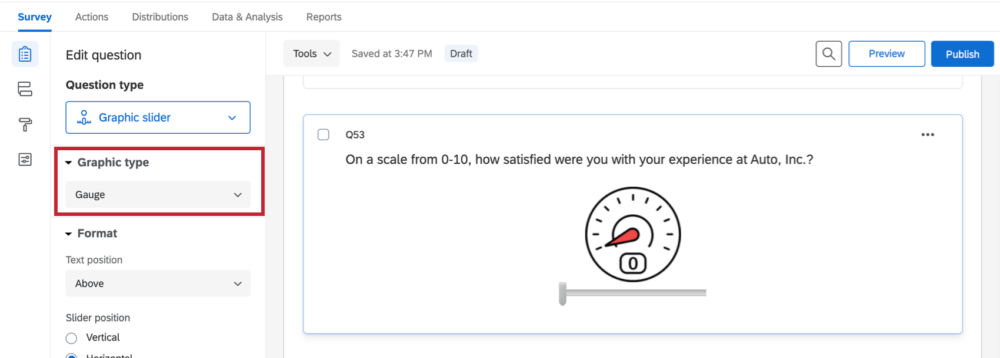

# Graphic Slider Question

## About Graphic Slider Questions

The graphic slider provides an engaging scale for respondents. It displays an image that changes as the scale adjusts. This format can be particularly useful for younger audiences or for simple satisfaction feedback.

* * *

* * *

## Graphic Types

Qualtrics has 10 different graphic sliders for you to choose from. These formats can be accessed and adjusted in the question editing pane under **Graphic type**. It isn’t possible to upload your own graphic for this question type.

### Gauge

This slider controls a 0–10 scale represented by a gauge graphic.

### Thermometer

This slider controls a 0–10 scale represented by a thermometer graphic.

### Stop Light

This slider controls a 3-point scale represented by a stoplight graphic.

### Smile

This slider controls a 5-point scale represented by a smiley face. The horizontal version puts the slider in a horizontal position under the face.

### Grades and Grades +/-

The Grades slider controls a letter grade assignment (A–F). Grades +/- looks the same, but includes +/- grades, too.

### Horizontal Bars

This slider controls a stack of horizontal bars.

### Disks

This slider controls a stack of disks.

### Building Blocks

This slider controls a stack of building blocks.

* * *

* * *

## Additional Graphic Slider Settings

In addition to choosing one of the slider types above, the following options are available for further customization. They can be found under the Format section in the question editing pane.

### Text Position

Graphic Slider questions have the unique functionality of choosing whether the question text will appear above, below, to the left, or to the right of the slider.

### Slider Position

Slider bars can be displayed either horizontally below the slider graphic or vertically beside it.

### Scale points

The horizontal bars, disks, and building blocks variations include the option to choose the number of scale points (5, 7, or 9), and to **Include scale point** so the numbers of the scale appear to the right of each segment.

* * *

* * *

## Data Analysis

Once your responses have been collected, Qualtrics offers various ways you can analyze your response data. From the [Reports tab](https://www.qualtrics.com/support/survey-platform/reports-module/results-vs-reports/), you can view aggregate data in pre-made reports as well as create your own reports from scratch. From the [Data & Analysis](https://www.qualtrics.com/support/survey-platform/data-and-analysis-module/data-and-analysis-overview/) tab, you can view and manage individual respondents’ data.

### Visualizations

The visualizations in reports display information by rank. For instance, you can make a bar chart that displays how many people rated 1 on the graphic slider, 2, 3, and so on. You can also display the mean rank given in the question if you change the visualization’s metric to mean.

In the [Results](https://www.qualtrics.com/support/survey-platform/reports-module/results-section/reports-overview/) section of the Reports tab, there are 7 visualization types available for graphic slider questions: [simple table](/support/results/visualizations/tables/simple-table/ "simple table"), [bar chart](/support/results/visualizations/charts/bar-chart/ "bar chart"), [line chart](/support/results/visualizations/charts/line-chart/ "line chart"), [pie chart](/support/results/visualizations/charts/pie-chart/ "pie chart"), [breakdown bar](/support/results/visualizations/breakdown-bar/ "breakdown bar"), [statistics table](/support/results/visualizations/tables/statistics-table/ "statistics table"), and [gauge chart](/support/results/visualizations/charts/gauge-chart/ "gauge chart"). For more information on these visualizations, please visit the linked visualization support pages.

In the [Reports](https://www.qualtrics.com/support/survey-platform/reports-module/reports-section/paginated-reports-overview/) section of the Reports tab, there are similar visualizations available: [data table](https://www.qualtrics.com/support/survey-platform/reports-module/reports-section/reports-visualizations/table-visualizations/data-table-visualization/), [results table](https://www.qualtrics.com/support/survey-platform/reports-module/reports-section/reports-visualizations/table-visualizations/results-table-visualization/), [bar chart](https://www.qualtrics.com/support/survey-platform/reports-module/reports-section/reports-visualizations/chart-visualizations/bar-chart-visualization/), [line chart](https://www.qualtrics.com/support/survey-platform/reports-module/reports-section/reports-visualizations/chart-visualizations/line-chart-visualization/), [pie chart](https://www.qualtrics.com/support/survey-platform/reports-module/reports-section/reports-visualizations/chart-visualizations/pie-chart-visualization/), [breakdown bar](https://www.qualtrics.com/support/survey-platform/reports-module/reports-section/reports-visualizations/chart-visualizations/breakdown-bar-visualization/), [statistics table](https://www.qualtrics.com/support/survey-platform/reports-module/reports-section/reports-visualizations/table-visualizations/statistics-table-visualization/), and [gauge chart](https://www.qualtrics.com/support/survey-platform/reports-module/reports-section/reports-visualizations/chart-visualizations/gauge-chart-visualization/).

### Downloaded Data Format

Your dataset will include a column for each graphic slider question. The value in this column for each participant is the coded value of the scale point they chose. The values will change depending on the graphic slider used.

**Example:** On a stoplight slider, “1” is a green light and “3” is a red light. On a smile slider (both horizontal and vertical), “1” is a very sad face and “5” is a very happy face. On a ten gauge slider, “1” is a low pressure and “10” is a high pressure. On a thermometer slider, “1” is a low temperature and “5” is a high pressure. On a grades slider, “1” is a low grade and “5” (without +/-) or “13” (with +/-) is a high grade.

* * *

* * *

* * *

* * *

## FAQs

[What kind of project can I use this type of question in?](#faq-975) ×

For a full list of questions and their project compatibilities, see [this table.](https://www.qualtrics.com/support/survey-platform/survey-module/editing-questions/question-types-guide/question-types-overview/#Compatibility)