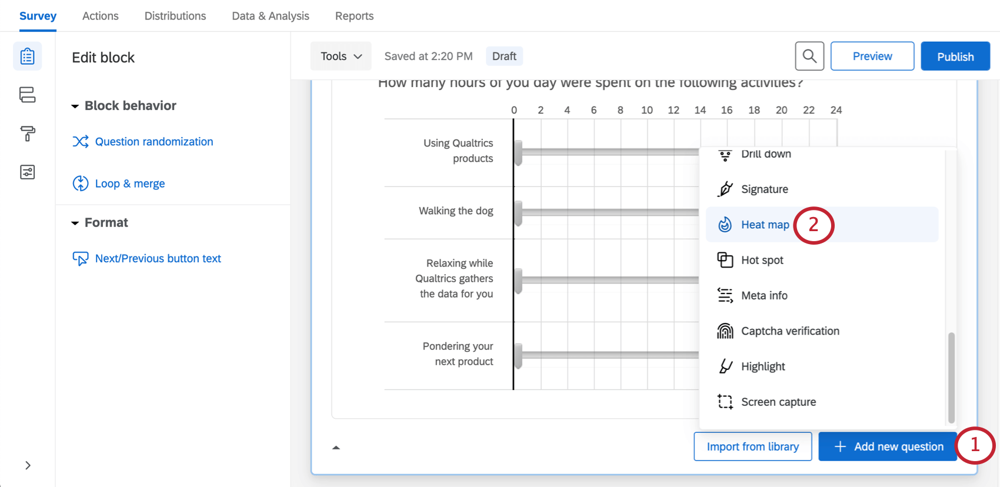

# Heat Map Question

## About Heat Map Questions

The heat map question type is used to gather feedback on images. The respondent is presented with an image and invited to click anywhere on that image. Unlike the [hot spot](/support/survey-platform/edit-survey/editing-questions/question-types-guide/specialty-questions/hot-spot/ "hot spot") question, respondents are not limited to selecting pre-determined regions of the image. However, you can still add hidden regions for reporting purposes.

**Example:** You ask users to view a page from your website, and tell them to find a certain feature. This question can be combined with a [timing](/support/edit-survey/editing-questions/question-types-guide/advanced/timing/ "timing") question to measure how long each respondent takes to find the appropriate button.

The respondent in this question has clicked on the **Support Site** button, as indicated by the dot.

**Qtip:** A respondent can deselect their answer by clicking the dot that appears in the image.

* * *

* * *

## Setting Up a Heat Map Question

**Qtip:** The heat map question will only appear as an option if you’re not using the [New Survey Taking Experience](https://www.qualtrics.com/support/survey-platform/survey-module/look-feel/simple-layout/).

1.  Click **Add new question**.  
    
2.  Select **Heat map**.
3.  Add a graphic, either by clicking **Choose graphic** in the editing pane, or clicking **Select a graphic to use in this question.  
      
    **
4.  Select a graphic you’ve already [uploaded to your library](https://www.qualtrics.com/support/survey-platform/account-library/graphics-library/), or upload a new one from your computer.  
    
5.  Under **Interaction**, set the number of times the respondent can click the image (“1” is the default).  
    
    
    **Qtip:** If the respondent clicks more than the allowed number of times, their oldest click will be replaced with the newest one.
    
6.  If desired, click **Add region**.
    
    **Qtip:** Regions are not required for a heat map question, but they can make reporting easier. Rather than reporting just the coordinates of each click, Qualtrics can report the number of respondents who click in each defined region.
    
7.  Click and drag the region to move it, or click and drag the corners to resize it.
8.  Click the text box beneath the region to type a region name.
    
    **Qtip:** This name will not display to respondents, but will be used in your survey results.
    
9.  Repeat steps 3–5 to add all desired regions.

* * *

* * *

## Custom Region Shapes

By default, all regions are rectangles. In certain scenarios, however, you may need different region shapes. For example, on a map, you may need a freeform region shape to cover a specific city or county.

Editing region shapes is the same with a hot spot as it is with a heat map. See the instructions on the [Hot Spot](https://www.qualtrics.com/support/survey-platform/survey-module/editing-questions/question-types-guide/specialty-questions/hot-spot/#CustomRegionShapes) support page for more information.

* * *

* * *

## Data Analysis

Once your responses have been collected, Qualtrics offers various ways you can analyze your response data. You can view and manage individual respondents’ data, export a spreadsheet of data, or create printable reports to share with stakeholders.

**Attention:** If you set up more than 50 heat map questions, only the first 50 questions will be reportable in Qualtrics (this includes the Data & Analysis tab, reports, dashboards, and datasets). You will be able to view all of your heat map question data when you [export via CSV](https://www.qualtrics.com/support/survey-platform/data-and-analysis-module/data/download-data/export-data-overview/).

### Downloaded Data Format

In the [exported dataset](https://www.qualtrics.com/support/survey-platform/data-and-analysis-module/data/download-data/export-data-overview/), 2 columns will be provided for each click participants were allowed to make on the image. 1 column will include the **x-coordinates of each click** (column Q1\_1\_x in the image), and the other will include the **y-coordinates of each click** (column Q1\_1\_y in the image), both measured in pixels.

If **regions** were added on the heat map question, an additional column will be included to indicate the chosen region.

**Qtip:** If a respondent clicked outside a defined region, that region will be labelled “other.”

### Viewing Individual Responses

You can [view an individual response](https://www.qualtrics.com/support/survey-platform/data-and-analysis-module/data/recorded-responses/#ViewingIndividualResponses) in the Data & Analysis tab and [export the response to PDF](https://www.qualtrics.com/support/survey-platform/data-and-analysis-module/data/recorded-responses/#ExportingAnIndividualResponseToPDF). When viewing an individual response to a heat map, a small white dot will show where the respondent clicked. 

### Reporting on Heat Map Data

In the [Reports](https://www.qualtrics.com/support/survey-platform/reports-module/reports-section/paginated-reports-overview/) tab, the [heat map](https://www.qualtrics.com/support/survey-platform/reports-module/reports-section/reports-visualizations/other-visualizations/heat-map-visualization/) visualization will display the most to least clicked areas.If you added regions, you can also use the [data table](https://www.qualtrics.com/support/survey-platform/reports-module/reports-section/reports-visualizations/table-visualizations/data-table-visualization/), [results table](https://www.qualtrics.com/support/survey-platform/reports-module/reports-section/reports-visualizations/table-visualizations/results-table-visualization/), [bar chart](https://www.qualtrics.com/support/survey-platform/reports-module/reports-section/reports-visualizations/chart-visualizations/bar-chart-visualization/), [line chart](https://www.qualtrics.com/support/survey-platform/reports-module/reports-section/reports-visualizations/chart-visualizations/line-chart-visualization/), [pie chart](https://www.qualtrics.com/support/survey-platform/reports-module/reports-section/reports-visualizations/chart-visualizations/pie-chart-visualization/), or [breakdown bar](https://www.qualtrics.com/support/survey-platform/reports-module/reports-section/reports-visualizations/chart-visualizations/breakdown-bar-visualization/).

If you plan to use [Results Dashboards](https://www.qualtrics.com/support/survey-platform/reports-module/results-dashboards/results-dashboard-overview/?parent=p002090), we recommend using regions with your heat map. You can then report on how often specific regions were clicked, and report on data such as average number of clicks. For region reports, you can use [widgets](https://www.qualtrics.com/support/survey-platform/reports-module/results-dashboards/results-dashboards-widgets/#WidgetTypes) that are compatible with categorical data, such as horizontal bars, vertical bars, lines, and donut / pie charts.

If you don’t use regions, you cannot report on heat map data in Results Dashboards.

**Qtip:** In [legacy Results](https://www.qualtrics.com/support/survey-platform/reports-module/results-section/reports-overview/), there’s a visualization called the [heat map plot](https://www.qualtrics.com/support/survey-platform/reports-module/results-section/visualizations/heat-map-plot/) that works similarly to the heat map in Reports. If you have added regions to your heat map question, you can also use a [simple table](/support/results/visualizations/tables/simple-table/ "simple table"), [bar chart](/support/results/visualizations/charts/bar-chart/ "bar chart"), [line chart](/support/results/visualizations/charts/line-chart/ "line chart"), [pie chart](/support/results/visualizations/charts/pie-chart/ "pie chart"), or [breakdown bar](/support/results/visualizations/breakdown-bar/ "breakdown bar") in legacy Results.

* * *

* * *

## FAQs

[What kind of project can I use this type of question in?](#faq-975) ×

For a full list of questions and their project compatibilities, see [this table.](https://www.qualtrics.com/support/survey-platform/survey-module/editing-questions/question-types-guide/question-types-overview/#Compatibility)