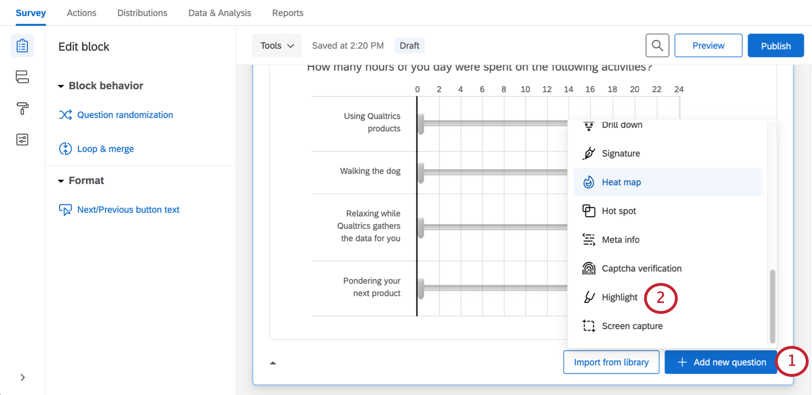

# Highlight Question

## About Highlight Questions

The highlight question type allows you to present survey participants with an interactive text sample. Participants can select words from the text to evaluate using criteria you choose. For example, they can indicate whether they like or dislike the selected text.

* * *

Was this helpful?

YesNo

* * *

## Setting Up a Highlight Question

1.  Click **Add new question.  
      
    **
2.  Select **Highlight** from the dropdown.
3.  Enter your question text, then select the blue **Click to edit highlight text** to enter the interactive text participants will evaluate.  
    
4.  If desired, group multiple words together by clicking between the words (click again to separate the words).
5.  If desired, click on a word or group to specify that it should be non-interactive. Interactive words are outlined, and non-interactive words are not.
    
    **Qtip:** You can use the stop words feature in the question editing pane on the left to automatically specify basic words (it, the, to, a, etc.) as non-interactive.
    
6.  If desired, click the category names to edit them.  
    

* * *

Was this helpful?

YesNo

* * *

## Highlight Question Options

The highlight question type can be customized using a few special features found in the question editing pane.

### Categories

Under Categories, adjust the number of options in your scale (e.g., Like, Neither like nor dislike, and Dislike would be 3). You can click **Edit multiple** to edit the names of these categories, or you can click the category names as displayed in the question.

You can also use the [**Suggested categories**](https://www.qualtrics.com/support/survey-platform/survey-module/editing-questions/formatting-answer-choices/#AutomaticChoices) option to alter the scale to use words like Effective/Ineffective.

### Exclude Stop Words

Automatically exclude filler words from the interactive parts of your question by selecting **Exclude stop words** under Format. With this enabled, all words like “it,” “a,” “an,” “to,” etc. won’t be selectable for survey participants, without you having to manually click each one.

### Color Schemes

Under Format, you can customize the colors associated with each scale point. Select **Reverse Color Order** to reverse the order the colors from your palette are used in the scale points.

### Text size

Change the font size for the interactive text part of your question.

### Response Requirements

By default, respondents are not required to answer the question a certain way. However, you can select **Add validation** to create response requirements.

You can use the **Must Select** option to determine a maximum and minimum numbers of words/phrases that respondents must express an opinion for before they move forward.

To learn more about your other response requirements and validation options, see the support page on [Response Requirements & Validation](/support/survey-platform/edit-survey/editing-questions/validation/ "Validation").

* * *

Was this helpful?

YesNo

* * *

## Data Analysis

Once your responses have been collected, Qualtrics offers various ways you can analyze your response data. From the [Results tab](https://www.qualtrics.com/support/survey-platform/reports-module/results-dashboards/results-dashboard-overview/?parent=p002), you can view aggregate data in pre-made reports as well as create your own reports from scratch. From the [Data & Analysis](https://www.qualtrics.com/support/survey-platform/data-and-analysis-module/data-and-analysis-overview/) tab, you can view and manage individual respondents’ data.

**Qtip:** Highlight questions are not compatible with [Stats iQ](https://www.qualtrics.com/support/stats-iq/getting-started-with-stats-iq/overview-stats-iq/) or [crosstabs](https://www.qualtrics.com/support/survey-platform/data-and-analysis-module/cross-tabulation/cross-tabulation-overview/).

### Visualizations

In the [Results](https://www.qualtrics.com/support/survey-platform/reports-module/results-section/reports-overview/) tab, there are several visualization types available for highlight questions: tables, charts, and word cloud. For more information on these visualization types, see [Results Dashboards Widgets](https://www.qualtrics.com/support/survey-platform/reports-module/results-dashboards/results-dashboards-widgets/).

In the [Reports](https://www.qualtrics.com/support/survey-platform/reports-module/reports-section/paginated-reports-overview/) tab, you can load 1 category at a time into the data source of the [bar chart](https://www.qualtrics.com/support/survey-platform/reports-module/reports-section/reports-visualizations/chart-visualizations/bar-chart-visualization/), [line chart](https://www.qualtrics.com/support/survey-platform/reports-module/reports-section/reports-visualizations/chart-visualizations/line-chart-visualization/), [pie chart](https://www.qualtrics.com/support/survey-platform/reports-module/reports-section/reports-visualizations/chart-visualizations/pie-chart-visualization/), [breakdown bar](https://www.qualtrics.com/support/survey-platform/reports-module/reports-section/reports-visualizations/chart-visualizations/breakdown-bar-visualization/), [data table](https://www.qualtrics.com/support/survey-platform/reports-module/reports-section/reports-visualizations/table-visualizations/data-table-visualization/), or [results table](https://www.qualtrics.com/support/survey-platform/reports-module/reports-section/reports-visualizations/table-visualizations/results-table-visualization/).

### Downloaded Data Format

In the [exported dataset](/support/survey-platform/data-and-analysis-module/data/download-data/export-data-overview/ "Export Data Overview"), the appearance of your data depends on whether you turned on [Split multi-value-fields into columns](https://www.qualtrics.com/support/survey-platform/data-and-analysis-module/data/download-data/export-options/#ExportOptionsDataTable) when exporting your data.

When columns aren’t split, each scale point gets a column, and the words/phrases the respondent rated that scale point as are listed in the column.

When columns are split, every scale and phrase combination gets a column. For example, if you have 6 phrases and 3 scale points, you will have 18 columns. The cell will be filled if the respondent assigned that scale point to that phrase, and it will be blank if they did not.

* * *

Was this helpful?

YesNo

* * *

## FAQs

[What kind of project can I use this type of question in?](#faq-975) ×

For a full list of questions and their project compatibilities, see [this table.](https://www.qualtrics.com/support/survey-platform/survey-module/editing-questions/question-types-guide/question-types-overview/#Compatibility)