# Hot Spot Question

## About Hot Spot Questions

You can use the hot spot question type to gather feedback on images. With this question type, the respondent is presented with an image that has predefined regions to select from.

[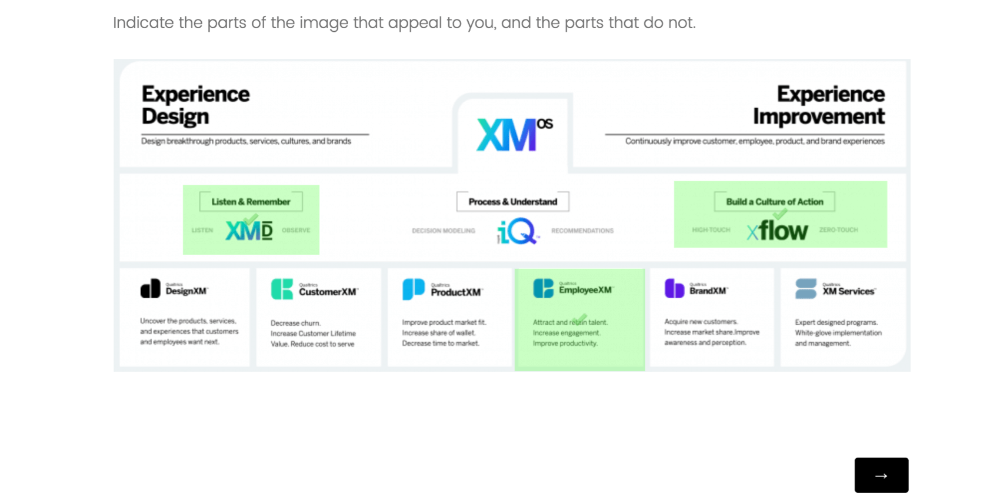](https://www.qualtrics.com/m/assets/support/wp-content/uploads//2021/04/hot-spot-1.png)

**Example:** You can use this question type in concept testing for print ads (“Which portions of this ad stand out to you?”) and in usability testing (“Which portions of this webpage are unclear?”).

* * *

* * *

## Setting Up a Hot Spot Question

1.  Click **Add new question.  
    [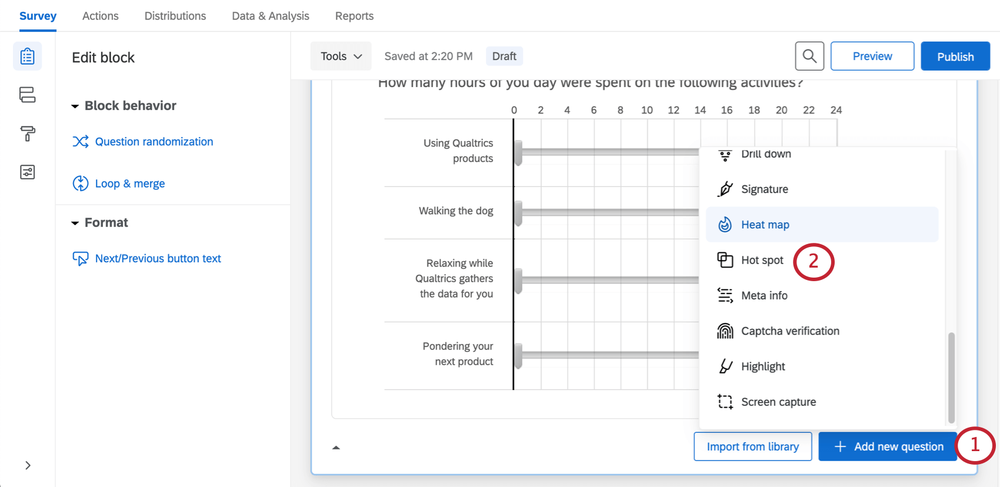](https://www.qualtrics.com/m/assets/support/wp-content/uploads//2021/04/hot-spot-2.png)  
    **
2.  Select **Hot spot**.
3.  Add a graphic, either by clicking **Choose graphic** in the editing pane, or clicking **Select a graphic to use in this question.**  
    [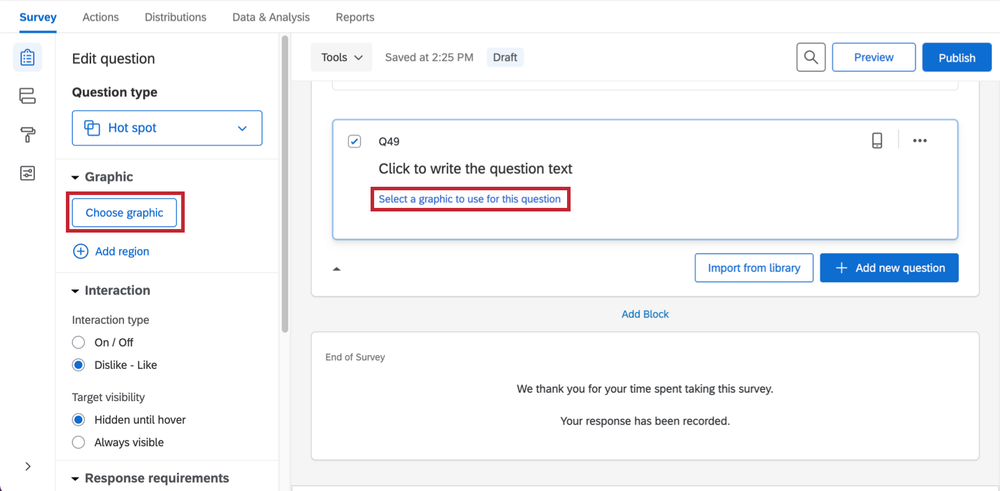](https://www.qualtrics.com/m/assets/support/wp-content/uploads//2021/04/hot-spot-3.png)
4.  Select a graphic you’ve already uploaded to your account or upload a new one from your computer.  
    [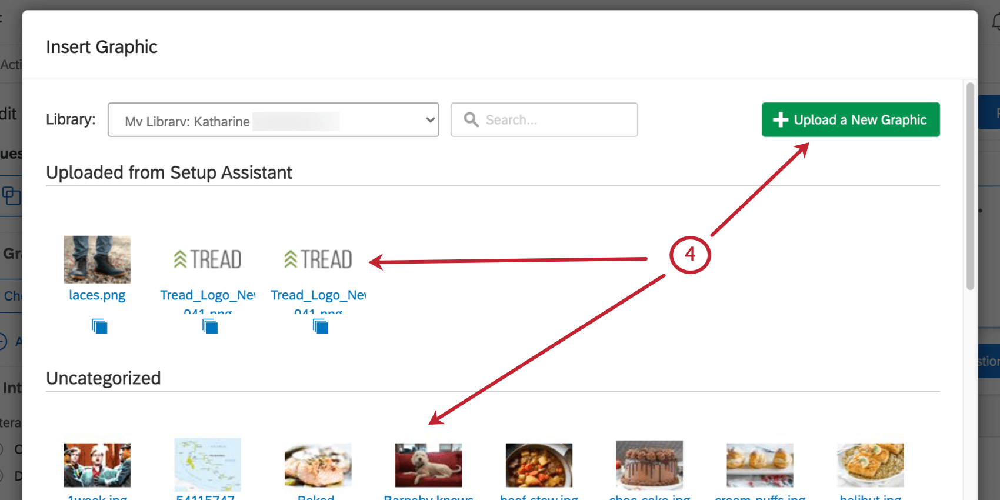](https://www.qualtrics.com/m/assets/support/wp-content/uploads//2021/04/hot-spot-4.png)
    
    **Qtip:** Qualtrics accepts most image file types, though we recommend saving your image as a PNG rather than a JPG.
    
5.  Click **Add Region** to add clickable regions.  
    [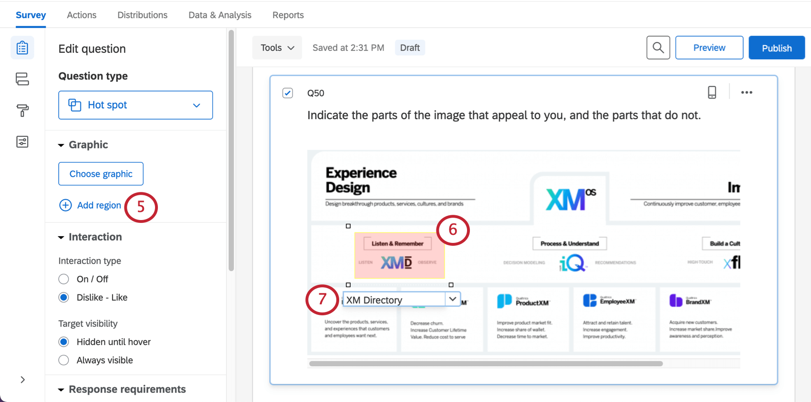](https://www.qualtrics.com/m/assets/support/wp-content/uploads//2021/04/hot-spot-5.png)
    
    **Warning:** Your hot spot question won’t collect data if you don’t add regions! If you are looking to create a heat map of generally clicked areas instead, you should create a [heat map question](https://www.qualtrics.com/support/survey-platform/survey-module/editing-questions/question-types-guide/specialty-questions/heat-map/).
    
6.  Click and drag the corners of the region to resize or move it.
7.  Click the text box beneath the region to type a region name (this name won’t display to respondents, but will be used in your survey results).
8.  Repeat steps 5–7 until all the necessary regions have been created.  
    [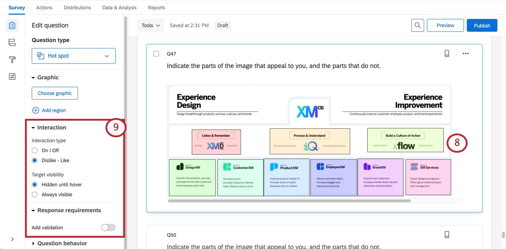](https://www.qualtrics.com/m/assets/support/wp-content/uploads//2021/04/hot-spot-6.png)
9.  Choose the question’s **Interaction type,** **Target visibility,** and **Response requirements**. Read more about these settings in the [Hot Spot Options](https://www.qualtrics.com/support/edit-survey/editing-questions/question-types-guide/specialty-questions/hot-spot#HotSpotOptions) section below.

* * *

* * *

## Custom Region Shapes

By default, all regions are rectangles. In certain scenarios, however, you may need custom region shapes. For example, on a map, you may need a free-form region shape to cover a specific city or country.

### Customizing a region’s shape

1.  Click anywhere on the region to select it.  
    [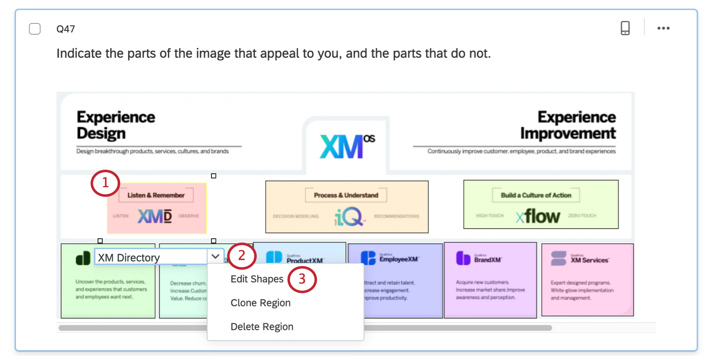](https://www.qualtrics.com/m/assets/support/wp-content/uploads//2021/04/hot-spot-7.png)
    
    **Qtip:** There are also options available to clone region (copy it) or delete it.
    
2.  Click the drop-down arrow next to the region name to open the region options.
3.  Choose **Edit Shapes**.
4.  Click any edge of the existing shape to add a new point to that edge, or you can use the **Add Point** button.  
    [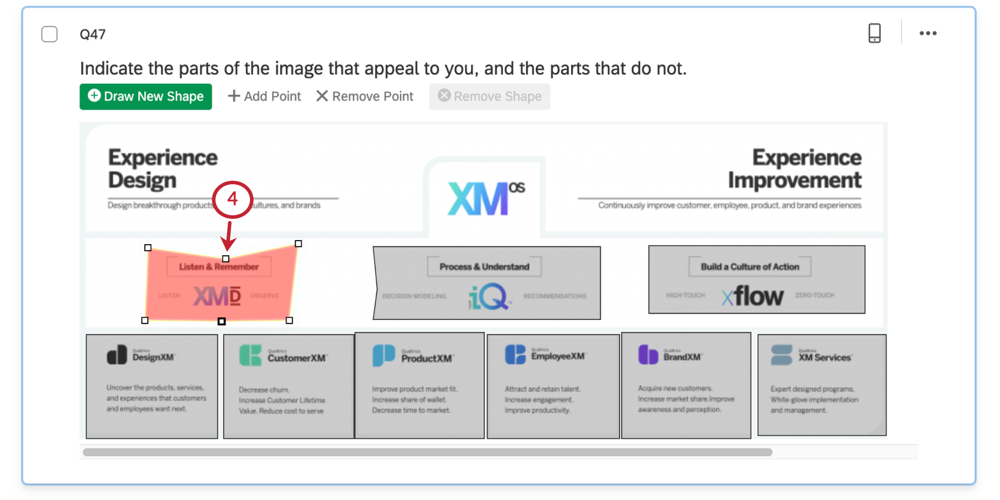](https://www.qualtrics.com/m/assets/support/wp-content/uploads//2021/04/hot-spot-8.png)
5.  Move the newly added points to create any shape you need.

**Qtip:** You can also use the blue shape editing toolbar at the top of the question to Draw New Shape, Add Point, Remove Point, or Remove Shape.  
[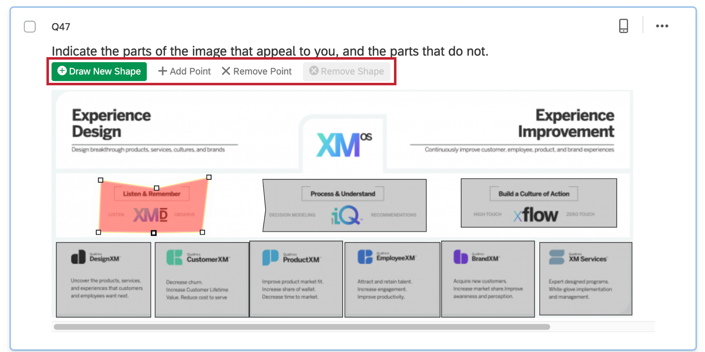](https://www.qualtrics.com/m/assets/support/wp-content/uploads//2021/04/hot-spot-9.png)

* * *

* * *

## Hot Spot Options

In addition to allowing you to add regions, the hot spot question has 3 options for customization.

### Interaction

Interaction settings determine how respondents interact with the hot spot.

[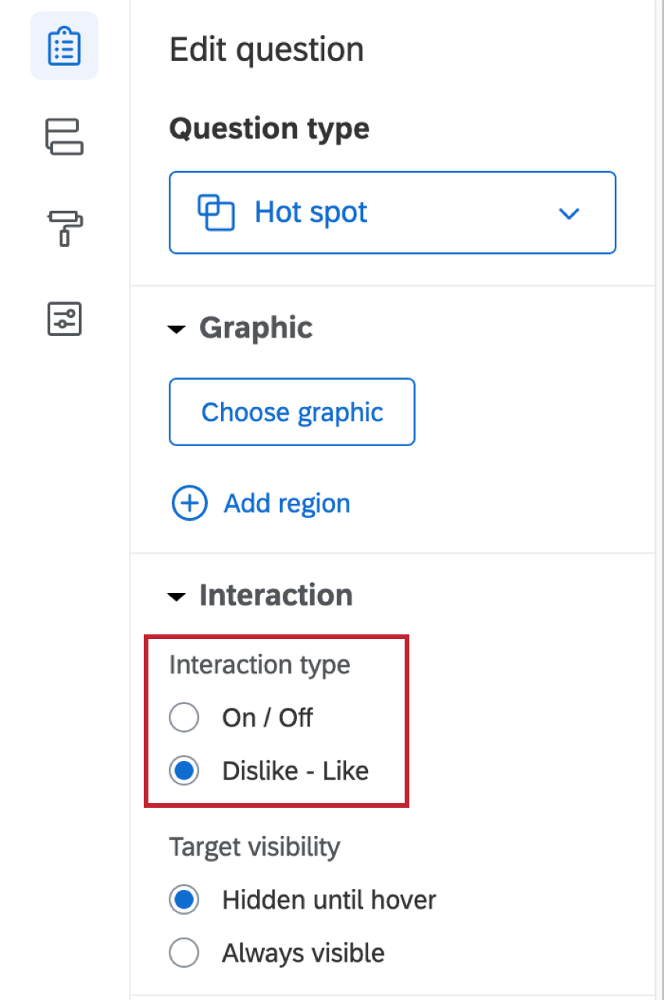](https://www.qualtrics.com/m/assets/support/wp-content/uploads//2021/04/hot-spot-10.png)

On/Off allows the respondent to either select or deselect a region.

[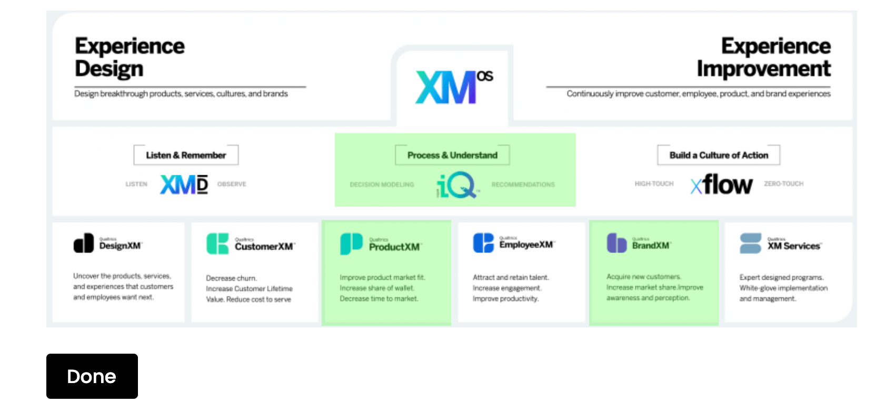](https://www.qualtrics.com/m/assets/support/wp-content/uploads//2021/04/hot-spot-11.png)

Like/Dislike allows a respondent to mark a region positively, mark a region negatively, or deselect a region.

[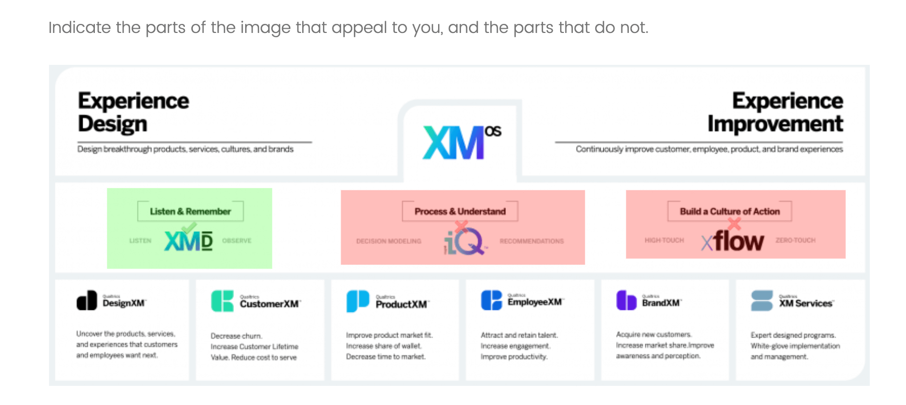](https://www.qualtrics.com/m/assets/support/wp-content/uploads//2021/04/hot-spot-12.png)

### Target visibility

[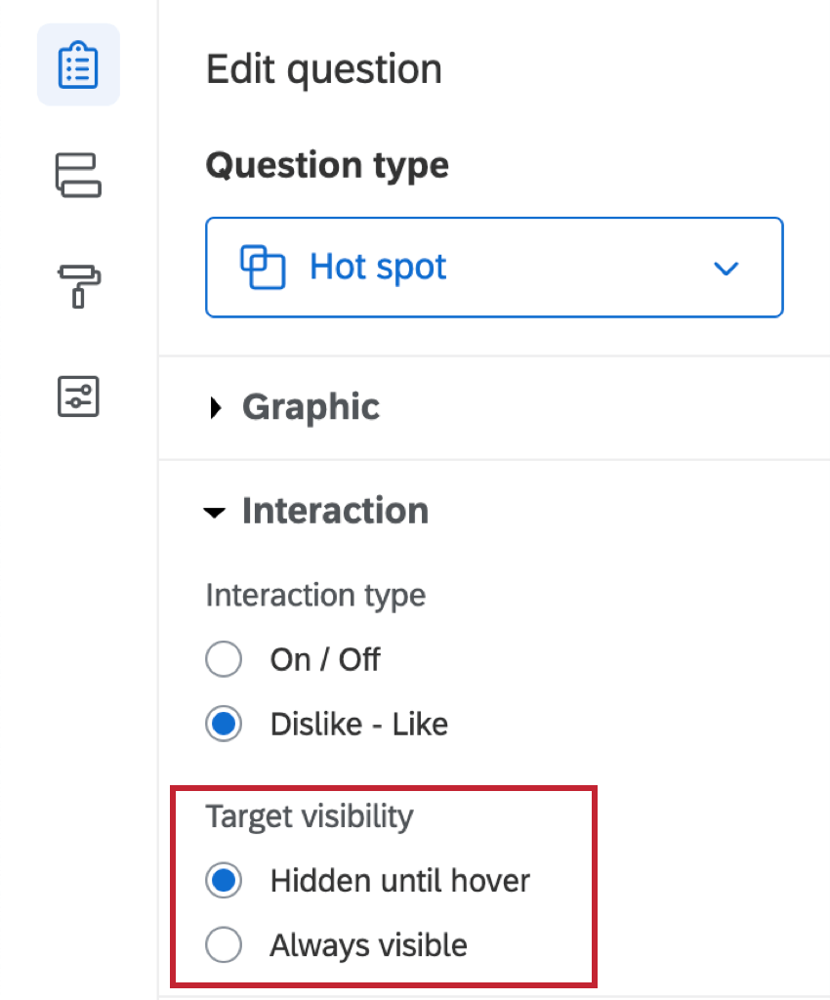](https://www.qualtrics.com/m/assets/support/wp-content/uploads//2021/04/hot-spot-13.png)

By default, regions do not display unless respondents hover over them. Alternatively, regions can be set to **Always visible**.

[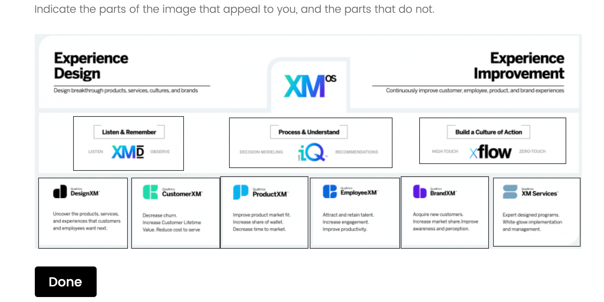](https://www.qualtrics.com/m/assets/support/wp-content/uploads//2021/04/hot-spot-14.png)

### Response Requirements

By default, respondents have no requirements for how they answer a hot spot question. If you click **Add validation**, you can add requirements.

**Minimum regions selected** allows you to define how many regions, minimum, have to be clicked.

[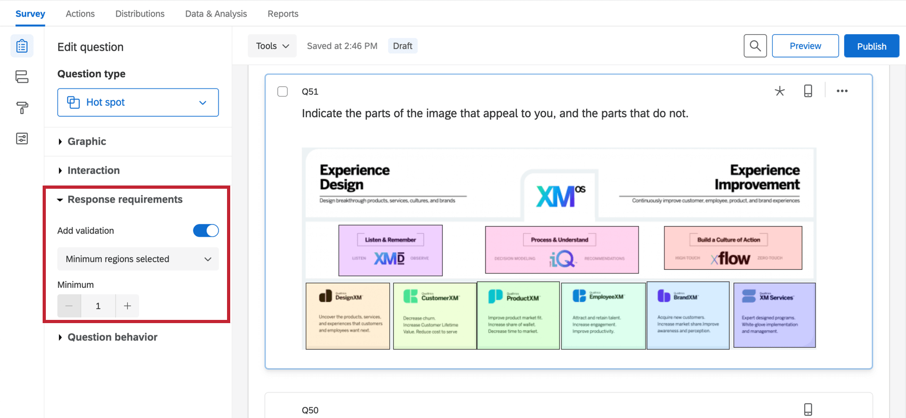](https://www.qualtrics.com/m/assets/support/wp-content/uploads//2021/04/hot-spot-15.png)

**Answer range** allows you to set a minimum and a maximum number of regions that must be selected.

[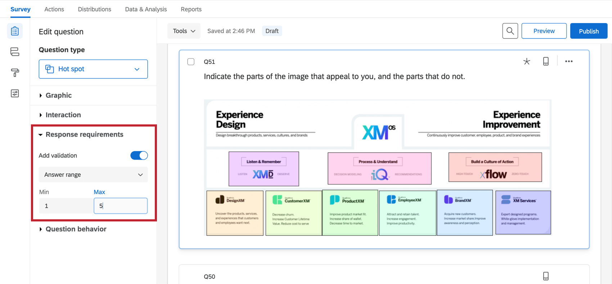](https://www.qualtrics.com/m/assets/support/wp-content/uploads//2021/04/hot-spot-16.png)

See our [Response Requirements & Validation](/support/edit-survey/editing-questions/validation/ "Validation") page to learn more about custom validation.

* * *

* * *

## Data Analysis

Once your responses have been collected, Qualtrics offers various ways you can analyze your response data. From the [Reports tab](https://www.qualtrics.com/support/survey-platform/reports-module/results-vs-reports/), you can view aggregate data in pre-made reports as well as create your own reports from scratch. From the [Data & Analysis tab](https://www.qualtrics.com/support/survey-platform/data-and-analysis-module/data-and-analysis-overview/), you can view and manage individual respondents’ data.

### Visualizations

Hot spots display data in reports by showing how many times each region was selected.

**Qtip:** Do you want to be able to display selections as a heat map? You shouldn’t be using the hot spot, but the [heat map question](https://www.qualtrics.com/support/survey-platform/survey-module/editing-questions/question-types-guide/specialty-questions/heat-map/) instead.

In the [Results](https://www.qualtrics.com/support/survey-platform/reports-module/results-section/reports-overview/) section of the Reports tab, there are 5 visualization types available for hot spot questions: [simple table](/support/results/visualizations/tables/simple-table/ "simple table"), [bar chart](/support/results/visualizations/charts/bar-chart/ "bar chart"), [line chart](/support/results/visualizations/charts/line-chart/ "line chart"), [pie chart](/support/results/visualizations/charts/pie-chart/ "pie chart"), and [breakdown bar](/support/results/visualizations/breakdown-bar/ "breakdown bar"). For more information on these visualizations, please visit the linked visualization support pages.

In the [Reports](https://www.qualtrics.com/support/survey-platform/reports-module/reports-section/paginated-reports-overview/) section of the Reports tab, the visualizations available for the hot spot are the [bar chart](https://www.qualtrics.com/support/survey-platform/reports-module/reports-section/reports-visualizations/chart-visualizations/bar-chart-visualization/), [line chart](https://www.qualtrics.com/support/survey-platform/reports-module/reports-section/reports-visualizations/chart-visualizations/line-chart-visualization/), and [statistics table](https://www.qualtrics.com/support/survey-platform/reports-module/reports-section/reports-visualizations/table-visualizations/statistics-table-visualization/). For more information on these visualizations, please visit the linked visualization support pages.

### Downloaded Data Format

In the [exported dataset](https://www.qualtrics.com/support/survey-platform/data-and-analysis-module/data/download-data/export-data-overview/), a column will be provided for each region.

If the hot spot question was set to Like / Dislike, a “Dislike” indicates dislike, a “Neutral” indicates neutral (the user didn’t select this region), and a “Like” indicates like.

If the hot spot question was set to On / Off, an unselected region will be indicated by  “Off”, and a selected region will be indicated by  “On”.

[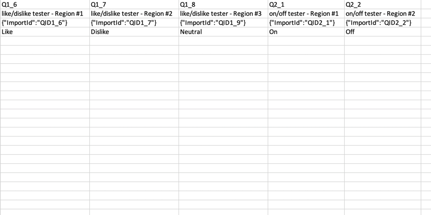](https://www.qualtrics.com/m/assets/support/wp-content/uploads//2021/02/Hotspot_download.png)

* * *

* * *

## FAQs

[What kind of project can I use this type of question in?](#faq-975) ×

For a full list of questions and their project compatibilities, see [this table.](https://www.qualtrics.com/support/survey-platform/survey-module/editing-questions/question-types-guide/question-types-overview/#Compatibility)