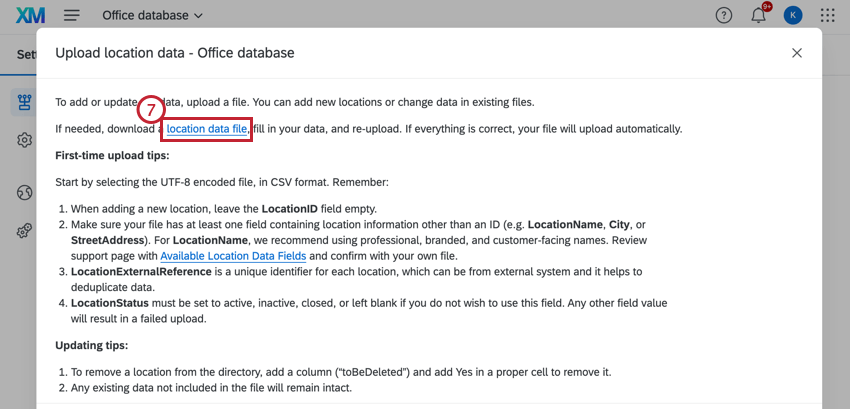
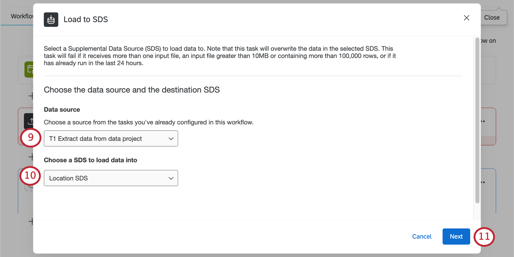

# Location Data Management

## About Location Data Management

In Qualtrics, you can establish a source of truth for your organization’s location data, that you can then reference in different projects and dashboards. This lets you collect comprehensive feedback on all of your locations, and analyze them accordingly. This is also especially useful if you ever need to update your list of locations; you only need to edit one source to make updates all across the program.

**Qtip**: Location directories are shared globally within your brand, meaning any user with access to your brand also has access to the location directories created. When a directory is created, an [Imported Data Project](https://www.qualtrics.com/support/survey-platform/my-projects/imported-data-projects/#Actions) is automatically created using the following syntax: “\[Location directory\] <directory name>”. These projects are only shared with the creator of the directory by default. IDPs are useful for using location data for [survey customization](https://www.qualtrics.com/support/common-use-case/analyzing-results/corexm-analysis/location-data/#CustomizingSurveyswithSupplementalData) and [dashboard reports](https://www.qualtrics.com/support/common-use-case/analyzing-results/customer-experience-dashboards/using-location-data-in-dashboards/), but must be shared with the necessary users to apply to these project types. See [Imported Data Projects](https://www.qualtrics.com/support/survey-platform/my-projects/imported-data-projects/#Actions) for more information.

**Qtip:** To access and manage the location directory, you need the **Manage Location Data** permission. To create location directories, you need the **Use Imported Data Projects** permission.

* * *

Was this helpful?

YesNo

* * *

## Uploading Locations to a Directory

1.  Go to the global navigation menu, then select **Directories**.  
    
2.  If you have Employee Experience or XM Directory you may see other directory options. Select **Location Directory**.  
    
3.  Click **Add location directory**.  
    
4.  Enter a name for your location data.  
    
5.  Click **Save location directory**.
6.  Click **Add locations data**.  
    
7.  Click **location data file**.  
    
8.  Edit your file so each row represents a specific location. Make sure you also include the fields required for your specific use case.  
    
    
    **Attention:** Leave the Location ID field blank. If you have IDs you already use for your locations, put them in the LocationExternalReference column instead.
    
    **Qtip:** See required fields for [location selectors](https://www.qualtrics.com/support/survey-platform/survey-module/editing-questions/question-types-guide/advanced/location-selector-question/#RequiredLocationDataFieldsforLocationSelectors) and [reputation management](https://www.qualtrics.com/support/integrations/online-reputation-management/reputation-management-projects/searching-the-web-for-reviews-rm/#BusinessLocations). See a [full list of fields](https://www.qualtrics.com/support/common-use-case/analyzing-results/corexm-analysis/location-data/#AvailableLocationDataFields).
    
9.  Save your file as a TSV or CSV with UTF-8 encoding.
10.  Click **Choose file** to upload the spreadsheet you created.  
    
11.  Click **Validate and upload file**.

When a file is successfully validated, the file begins to automatically upload to the directory.

You’ll see a banner in the locations directory showing the upload’s progress, including whether all locations were successfully imported, or if there were issues detected in the file.

* * *

Was this helpful?

YesNo

* * *

## Troubleshooting File Upload Issues

If there are issues with your file and no locations can be successfully uploaded, a message will appear, and you’ll be able to try again.

If only a few locations were successfully uploaded, you’ll see a summary of how many locations were added, whereas how many locations had issues and couldn’t be added.

You can always download your directory to see which locations succeeded:

1.  Click **View locations** next to a location directory.  
    
2.  Click the **Download locations** button to download a CSV file to your computer.

### File formatting

-   The location directory only supports TSV or  CSV files with UTF-8 formatting. The directory does not support XLSX or any other file types.
-   The maximum file you can upload is 100 MB.

**Qtip:** For additional help with TSV and CSV file formatting, see [CSV and TSV Upload Issues](https://www.qualtrics.com/support/survey-platform/contacts/csv-upload-issues/).

### Reasons for file failure

-   Includes a location ID that doesn’t already exist in the directory. (If updating a location.)
-   Contains [columns of data that aren’t supported](https://www.qualtrics.com/support/common-use-case/analyzing-results/corexm-analysis/location-data/#AvailableLocationDataFields).
-   Does not contain **any** location information other than an ID. (E.g., no location name, city, or address.)
-   Has a “Location Status” is set to anything other than active, inactive, or closed. You can also leave the status blank.
-   Has a latitude greater than or equal to 90, or lesser than or equal to -90.
-   Has a longitude greater than or equal to 180, or lesser than or equal to -180.

* * *

Was this helpful?

YesNo

* * *

## Editing Locations

If you want to remove locations or change how they appear in the location selector, you can return to the location directory.

Go to the global navigation menu, select **Directories**, then select **Location Directory**.

  
Then, click **View locations** next to 1 of your location directories. 

Once there, you can do the following:

1.  **Search**: Find a specific location to make changes to. Note that search is only compatible with default [location fields](https://www.qualtrics.com/support/common-use-case/analyzing-results/corexm-analysis/location-data/#AvailableLocationDataFields).
2.  **Add location:** Add an individual location to the directory by filling out the fields provided. Click the arrow next to the button to upload a CSV with location data. This is helpful if you’d like to add or edit locations in bulk.
3.  **Download locations**: Download the CSV of your location data. You can edit this to add and remove locations. Make sure to keep all locations you want to include.
4.  **Edit**: Make changes to a given location’s existing fields.
5.  **Delete**: Delete a select location from the directory.
6.  **View**: Select a location and view all related field values in the righthand panel.

### Displayed address

You can decide what information you want to display with each [location in the selector](https://www.qualtrics.com/support/survey-platform/survey-module/editing-questions/question-types-guide/advanced/location-selector-question/). You can choose 3 from any of the fields mapped to the location directory. When you’re finished, click **Save**.

* * *

Was this helpful?

YesNo

* * *

## Location Settings

The settings menu provides different settings that you can configure for your directory.

### Data Sources

The data sources tab contains a list of the data sources used in the location directory you selected. Click **Add or update location data** to upload a location list.

-   To add a new location: leave the “LocationID” field empty.
-   To update existing locations: edit the fields you would like to update but leave the existing “LocationID” field the same. For more information, see [Uploading Locations to a Directory](https://www.qualtrics.com/support/common-use-case/analyzing-results/corexm-analysis/location-data/#UploadingLocationstoaDirectory).
-   To delete a location: Add a column with the title “toBeDeleted”, then enter “yes” for the rows of locations you would like to delete. These values are case sensitive. See [Deleting Locations from a Directory](https://www.qualtrics.com/support/common-use-case/analyzing-results/corexm-analysis/location-data/#DeletingLocationsfromaDirectory) for more information.

**Qtip:** Any existing data not included in the uploaded file will remain the same.

### Schema Settings

The schema settings contain the location fields used in your directory. Click **Create a custom location field** to add a new field to the directory.

1.  Name the custom field.
2.  Set the custom field type.
3.  Delete the custom field and cancel changes.
4.  Save the custom field.

**Qtip:** Custom fields are shared across all location directories. You can create up to 30 custom fields per brand. Once custom fields are created, they cannot be deleted.

### Displayed Address

You can decide what information you want to display with each [location in the selector](https://www.qualtrics.com/support/survey-platform/survey-module/editing-questions/question-types-guide/advanced/location-selector-question/). You can choose 3 from any of the fields mapped to the location directory. When you’re finished, click **Save**.  

### Delete Directory

**Warning:** Deleting a location directory will impact any dashboards, location selectors, or reputation management projects it’s connected to. Once a location directory is deleted, it is **irretrievable**, and you will need to create a new directory to connect to selectors and projects.

1.  Click **View locations** for the directory you’d like to delete.
2.  In the **Settings** tab, go to **Manage directory**.  
    
3.  Click **Delete directory**.
4.  Select **I understand that all users will lose access to this directory**.
5.  Enter the name of the directory.
6.  Click **Delete directory**.

### Active Projects

Navigate to the **Active projects** tab to view the projects that currently use data from your location directory. For example, a project that uses [location selector questions](https://www.qualtrics.com/support/survey-platform/survey-module/editing-questions/question-types-guide/advanced/location-selector-question/) would be here. Click **Go to project** to open a specific project.  

* * *

Was this helpful?

YesNo

* * *

## Deleting Locations from a Directory

You can [delete individual locations](https://www.qualtrics.com/support/common-use-case/analyzing-results/corexm-analysis/location-data/#EditingLocations) from your directory manually. To remove multiple locations at once, you can upload a file:

**Qtip:** If you have an automation such as a workflow set up for your locations, we recommend also deleting the location from your automation source (such as your Google Business account). Otherwise, the location will be added back when your automation runs.

1.  Go to the location directory by selecting **Directories** from the global navigation menu, then selecting **Location Directory**.  
    
2.  Click **View locations** next to the location directory that contains the locations you’d like to delete.
3.  Click **Download locations**.  
    
4.  Open your file and add a column named **toBeDeleted**.
    
    **Qtip:** This column is case-sensitive.
    
5.  Under this column, mark each location you’d like to delete as either “yes,” “y,” or “true.” (Without punctuation.)
6.  In Qualtrics, click the arrow next to the **Add locations** button and select **Add more locations**. 
7.  Select your file with the deleted locations.

**Qtip:** Alternatively, you can delete a single location by clicking the options menu next to the location and selecting **Delete**.

* * *

Was this helpful?

YesNo

* * *

## Available Location Data Fields

**Attention:** We highly recommend [exporting a sample file](https://www.qualtrics.com/support/common-use-case/analyzing-results/corexm-analysis/location-data/#UploadingLocationstoaDirectory) before you create a file of location data.

One of the steps to set up a location directory is to create a file of the locations you want to be able to use in Qualtrics. Below, we’ll give you a list of all of the fields we support.

**Qtip:** If there are additional location fields you’d like to include that aren’t covered here, you can add them as custom fields. For more information, see [Schema Settings.](https://www.qualtrics.com/support/common-use-case/analyzing-results/corexm-analysis/location-data/#LocationSettings)

-   **LocationName**: Provides a recognizable name for each entry in the directory, allowing users to easily identify and manage different locations (e.g. “Qualtrics Provo”). These should be professional, branded, customer-facing names, and should ideally match what appears in Google Maps. This field is required for [Search The Web](https://www.qualtrics.com/support/integrations/online-reputation-management/getting-started-with-online-reviews-qualtrics/#TypesofProjects) projects.
-   **LocationID**: This is a unique identifier automatically assigned by the Qualtrics system. For first time imports or when adding new locations to an existing directory, make sure to include this column, but leave the values blank. This field is required for [Search The Web](https://www.qualtrics.com/support/integrations/online-reputation-management/getting-started-with-online-reviews-qualtrics/#TypesofProjects) projects.
    
    **Warning:** You **must** leave location IDs blank to upload a new location. [Upload existing location IDs to make updates to existing locations](https://www.qualtrics.com/support/common-use-case/analyzing-results/corexm-analysis/location-data/#UploadingLocationstoaDirectory).
    
    **Qtip:** Once location IDs are generated, they take the format LOC\_XXXXXX.
    
    **Warning:** Records with existing location IDs will have all non-null fields overwritten with the revised values in the new CSV file when uploaded, including LocationExternalReference.
    
-   **LocationExternalReference**: Relies on a unique identifier from your internal system of record, and is often used to rehydrate datasets in systems external to Qualtrics or to deduplicate locations across directories. This field is required for [Search The Web](https://www.qualtrics.com/support/integrations/online-reputation-management/getting-started-with-online-reviews-qualtrics/#TypesofProjects) projects.
    
    **Warning**: Using an internal field that does not act as a unique identifier to populate values in the LocationExternalReference column may result in data inconsistencies.
    
-   **City**: The city that the location is in (e.g. “Atlanta”). This field is required for [Search The Web](https://www.qualtrics.com/support/integrations/online-reputation-management/getting-started-with-online-reviews-qualtrics/#TypesofProjects) projects.
-   **CountryRegion**: The country or region that the location is in (e.g. “United States” or “Midwest”). This field is required for [Search The Web](https://www.qualtrics.com/support/integrations/online-reputation-management/getting-started-with-online-reviews-qualtrics/#TypesofProjects) projects.
-   **Department**: The department or location type that the location is associated with (e.g. “Outlet Store”).
-   **District**: The district that the location is in. This is typically the District ID.
-   **GoogleMapsURL**: The Google Maps URL of the location. This field makes [Search The Web](https://www.qualtrics.com/support/integrations/online-reputation-management/getting-started-with-online-reviews-qualtrics/#TypesofProjects) projects more precise.
-   **LocationEmail**: The email that feedback for the location should be sent to.
-   **LocationLatitude:** The latitudinal coordinates for the location (e.g. “40.3030”). The coordinates should be in decimal degrees, within the range of -90 to 90.
    
    **Qtip:** The [location selector question](https://www.qualtrics.com/support/survey-platform/survey-module/editing-questions/question-types-guide/advanced/location-selector-question/) has a “Nearby” feature that will search which of the locations you provided is closest to the survey respondent. To activate this feature, your data file **must** include latitude and longitude fields.
    
-   **LocationLongitude**: The longitudinal coordinates for the location (e.g. “111.6634”). The coordinates should be in decimal degrees, within the range of -180 to 180.
-   **LocationPhoneNumber**: The phone number used by customers to reach a specific location.
-   **LocationStatus**: Indicates whether this location is operating under usual business hours, is temporarily closed, or has been permanently closed.
    
    **Qtip:** Values should only be set to active, inactive, closed, or otherwise left empty (null).
    
    **Warning:** Failure to use the pre-defined values for this field will result in a failed data upload for the locations with this field assigned incorrectly.
    
-   **PostalCode**: The zip code of the location. This field is required for [Search The Web](https://www.qualtrics.com/support/integrations/online-reputation-management/getting-started-with-online-reviews-qualtrics/#TypesofProjects) projects.
-   **StateProvince**: The country or region of the location (e.g. “Utah” or “Nova Scotia”). This field is required for [Search The Web](https://www.qualtrics.com/support/integrations/online-reputation-management/getting-started-with-online-reviews-qualtrics/#TypesofProjects) projects.
-   **StreetAddress**: The street address of a physical location. Values in this field should contain a building number and street name (e.g. “333 River Park Dr”).
-   **LastUpdateDate**: For directories that have been updated at least once, this field indicates the date that a given location entry was last updated.
-   **CreationDate**: Once a directory is established, this field indicates the date that a given location entry was created.
-   **GoogleAccountName**: The name of the Google Business account used to manage the location’s Business Profile.
-   **GoogleLocationName**: The name used to represent the location on Google.
-   **GooglePlaceID**: The unique identifier populated by Google for your location. This type of identifier is created by Google to organize places such as businesses, landmarks, parks, and intersections
-   **GoogleStoreCode**: The unique identifier assigned to each location in your Google Business Profile.

**Attention:** For the fields required by each solution, see [Required Location Data Fields for Location Selectors](https://www.qualtrics.com/support/survey-platform/survey-module/editing-questions/question-types-guide/advanced/location-selector-question/#RequiredLocationDataFieldsforLocationSelectors) and [Required Fields for Reputation Management](https://www.qualtrics.com/support/integrations/online-reputation-management/reputation-management-projects/searching-the-web-for-reviews-rm/#BusinessLocations).

* * *

Was this helpful?

YesNo

* * *

## Customizing Surveys with Supplemental Data

Using supplemental data sources (SDS) in your [survey projects](https://www.qualtrics.com/support/survey-platform/getting-started/survey-platform-overview/) lets you use location data to customize the survey experience and enhance your data analysis. You’ll be able to customize what customers see based on their location, and you’ll be able to pull in a lot of location data without having to individually save  each piece of information in the survey itself.

Once you set up supplemental data in the same survey as your [location selector](https://www.qualtrics.com/support/survey-platform/survey-module/editing-questions/question-types-guide/advanced/location-selector-question/) or [solicit reviews question](https://www.qualtrics.com/support/integrations/online-reputation-management/solicit-reviews-question/), you’ll be able to use the following features:

-   [Display logic](https://www.qualtrics.com/support/survey-platform/survey-module/question-options/display-logic/)
-   [Branch logic](https://www.qualtrics.com/support/survey-platform/survey-module/survey-flow/standard-elements/branch-logic/)
-   [Piped text](https://www.qualtrics.com/support/survey-platform/survey-module/editing-questions/piped-text/piped-text-overview/)

In addition, you will then be able to save your location data as [embedded data](https://www.qualtrics.com/support/survey-platform/survey-module/survey-flow/standard-elements/embedded-data/), which can be used in [results dashboards](https://www.qualtrics.com/support/survey-platform/reports-module/results-dashboards/results-dashboard-overview/), [reports](https://www.qualtrics.com/support/survey-platform/reports-module/reports-section/paginated-reports-overview/?parent=p002), [Stats iQ](https://www.qualtrics.com/support/stats-iq/getting-started-with-stats-iq/overview-stats-iq/), and more.

1.  [Create your location directory](https://www.qualtrics.com/support/common-use-case/analyzing-results/corexm-analysis/location-data/#UploadingLocationstoaDirectory).
    
    **Qtip:** If you’re using a [solicit reviews question](https://www.qualtrics.com/support/integrations/online-reputation-management/solicit-reviews-question/), make sure you’ve got your [your Google Place IDs](https://www.qualtrics.com/support/integrations/online-reputation-management/solicit-reviews-question/#GooglePlaceIDs) so you can add them to the location directory.
    
2.  Use the same data file to [create a supplemental data source (SDS)](https://www.qualtrics.com/support/survey-platform/survey-module/sds/supplemental-data-sources-basic-overview/#CreatingandUploadingYourFile).  
    
3.  Now we need to make sure the SDS will stay updated with the same location info as the directory. First, [create a scheduled workflow](https://www.qualtrics.com/support/survey-platform/actions-page/building-workflows/#Schedule).  
    
4.  Add an [**Extract data from data project**](https://www.qualtrics.com/support/survey-platform/actions-page/etl-workflows/data-extractor-tasks/extract-data-from-data-project-task/) task.  
    
5.  When you select an **Imported data** **project**, make sure to select your **location directory**.  
    
6.  Finish the task and save changes.
7.  Click **Add a data** **destination**.  
    
8.  Select [**Load to SDS**](https://www.qualtrics.com/support/survey-platform/actions-page/etl-workflows/data-loader-tasks/load-to-sds-task/).  
    
9.  Under **Data Source**, select the task you made in step 4.  
    
10.  Under **Choose a SDS to load data to**, select the SDS you made with your location data in step 2.
11.  [Finish the task](https://www.qualtrics.com/support/survey-platform/actions-page/etl-workflows/data-loader-tasks/load-to-sds-task/) and save changes.
12.  Activate your workflow. This ensures whenever you update your location directory, your SDS will later update with the same new info on the schedule you chose.  
    
13.  Open the survey you want to connect location data to.  
    
14.  Open the **Survey flow**.
15.  Add a supplemental data source and [move it](https://www.qualtrics.com/support/survey-platform/survey-module/survey-flow/survey-flow-overview/#AddingElements) according to your use case:  
    
    
    -   **For surveys with [location selector questions](https://www.qualtrics.com/support/survey-platform/survey-module/editing-questions/question-types-guide/advanced/location-selector-question/)**:[Move the SDS](https://www.qualtrics.com/support/survey-platform/survey-module/survey-flow/survey-flow-overview/#AddingElements) so that the source comes **after** the question block that asks your respondents to choose their location.
    -   **For surveys with [solicit reviews questions](https://www.qualtrics.com/support/integrations/online-reputation-management/solicit-reviews-question/):** [Move the SDS](https://www.qualtrics.com/support/survey-platform/survey-module/survey-flow/survey-flow-overview/#AddingElements) to the **top** of the survey flow, or at least anywhere **before** the block where the solicit reviews question appears.
16.  For **Database**, select the SDS you created.
17.  Under **Choose Columns to Search On**, choose the ID you’ll use to find specific locations:  
    
    
    -   **For surveys with [location selector questions](https://www.qualtrics.com/support/survey-platform/survey-module/editing-questions/question-types-guide/advanced/location-selector-question/)**: Select the Location ID column.
    -   **For surveys with [solicit reviews questions](https://www.qualtrics.com/support/integrations/online-reputation-management/solicit-reviews-question/):** Select the Google Place ID field.
        
        **Qtip:** For surveys with both question types, try the location ID. However, you’ll need to make sure you add the embedded data for google place IDs in step 19.
        
18.  Now we’ll map the location directory field to the survey field:
    -   **For surveys with [location selector questions](https://www.qualtrics.com/support/survey-platform/survey-module/editing-questions/question-types-guide/advanced/location-selector-question/)**: Set it equal to the answer of the location selector question.
    -   **For surveys with [solicit reviews questions](https://www.qualtrics.com/support/integrations/online-reputation-management/solicit-reviews-question/):** Set it equal to the embedded data for Google Place ID (e.g., GooglePlaceID).
        
        **Qtip:** Use the dropdown to access the piped text menu. Don’t select “Question Text.”
        
19.  Click **Add Embedded Data** and add whatever additional location information you’d like to customize your survey with.
    
    **Example:** We added the country and location name because we want to use these in branch logic and piped text.  
    
    
20.  You can now create branch logic based on the location the respondent selected.
    
    **Example:** We are directing the respondent to a different set of survey questions if the selected location is in France.  
    
    
21.  Back in the survey builder, you now pipe text from the respondent’s answer to the location selector.
    
    **Example:** Here, we’re thanking the respondent for visiting a particular location.  
    
    

**Attention:** All logic and piped text should be based on the embedded data you created in step 19.

* * *

Was this helpful?

YesNo

* * *

## Managing Location Directories from Imported Data Projects

**Attention:** [Directly imported location directories](https://www.qualtrics.com/support/common-use-case/analyzing-results/corexm-analysis/location-data/#UploadingLocationstoaDirectory) have several performance and functionality improvements that imported data project directories do not. We recommend [directly importing your location data](https://www.qualtrics.com/support/common-use-case/analyzing-results/corexm-analysis/location-data/#UploadingLocationstoaDirectory) instead.

**Qtip:** If you are using an imported data project rather than uploading a file directly, it may take up to 24 hours for you to see the updated values in the location selector.

You can no longer create location directories using [imported data projects](https://www.qualtrics.com/support/survey-platform/my-projects/imported-data-projects/). However, if you’ve made such location directories in the past and want to edit or delete them, go to the location directory, then go to the **Data from Imported Data Project** tab.

Click the edit icon to adjust field mappings or the displayed addresses for location selector questions.

### Formatting Imported Data Fields

In the [imported data project](https://www.qualtrics.com/support/survey-platform/my-projects/imported-data-projects/), you **must** set a unique ID. This unique ID **must be a text value**, even if it’s actually a numeric ID.

If you included latitude and longitude fields, make sure they are mapped as **numeric values**.

**Qtip:** If you ever need to change the available locations, you’ll need to edit your original locations data file and re-import the updated file into this **imported data project**. Any new data must be [re-imported](https://www.qualtrics.com/support/survey-platform/my-projects/data-analysis-in-imported-data-projects/#ReImportingData). Once the data is re-imported, it may take up to 24 hours for you to see the updated values in the location selector.

### Mapping Location Directory Fields

1.  Go to the location directory by selecting **Directories** from the global navigation menu, then selecting **Location Directory**.
2.  Go to the **Data from Imported Data Project** tab.
3.  Click the pencil icon next to your directory.  
    
4.  Map the default fields. Determine what columns in your file match the location ID and location name.  
    
5.  To map more fields, click **Add a field**.
    
    **Attention:** Each field can only be mapped **once**.
    
6.  Set the displayed address. These fields will automatically populate so that the location name is shown above the address itself, but you can change these as needed.  
    
7.  Click **Save**.

* * *

Was this helpful?

YesNo

* * *

## FAQs

[How do I reach the location directory?](#faq-965) ×

The easiest way to reach the location directory is to go to the global navigation menu, select Directories, then select Location Directory.  
  
We also link to the location directory in the platform when you create a [location selector question](https://www.qualtrics.com/support/survey-platform/survey-module/editing-questions/question-types-guide/advanced/location-selector-question/) and when you create a [reputation management project based on searching the web](https://www.qualtrics.com/support/integrations/online-reputation-management/reputation-management-projects/searching-the-web-for-reviews-rm/).  
  

[If I edit a location's data in a location directory, will this change be applied retroactively to my dashboard data?](#faq-966) ×

Yes, any changes to the location data stored in a location directory will retroactively apply whenever that data is being used (e.g., dashboards, filters, and location selector questions).

[Can I use my location data in dashboard reporting?](#faq-967) ×

Yes! See [Using Location Data in Dashboards](https://www.qualtrics.com/support/common-use-case/analyzing-results/customer-experience-dashboards/using-location-data-in-dashboards/).