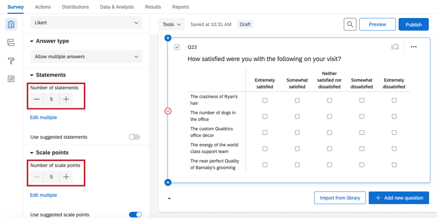
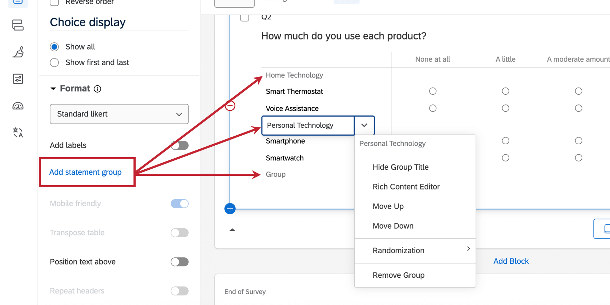
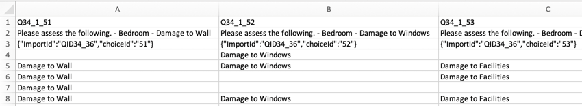

# Matrix Table Question

## About Matrix Table Questions

Matrix table questions allow you to combine multiple questions that have the same answer choices. This is most useful when you need to ask multiple questions that should be rated on the same scale.

There are several variations on the matrix table question. Each variation has unique options and a unique format.

* * *

Was this helpful?

YesNo

* * *

## Statements vs. Scale Points

**Statements** are the rows of the matrix table. These are the items you’d like a respondent to rate.

**Scale points** are the columns of the matrix table. These are the ratings you want respondents to choose for each statement.

When you set your matrix table to [single answer](https://www.qualtrics.com/support/survey-platform/survey-module/editing-questions/question-types-guide/standard-content/matrix-table/#AdditionalOptions), you can choose 1 scale point for every statement. This is the same even if the table is [transposed](https://www.qualtrics.com/support/survey-platform/survey-module/editing-questions/question-types-guide/standard-content/matrix-table/#AdditionalOptions) so that statements become columns and scale points become rows.

### Adding and Removing Statements and Scale Points

Use the plus (**+**) and minus (**–**) buttons under **Statements** and **Scale points** to adjust the number of statements and scale points.

You can also click directly on the name of a statement or scale point and press Enter for each option you want to add, or use **Edit multiple** to change the text. See [adding and editing questions](https://www.qualtrics.com/support/survey-platform/survey-module/editing-questions/formatting-answer-choices/#AddingAndEditingAnswerChoices) for more information.

**Qtip:** When adding statements or scale points, you have the option to select from [suggested choices](https://www.qualtrics.com/support/survey-platform/survey-module/editing-questions/formatting-answer-choices/#AutomaticChoices). This can be a quick way to add common choices, such as an “agree to disagree” scale, in a single click.  

**Qtip:** You can adjust the width of the column containing your statements by clicking and dragging the vertical line to the left of your statements.

* * *

Was this helpful?

YesNo

* * *

## Variations

To access matrix table variations, use the **Matrix type** drop-down menu. Note that each variation will bring up a different set of question editing options.  

**Qtip:** Some matrix variations are [unsupported](https://www.qualtrics.com/support/survey-platform/survey-module/look-feel/simple-layout/#CurrentlyUnsupported) in the new survey taking experience. If you’d like to use a variation but find it unavailable, then you must [revert your survey to the legacy experience](https://www.qualtrics.com/support/survey-platform/survey-module/look-feel/simple-layout/#Reverting).

### Likert

The **Likert** variation displays a list of statements (rows) and scale points (columns) in a table format. You can determine how respondents answer the question using the **Answer type** dropdown:  

-   **Allow one answer**: The respondent can select 1 scale point per statement.
-   **Allow multiple answers:** The respondent can select multiple scale points per statement.
-   **Dropdown list**: The respondent selects 1 scale point per statement using a drop-down menu.
-   **Drag and drop**: The respondent selects 1 scale point per statement by dragging and dropping scale points into statement buckets.

### Bipolar

The **Bipolar** variation displays 2 extremes of a scale. Respondents select a point between the 2 extremes.

### Rank Order

The **Rank order** variation allows respondents to rank a set of scale points by typing in a number for each scale point.

You can include multiple statements and allow the respondent to rank the scale points for several different topics (e.g., “Please rank the following topics from 1–5 for each of the following restaurants”).

### Constant Sum

The **Constant sum** variation allows respondents to allocate resources among the items in each row. As the respondent provides answers, the total resources can be displayed to the respondent.

Constant sum matrix tables have the following unique options to help you customize the survey taking experience:  

1.  **Add total box**: Adds a total box that sums the entered values. You can position the box on either the statements or scale points.
2.  **Add symbol**: Adds a symbol before or after each box. This is useful for adding currency symbols.
3.  **Add range requirement**: Allows you to specify a minimum and maximum value for every box.

**Qtip:** In the above example, you’ll notice you can also position where you want the total box to appear on the matrix. Here, the totals show up along the bottom, adding up the values in the columns (scale points).

### Text Entry

With the **Text entry** variation, each row contains a set of text entry boxes. This variation looks and acts similar to the [text entry – form](/support/edit-survey/editing-questions/question-types-guide/text-entry/ "Text Entry") question type. You can specify the size of the text boxes (short, medium, long) using the **Text box Size** option.

You can use the **Add validation** options to specify what type of content the boxes will allow. You can restrict character ranges, maximum and minimum character length, and [custom validation](https://www.qualtrics.com/support/survey-platform/survey-module/editing-questions/validation/#CustomValidation).

### Profile

The **Profile** variation allows you to label every single scale point within the matrix table separately so each row can have its own scale points. To enable the profile variation, select the **l****ikert** matrix table and change the format to **p****rofile.**

Question options can be single answer, multiple answer, or a dropdown list.

### MaxDiff

MaxDiff is a specialized variation of the matrix table that allows respondents to choose 1 option in each of 2 categories.

**Qtip:** Interested in running a MaxDiff project? Check out our support pages on the [MaxDiff XM Solution.](https://www.qualtrics.com/support/conjoint-project/getting-started-conjoints/getting-started-maxdiff/getting-started-with-maxdiff-projects/)

**Qtip:** If you need to add more than 1 scale to the same set of statements, try using a [side by side](https://www.qualtrics.com/support/survey-platform/survey-module/editing-questions/question-types-guide/standard-content/side-by-side/) question instead.  

* * *

Was this helpful?

YesNo

* * *

## Carousel View

Carousel view allows survey takers to view matrix tables 1 statement at a time. In the editor, these look the same as regular likert matrix tables, but look like this when taking the survey:

**Qtip:** Regardless of whether you have [autoadvance on questions](https://www.qualtrics.com/support/survey-platform/survey-module/look-feel/fonts-and-colors/#Autoadvance) turned on in a survey, answering a statement will automatically progress the respondent to the next statement. If respondents want to go back or skip ahead, they can use the arrows on either side of the statements.

To enable carousel view:

1.  Select a matrix table.  
    
2.  Make sure the **Matrix type** is set to **Likert**.
3.  Under **Answer type**, select either **Allow one answer** or **Allow multiple answers**  (depending on whether respondents should select a single answer or multiple answers).
4.  For **Format**, choose **Carousel**. 
5.  Choose the **Alignment** of your statement text. You can choose from the following:
    -   **Vertical**: Answers are lined up vertically beneath the statement.  
        
    -   **Horizontal**: Answers are lined up horizontally beneath the statement.  
        
    -   **Column**: Split answers into columns. You can set how many columns.  
        
6.  Select **Show progress** to add a progress bar to the carousel. This bar fills with color as the respondent answers the statements.  
    

**Qtip:** The **M****obile friendly** option makes sure the question is always in the vertical view in mobile.

**Qtip:** Unlike with other matrix tables, you can [add text entry](https://www.qualtrics.com/support/survey-platform/survey-module/editing-questions/formatting-answer-choices/#AllowTextEntry) to scale points on a carousel matrix.

This is what this looks like in the survey:

* * *

Was this helpful?

YesNo

* * *

## Additional Options

Depending on the matrix table variation you’ve selected above, you may see some of the following additional settings when editing your question.

### Answer types

If you’ve set your matrix table to the likert format, you can change the answer format.

-   **Allow one answer:** Respondents can choose 1 scale point per statement.
-   **Allow multiple answers:** Respondents can choose multiple scale points per statement. If you do, you get additional options under **Add validation:  
      
    **
    
    -   **Minimum scale points selected:** Require respondents to select a certain number of answers before they can proceed with the rest of the survey. In this case, there is no maximum number of responses, only a minimum.
    -   **Answers range:** Specify a minimum and maximum number of responses the respondent can provide.
    -   **Custom:** Require respondents to select specific choices before they can proceed. See [custom validation](https://www.qualtrics.com/support/survey-platform/survey-module/editing-questions/validation/#CustomValidation) and [custom validation messages](https://www.qualtrics.com/support/survey-platform/survey-module/editing-questions/validation/#CustomValidationMessages).
-   **Dropdown list:** Respondents can choose a single scale point for each statement from a dropdown list. You must select **Click here to edit scale points** to edit the names of scale points.  
    
-   **Drag and drop:** Respondents can drag statements into the box of a single scale point.  
    

Data for dropdown list and drag and drop is in the same format as single answer likert matrix tables.

### Mobile Friendly

When viewed on mobile devices or reduced screen sizes, Matrix Tables often require respondents to scroll to see the full question. The **Mobile friendly** option formats matrix table statements into an accordion so they can all fit comfortably on 1 screen.

For more information on mobile compatibility for your surveys, visit our [mobile survey optimization](/support/survey-platform/edit-survey/more-edit-survey/mobile-survey-optimization/ "Mobile Device Look and Feel") page.

### Transpose Table

**Transpose table** switches your scale points to the left and your statements along the top. However, it is important to note that the selection works the same as when the table isn’t transposed, so that for a single answer likert matrix, you can only choose 1 scale point per statement, and data exports will have columns organized by statements.

### Position Text Above

For a slightly more compact display, statements for each row sit on top of the scale rather than to the left.

### Statement Groups

Statement groups are labels you can add to your answer choices, allowing you to group them together to help respondents stay organized. This option is available for likert, rank order, constant sum, and text entry variations.

Click **Add statement group** to add a group to your matrix question. See [Assign to Group](https://www.qualtrics.com/support/survey-platform/survey-module/editing-questions/formatting-answer-choices/#AssigntoGroup) for information about customizing your statement group.

### Repeat Headers

**Repeat headers** are helpful for respondents when matrix tables are longer. The header row is repeated periodically throughout the question.

Repeat scale points along the middle row of statements (**Middle**).

Repeat scale points along the bottom row (**Bottom**).

Repeat scale points both along the middle and the bottom rows (**Both**).

Repeat scale points above every row of statements (**All**).

### Add Whitespace

**Add whitespace** is helpful for respondents on longer matrix tables. When enabled, whitespace is added periodically throughout the question.

### Choice Randomization

You can [randomize the choices](https://www.qualtrics.com/support/survey-platform/survey-module/question-options/choice-randomization/) in your matrix table in the **Question** **behavior** section:

-   Click **Statement randomization** to randomize statements.
-   Click **Scale point randomization** to randomize scale points.

See [choice randomization](https://www.qualtrics.com/support/survey-platform/survey-module/question-options/choice-randomization/) for more details.

* * *

Was this helpful?

YesNo

* * *

## Downloaded Data Format

Once your responses have been collected, Qualtrics offers various methods to create reports both in and out of the platform. From the [Data & Analysis](/support/survey-platform/data-and-analysis-module/data-and-analysis-overview/ "Data & Analysis Overview") tab, you can view and manipulate your survey responses on an individual basis.

When you [export your response data](https://www.qualtrics.com/support/survey-platform/data-and-analysis-module/data/download-data/export-data-overview/), the way your matrix table data is formatted depends on the [format of the question](https://www.qualtrics.com/support/survey-platform/survey-module/editing-questions/question-types-guide/standard-content/matrix-table/#Variations). For example, a text entry matrix table response could display as strings of alphanumeric characters when downloaded, where a likert matrix table response displays as a single number; each question format has a different downloaded data format.

### Similar to All Exports

The first 3 rows of every export are column headers. Every row after that is a different survey respondent’s answers.

**Qtip:** If you’ve added [export tags](https://www.qualtrics.com/support/survey-platform/survey-module/question-options/recode-values/#QuestionExportTags) to your matrix table, the names of export column may vary. See the linked export tags page for more on how this feature affects exports.

### Single Answer Likert Matrix Table

For **single answer** variations of the likert matrix table, where a participant can choose 1 answer per statement on your matrix table, you’ll find 1 column in your dataset for each statement in your matrix table.

Generally, each matrix table statement get its own separate column of data. Each column has a header in the format “Question Text – Statement Text” to clarify what specific matrix table and what statement it’s referring to.

**Example:** In the below example data export, the column of data for the first statement is labelled, “How satisfied were you with the following during your visit? – The number of dogs in the office.”

Depending on whether you exported the data in [label or value format](https://www.qualtrics.com/support/survey-platform/data-and-analysis-module/data/download-data/export-options/#ExportOptionsDataTable), you will either see the scale point the respondent selected (e.g., Extremely dissatisfied) or the [recode value](https://www.qualtrics.com/support/survey-platform/edit-survey/question-options/recode-values/) assigned to the scale point (e.g., 1).

### Multi-Answer Likert Matrix Table

For **multiple answer** variations, it depends on whether you chose to [split multi-value fields into columns](https://www.qualtrics.com/support/survey-platform/data-and-analysis-module/data/download-data/export-options/#ExportOptionsDataTable). If you did not (which is the default), each statement gets its own column, and every answer the respondent selected is listed as comma-separated in the same column.

**Example:** Note how the header format is “Question – Statement” and responses are comma-separated in the same column.

If you did choose to split columns, then each scale point will have its own column in the dataset. On each participant’s row, there will be a “1” or the text of the answer in the columns of the choices they selected.

**Example:** Note how the header format is now “Question – Statement – Scale Point” and columns are now blank or have only 1 answer.

### Text Entry Matrix Table

For this matrix variation, a column will be included in the dataset for each text box in the table. In this column, you’ll see the text each participant typed into the text box. In the example below, the text entry was restricted to **Numeric Content Type**, and so the export displays the numbers the respondents typed into the text boxes.

Each column is labeled according to this numbering scheme: \[Question Number\]\_\[Row Number\]\_\[Column Number\].

### Max Diff Matrix Table

For this matrix variation, you’ll see a column in the spreadsheet for each item the participant can rate in your MaxDiff table. These columns are sorted so the first column in the dataset refers to the first statement in your matrix table, the second column in the dataset to the second statement in your matrix table, etc.

Depending on whether you exported the data in [label or value format](https://www.qualtrics.com/support/survey-platform/data-and-analysis-module/data/download-data/export-options/#ExportOptionsDataTable), you will either see:

-   **Label:** The level of favorability the respondent selected (e.g., “Favorite” or “Least Favorite”).  
    
-   **Value:** For each row of the matrix table, you’ll see a “1” in the column representing the item listed on the left of the statements, and a “0” in the column representing the item listed on the right of the statements. In the example shown here, “Least Favorite” would be coded a “1” and “Favorite” would be coded as a 0.  
    

### Constant Sum Matrix Table

For this matrix variation, the downloaded data file will include 1 column for every text box in the matrix table. The columns are labeled according to this numbering scheme: (question number)\_(column number)\_(row number). In each cell of those columns will be the number that the respondent typed into the constant sum text box.

**Qtip:** Constant sum questions don’t automatically export the data for the totals. To include this data in your export, you can create a [formula variable](https://www.qualtrics.com/support/survey-platform/data-and-analysis-module/data/add-new-fields/formula-variable-creation/) at any point in the data collection. If you want to be able to display this total to respondents, then before you collect your data, you’ll need to create [embedded data](https://www.qualtrics.com/support/survey-platform/survey-module/survey-flow/standard-elements/embedded-data/) equal to [math operations](https://www.qualtrics.com/support/survey-platform/survey-module/editing-questions/piped-text/math-operations/) adding up the [piped text](https://www.qualtrics.com/support/survey-platform/survey-module/editing-questions/piped-text/piped-text-overview/) for the appropriate columns or rows.

### Bipolar Matrix Table

For this matrix variation, the downloaded data file will include 1 column for each row in the matrix table. In each cell of those columns will be a number that corresponds to 1 of the radio boxes on that particular row. For more information on the numbers attached to radio boxes in a question, visit our [recode values](/support/survey-platform/edit-survey/question-options/recode-values/ "recode values") page.

Exports will look this way regardless of whether they are in label or value format.

### Rank Order Matrix Table

For this matrix variation, the downloaded data file will include 1 column for every text box in the matrix table. The columns are labeled according to this numbering scheme: (question number)\_(column number)\_(row number). In each cell of those columns will be the rank (in number format) that the respondent gave to that particular topic.

### Profile Matrix Table

For this matrix variation, the downloaded data file will include 1 column for each statement in the matrix table. Depending on whether you exported the data in [label or value format](https://www.qualtrics.com/support/survey-platform/data-and-analysis-module/data/download-data/export-options/#ExportOptionsDataTable), you will either see the scale point the respondent selected (e.g., Extremely dissatisfied) or the [recode value](https://www.qualtrics.com/m/assets/support/survey-platform/edit-survey/question-options/recode-values/) assigned to the scale point (e.g., 1).

* * *

Was this helpful?

YesNo

* * *

## Reporting on Matrix Tables

Once your responses have been collected, Qualtrics offers various methods to create reports both in and out of the platform. From the [Reports](https://www.qualtrics.com/support/survey-platform/reports-module/results-vs-reports/ "Reports Overview") tab, you can view aggregate data with pre-made reports as well as create your own.

The visualization types available for your matrix table depend on the format of matrix table you’ve selected.

For example, likert matrixes tend to have the same [visualization options as multiple choice questions](https://www.qualtrics.com/support/survey-platform/survey-module/editing-questions/question-types-guide/standard-content/multiple-choice/#Reports), even down to how single answer vs. multi answer formats behave.

Meanwhile, text entry matrix tables work best with visualizations made for open feedback-style data. This includes [word clouds](/support/results/visualizations/word-cloud/ "Word Cloud") and [paginated tables](/support/results/visualizations/tables/paginated-table/ "Paginated Table") in Results, and [word clouds](https://www.qualtrics.com/support/survey-platform/reports-module/reports-section/reports-visualizations/other-visualizations/word-cloud-visualization/) and [results table visualizations](https://www.qualtrics.com/support/survey-platform/reports-module/reports-section/reports-visualizations/table-visualizations/results-table-visualization/) in Reports.

When a matrix table is formatted to only accept numeric data, such as when it is a constant sum matrix table, the visualizations available are those best equipped to report on solely numeric data. These types of matrix tables are compatible with the same [Results and Reports visualizations that constant sum questions are compatible with](https://www.qualtrics.com/support/survey-platform/survey-module/editing-questions/question-types-guide/specialty-questions/constant-sum/#DataAnalysis).

* * *

Was this helpful?

YesNo

* * *

## FAQs

[Can I edit a live survey that is currently being taken?](#faq-58) ×

Yes, but there are a couple considerations:

-   _Who will see the changes?_ Only those who have not yet started the survey will see the new changes. Anyone who started the survey prior to your changes will see the original survey, not the updated one.
-   _What kinds of changes are okay?_ Superficial text edits are fine (e.g., fixing a typo or changing the font), as are adding questions or answer options. However, deleting questions or answer options can harm previously collected data. We recommend **never deleting** answer choice options or questions (unless you are 100% positive that you will not ever need any of the collected data associated with those answer choice options or questions). Instead, we recommend hiding unwanted questions and answer options with [Advanced Randomization](https://www.qualtrics.com/support/survey-platform/survey-module/block-options/question-randomization/#AdvancedRandomization).

To learn more, visit our page on [Testing and Editing an Active Survey](https://www.qualtrics.com/support/survey-platform/survey-module/more-survey-module/testing-and-editing-an-active-survey/).

[How do I save/undo my edits to my survey?](#faq-59) ×

Qualtrics is a web-based application and saves differently than other downloaded or installed types of programs. Rather than having a particular “Save” button, Qualtrics automatically saves whenever you click on an actionable item outside the area you are working on, or leave the page. For example, if you are editing a question, your changes are saved when you click on a different question or change tabs.  
  
Often, Qualtrics will allow you to undo a change if you hit Ctrl + z (PC) or Cmd + z (Mac) on your keyboard. However, not all changes are undoable.  
  
Qualtrics automatically saves [previous versions](https://www.qualtrics.com/support/survey-platform/survey-module/survey-tools/saving-and-restoring/) of your survey when you make edits or publish your survey. Survey versions are a snapshot of your survey and its settings and allow you to view any past version and restore your survey to that form. See the linked page for more information on this feature.

[Why are my recode values all out of order?](#faq-60) ×

Recode values are assigned in the order the answer choices are created. Before you start collecting responses, these values will reset to always be in sequential order as long as you haven’t edited your recode values yet. As soon as you select **Recode Values** to enable editing them, the order of the choices will be assigned to include re-ordering and deletion.  
  
After you collect your first response, the recode values won't automatically update to be in a sequential order so as to protect your collected data.  
  
So, if you make three options—we'll say Red, Yellow, and Blue—your recode values initially are 1, 2, and 3. If you delete Yellow and add Orange, Orange is the fourth option and has a recode value of 4. Your recode values are now 1, 3, and 4. If you move Red so that it’s the last listed option, your recode values are now 3, 4, and 1.  
  
However, you can change the [recode values](https://www.qualtrics.com/support/survey-platform/survey-module/question-options/recode-values/) at any time without affecting your data. You will see the updated values the next time you download your data or view your results.

[How do I allow text entry on my “Other” answer choice?](#faq-69) ×

1.  Click on the answer choice (as if you were going to edit the answer text).
2.  Click on the blue dropdown arrow that appears to the right of the choice.
3.  Select [**Allow Text Entry**](https://www.qualtrics.com/support/survey-platform/survey-module/editing-questions/formatting-answer-choices/#AllowTextEntry).

[Why are all of my fonts different in my survey? How do I fix it?](#faq-70) ×

Fonts can be edited 2 ways: globally and locally.  
  
Global font changes are made in the [Look and feel](https://www.qualtrics.com/support/survey-platform/survey-module/look-feel/fonts-and-colors/) menu and local font changes are made in the [rich content editor](https://www.qualtrics.com/support/survey-platform/survey-module/editing-questions/rich-content-editor/rich-content-editor-overview/) for that specific [question](https://www.qualtrics.com/support/survey-platform/survey-module/editing-questions/formatting-questions/#EditingQuestionType) or [answer choice](https://www.qualtrics.com/support/survey-platform/survey-module/editing-questions/formatting-answer-choices/#EditingAnswerChoices).  
  
Local font changes override global font changes, so if you made both types, you’ll end up with a mix between the global font settings and the local font settings for questions. Follow these steps to clear away all local formatting and let the global changes take effect uniformly:

1.  Select all the questions (click on the first question, scroll to the bottom, hold down Shift, and click the last question).
2.  Click **Tools**.
3.  Highlight **Review**.
4.  Select **Strip Formatting**.

Note that global changes made within Look and feel do not show up in the Survey tab. You need to [preview the survey](https://www.qualtrics.com/support/survey-platform/survey-module/more-survey-module/preview-survey/) to see the changes and styling.

[Why did the Edit Multiple button disappear on my survey?](#faq-75) ×

The Edit Multiple button disappears when a survey collects at least 1 response. This is a protective measure, since deleting answer options may corrupt your collected data and the Edit Multiple feature makes it very easy to delete answer options. If you [copy a project](https://www.qualtrics.com/support/survey-platform/my-projects/organizing-your-projects/#ProjectActions) where this has happened, the survey copy will also have Edit Multiple disabled.  
  
Pausing response collection will not bring Edit Multiple back. However, if you import the survey questions into a new project via the **Import Questions From** button, the Edit Multiple button will return.

[What does this red X next to my answer choice mean?](#faq-714) ×

Chances are, that choice is being [excluded from analysis](https://www.qualtrics.com/support/survey-platform/survey-module/editing-questions/formatting-answer-choices/#ExcludefromAnalysis), meaning it won't show up in reports or data exports. This is a reversible setting. Read the linked support page for more details.

[I want to remove a question or answer choice from a survey, but I’ve already collected some data. What do I do?](#faq-730) ×

Once you’ve collected data, we recommend **never** deleting a question or answer choice, as it could invalidate your data. Instead, you can use Display Logic to hide your question or answer choice so that respondents will not see it. See [Hiding Questions with Display Logic](https://www.qualtrics.com/support/survey-platform/survey-module/question-options/display-logic/#HidingQuestionswithDisplayLogic) for more information.

[How do matrix tables appear in Website and App Insights projects?](#faq-845) ×

It depends on the settings you have applied to your survey and the creatives you are using. If you are using the [simple layout](https://www.qualtrics.com/support/survey-platform/survey-module/look-feel/simple-layout/) or have applied the "Mobile friendly" setting, your matrix table will appear in the [accordion format](https://www.qualtrics.com/support/survey-platform/survey-module/mobile-survey-optimization/#MatrixTable). This is recommended if you're embedding your survey in a modal, dialog, or window of some sort, such as a Responsive Dialog or Feedback Button.  
  
If you don't apply the simple layout or "Mobile-friendly" setting, your matrix table will appear as a standard matrix table, regardless of whether that fits in the window where it's embedded.  
  
To learn more about making surveys optimized for Website & App Insights, see [Mobile Survey Optimization](https://www.qualtrics.com/support/survey-platform/survey-module/mobile-survey-optimization/) and [Formatting Embedded Targets](https://www.qualtrics.com/support/website-app-feedback/common-use-cases/formatting-embedded-targets/).

[What kind of project can I use this type of question in?](#faq-975) ×

For a full list of questions and their project compatibilities, see [this table.](https://www.qualtrics.com/support/survey-platform/survey-module/editing-questions/question-types-guide/question-types-overview/#Compatibility)