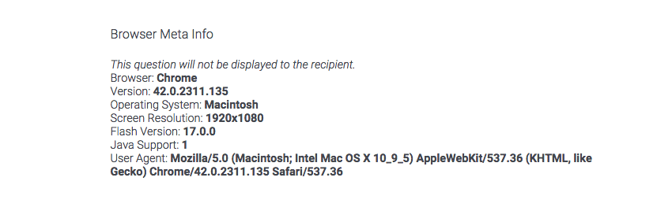
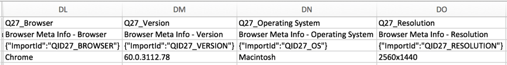

# Meta Info Question

## About Meta Info Questions

The meta info question is a hidden question that tracks and report basic information about your respondents, such as their operating system and browser. This question is often used for troubleshooting or for understanding the technical setup of your respondents.

**Qtip:** Forget to add a meta info question before launching your survey? No problem! Just add the [UserAgent embedded data field](/support/edit-survey/survey-flow/standard-elements/embedded-data#SettingValuesFromOtherSources "Embedded Data") to your survey flow and you’ll have access to a lot of the same information. Note that you may need to find a UserAgent Parser online to read this information.

* * *

* * *

## Using the Meta Info Question

The meta info question doesn’t require any special editing or preparation. Simply add it to any page of your survey that every respondent will see. Please note that the meta info question **must** be on a displayed page for the data to be gathered.

**Warning**: To ensure that data for the question is recorded, be sure to place the meta info question on the same page as other questions that are **displayed.** We typically recommend placing it as the **first** question in your **first** [block](https://www.qualtrics.com/support/survey-platform/survey-module/survey-flow/standard-elements/show-block/) of questions. This can help you avoid any logic that may cause the question to be skipped.

The meta info question gathers the following information:

-   **Browser:** The browser the respondent is using (e.g., Chrome or Internet Explorer).
-   **Version:** The version of the browser the respondent is using.
-   **Operating System:** The operating system the respondent is using (e.g., Windows or Macintosh).
-   **Screen Resolution:** The size of the respondent’s computer screen (in pixels).
-   **Flash Version:** The version of flash (if installed) the respondent is using.
    
    **Attention:** As of Dec 31, 2020, Adobe has stopped supporting Flash. As a result, we return -1 for the Flash version for all browsers, indicating that Flash is not installed. For more information about the Adobe Flash Player deprecation, see [this Adobe support page](https://www.adobe.com/products/flashplayer/end-of-life.html).
    
    **Attention:** This field is not available if you use the [New Survey Taking Experience](https://www.qualtrics.com/support/survey-platform/survey-module/look-feel/simple-layout/) for your survey.
    
-   **Java Support:** If the respondent has Java enabled on their browser. “1” if the respondent had Java enabled, and “0” if they didn’t.
    
    **Attention:** This field is not available if you use the [New Survey Taking Experience](https://www.qualtrics.com/support/survey-platform/survey-module/look-feel/simple-layout/) for your survey.
    
-   **User Agent:** The entire string of text supplied by the respondent’s computer used to retrieve the details above. This information is provided by the User Agent Request header sent by the browser.

* * *

* * *

## Downloaded Data Format

When you export your dataset in data table format, the meta info question type displays a column for browser, version, operating system, and screen resolution, as seen below.

* * *

* * *

## FAQs

[What kind of project can I use this type of question in?](#faq-975) ×

For a full list of questions and their project compatibilities, see [this table.](https://www.qualtrics.com/support/survey-platform/survey-module/editing-questions/question-types-guide/question-types-overview/#Compatibility)