# Multiple Choice Question

## About Multiple Choice Questions

The multiple choice question type allows the respondent to choose one or multiple options from a list of possible answers. This is the most common question type due to its simplicity and ease of use for both the survey creator and the survey taker.

[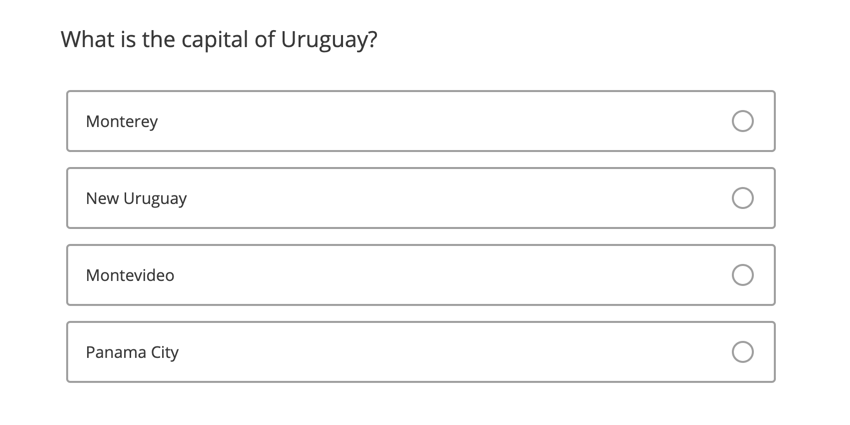](https://www.qualtrics.com/m/assets/support/wp-content/uploads//2019/11/multiple-choice.png)

**Qtip:** If you can’t find the answer you’re looking for on this page, try [formatting answer choices](https://www.qualtrics.com/support/survey-platform/survey-module/editing-questions/formatting-answer-choices/), [formatting questions](https://www.qualtrics.com/support/survey-platform/survey-module/editing-questions/formatting-questions/), and [question options](https://www.qualtrics.com/support/survey-platform/survey-module/question-options/question-options-overview/).

* * *

Was this helpful?

YesNo

* * *

## Single Answer Variations

The single answer format allows a respondent to select one, and only one, answer choice. To make your question single answer, enable the **Allow one answer** option.  
[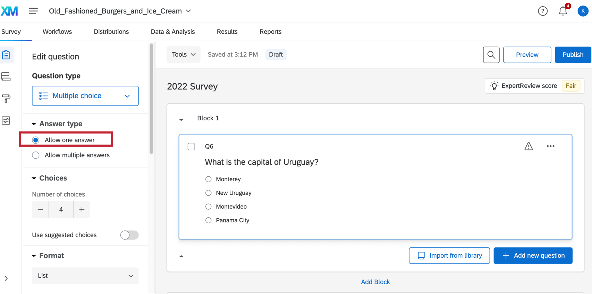](https://www.qualtrics.com/m/assets/support/wp-content/uploads//2015/04/Single-answer.png)

In the survey builder, you’ll notice that single answer questions always have radio buttons (circles). You can change how these buttons appear to your respondents based on the layout you have selected in the [Look & Feel](https://www.qualtrics.com/support/survey-platform/survey-module/look-feel/look-feel-overview/) menu.

**Qtip:** Although respondents can change their choice on a single-answer question, they can’t uncheck it. To give your respondent the option to uncheck their selected answer, you can use a [multiple answer](https://www.qualtrics.com/support/survey-platform/survey-module/editing-questions/question-types-guide/standard-content/multiple-choice/#Variations) variation and then turn on [Make Answer Exclusive](https://www.qualtrics.com/support/survey-platform/survey-module/editing-questions/formatting-answer-choices/#MakeAnswerExclusive) for each answer choice.[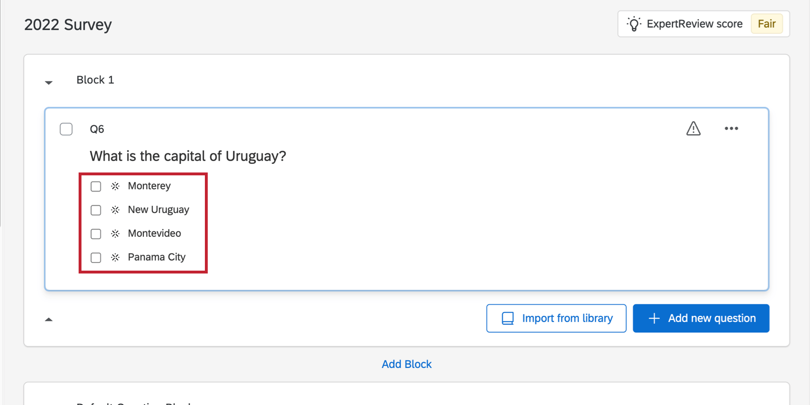](https://www.qualtrics.com/m/assets/support/wp-content/uploads//2015/04/Multi_answer_capital.png)

### List Format

The **List** format is the default format for multiple choice questions. In this format, answer choices are presented to respondents in a list view.

[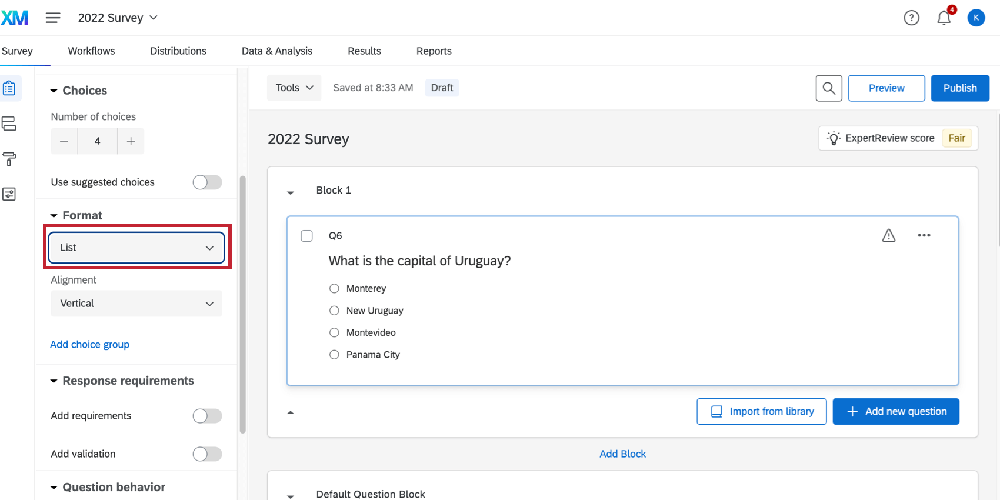](https://www.qualtrics.com/m/assets/support/wp-content/uploads//2015/04/List-option-multiple-choice.png)

### Dropdown

The **Dropdown** format displays answer choices as a dropdown list; respondents can only pick one answer choice.

[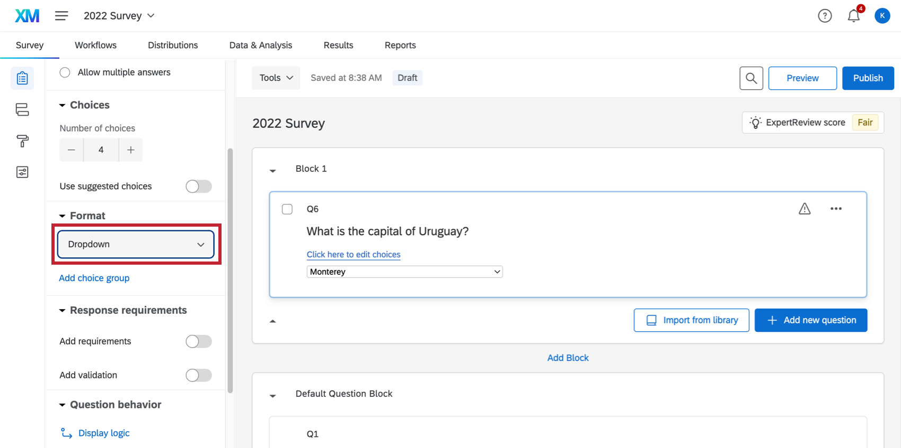](https://www.qualtrics.com/m/assets/support/wp-content/uploads//2015/04/Dropdown-format-for-cities.png)

If you need to edit the choices available, select **Click here to edit choices**. You will then be able to click choices to edit them.

[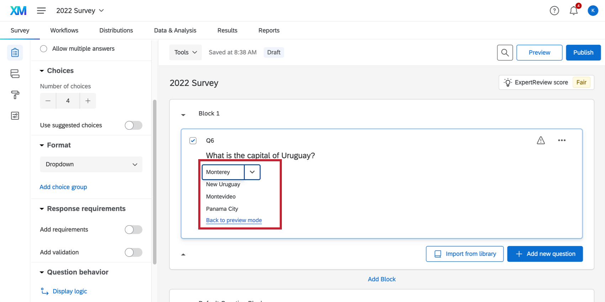](https://www.qualtrics.com/m/assets/support/wp-content/uploads//2015/04/Edit-dropdown-choices.png)

**Qtip:** Have a long list of choices? No need to type them in one at a time! If you have the list in a spreadsheet, or even in a Word document, you can simply copy the entire list and paste it into the first choice in Qualtrics. Qualtrics will populate the list for you. Make sure the list is formatted so there is one line break in between each choice. Be careful of formatting that may carry over from Word and other rich text editing software – you may need to [remove formatting](https://www.qualtrics.com/support/survey-platform/survey-module/editing-questions/formatting-questions/#EditingQuestionText) on the question.

### Select Box

The **Select box** format displays answer choices in a list respondents can scroll through. Respondents can select only one answer choice.

[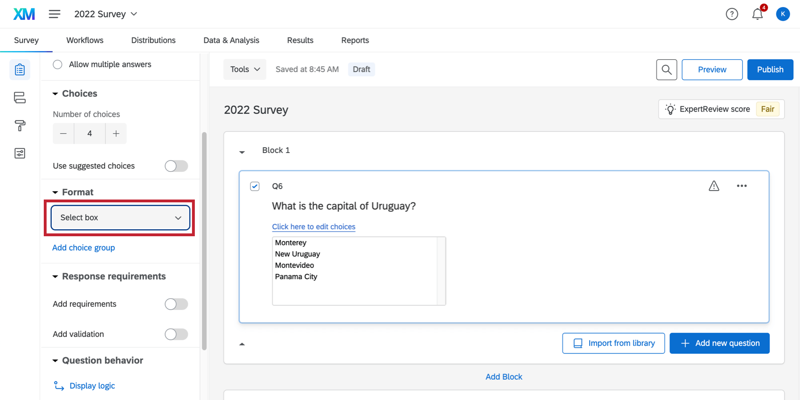](https://www.qualtrics.com/m/assets/support/wp-content/uploads//2015/04/Select-Box-answerchoice-format.png)

If you need to edit the choices available, select **Click here to edit choices**. You will then be able to click choices to edit them.

### Single Answer Validation & Response Requirements

[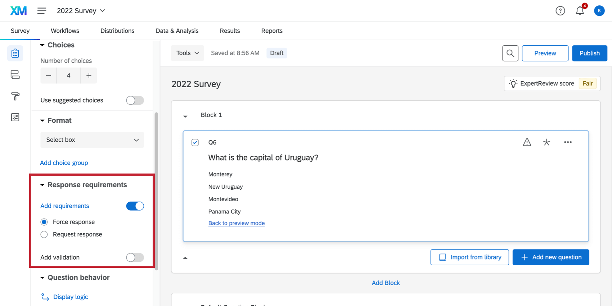](https://www.qualtrics.com/m/assets/support/wp-content/uploads//2015/04/Add-response-requirements.png)

Single answer questions have a variety of response requirements you can add to the questions. The **Add requirements** toggle allows you to add [force response](https://www.qualtrics.com/support/survey-platform/survey-module/editing-questions/validation/#ForceResponse) or [request response](https://www.qualtrics.com/support/survey-platform/survey-module/editing-questions/validation/#RequestResponse) validation to your question. The **Add validation** toggle allows you to add [custom validation](https://www.qualtrics.com/support/survey-platform/survey-module/editing-questions/validation/#CustomValidation) to your question.

* * *

Was this helpful?

YesNo

* * *

## Multiple Answer Variations

The multiple answer format allows a respondent to select multiple answer choices for a question. You can limit how many choices the respondent is allowed to select by customizing the validation options described at the end of this section. To make your question multiple answer, enable the **Allow multiple answers** option.  
[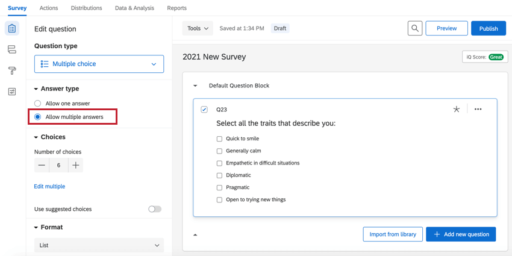](https://www.qualtrics.com/m/assets/support/wp-content/uploads//2021/02/AllowMultipleAnswerMC.png)

### List Format

The **List** format is the default format for multiple choice questions. In this format, answer choices are presented to respondents in a list view.

[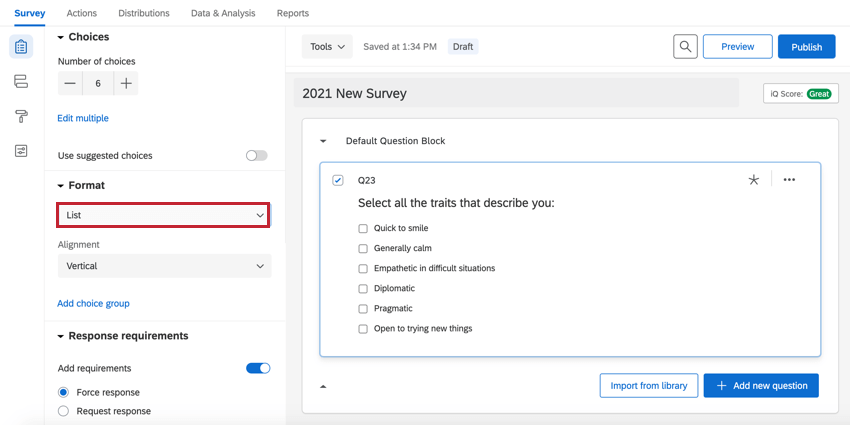](https://www.qualtrics.com/m/assets/support/wp-content/uploads//2021/02/ListMultipleMC.png)

In the editor, you’ll notice that multiple answer questions always have checkboxes. You can change how these buttons appear to your respondents based on the layout you have selected in the [Look & Feel](https://www.qualtrics.com/support/survey-platform/survey-module/look-feel/look-feel-overview/) menu.

### Select Box

The **Select Box** format displays answer choices in a list respondents can scroll through. Respondents can easily select multiple answer choices through several methods. To select options in a row, they can click and drag their mouse, or hold down Shift when selecting. To select non-sequential options, they can hold down Ctrl (on a PC) or Cmd (on a Mac) when clicking.

[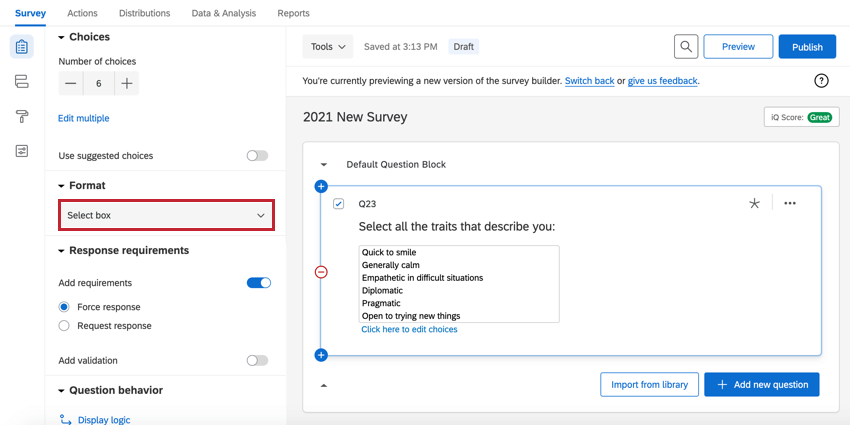](https://www.qualtrics.com/m/assets/support/wp-content/uploads//2021/02/SelectBoxMultipleMC.png)

If you need to edit the choices available, select **Click here to edit choices**. You will then be able to click choices to edit them.

[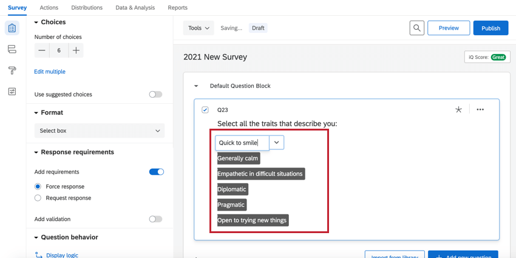](https://www.qualtrics.com/m/assets/support/wp-content/uploads//2021/02/EditBoxMCMultiple.png)

### Multiple Answer Validation & Response Requirements

Multiple select questions come with some of the same validation options that singe select questions do, but there are also options that are unique to multiple select questions. There are even a few ways to limit how many answers respondents can select. These options are found in the **Response Requirements** section of the survey builder.

[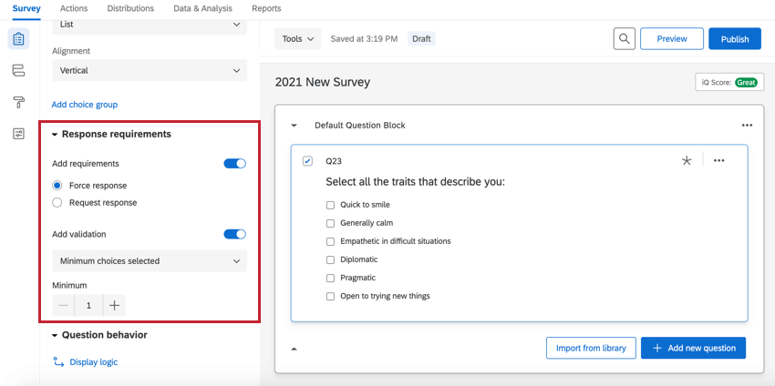](https://www.qualtrics.com/m/assets/support/wp-content/uploads//2021/02/ResponseRequirementsMultipleMC.png)

-   **Add Requirements:**
    -   **[Force response](https://www.qualtrics.com/support/survey-platform/survey-module/editing-questions/validation/#ForceResponse):** Force the respondent to select at least one response before they can proceed.
    -   **[Request response](https://www.qualtrics.com/support/survey-platform/survey-module/editing-questions/validation/#RequestResponse):** Request that the respondent try to answer the question before they proceed, but give them the option to refuse.
-   **Add validation:**
    -   **Minimum choices selected:** Require respondents to select a certain number of answers before they can proceed with the rest of the survey. In this case, there is no maximum number of responses, only a minimum.  
        [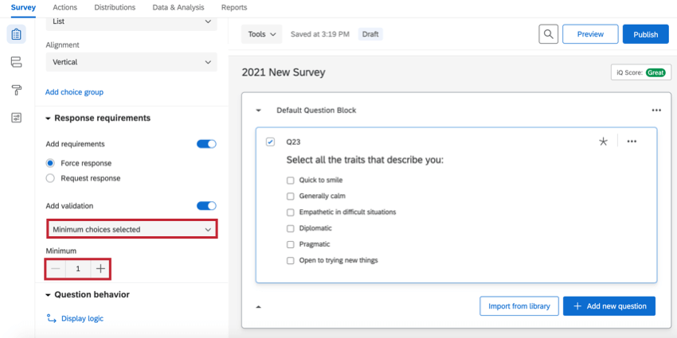](https://www.qualtrics.com/m/assets/support/wp-content/uploads//2021/02/MinimumChoicesMC.png)
    -   **Answers Range:** Specify a minimum and maximum number of responses the respondent can provide.  
        [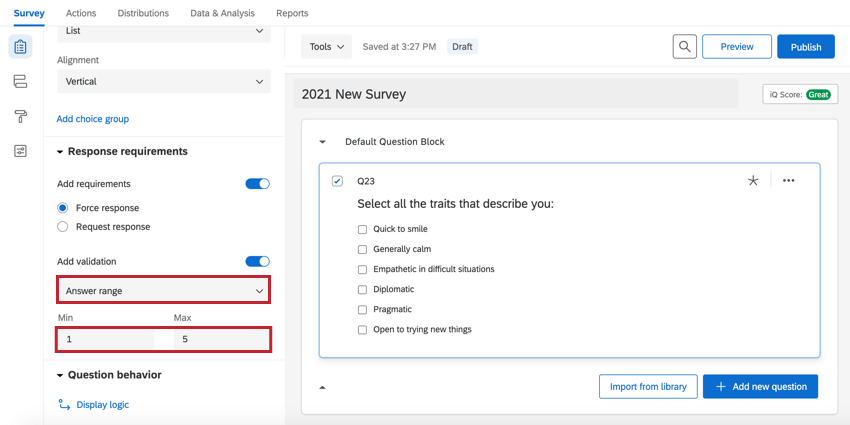](https://www.qualtrics.com/m/assets/support/wp-content/uploads//2021/02/AnswerRangeMC.png)
    -   **Custom Validation:** Require respondents to select specific choices before they can proceed. See [Custom Validation](https://www.qualtrics.com/support/survey-platform/survey-module/editing-questions/validation/#CustomValidation) and [Custom Validation Messages](https://www.qualtrics.com/support/survey-platform/survey-module/editing-questions/validation/#CustomValidationMessages).[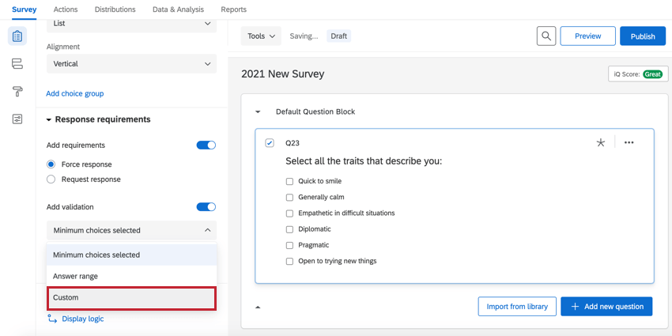](https://www.qualtrics.com/m/assets/support/wp-content/uploads//2021/02/CustomMCValidation.png)

* * *

Was this helpful?

YesNo

* * *

## Answer Positions

You can change the arrangement of your answer choices to improve the appearance of your survey and the way information is presented.

**Qtip:** These options are available for both single answer and multiple answer questions. This option is only available for **list** format multiple choice questions.

### Vertical

List choices vertically.

[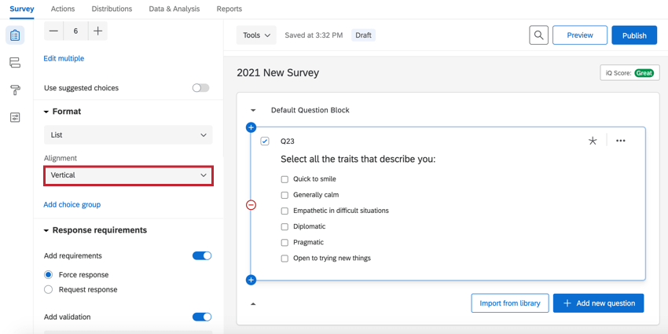](https://www.qualtrics.com/m/assets/support/wp-content/uploads//2021/02/VerticalMC.png)

### Horizontal

List choices horizontally.

[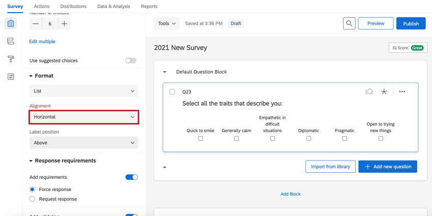](https://www.qualtrics.com/m/assets/support/wp-content/uploads//2021/02/HorizontalMC.png)

You can also adjust the **Label position** so that the choice text appears to the side of or above the radio buttons.

-   **Above:** The labels appear above the radio buttons.  
    [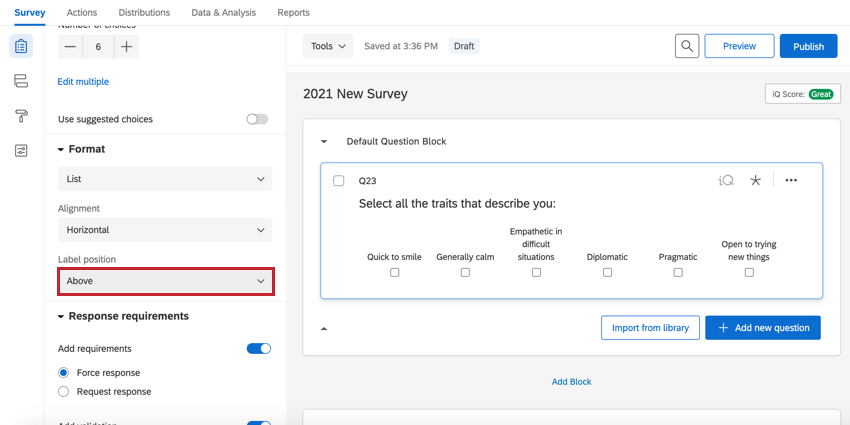](https://www.qualtrics.com/m/assets/support/wp-content/uploads//2021/02/AboveLabelsMC.png)
-   **Side**: The labels appear to the side of the radio buttons. Note that when you select “side,” the positioning of the radio button will vary based on [Look & Feel](https://www.qualtrics.com/support/survey-platform/survey-module/look-feel/look-feel-overview/) layout.  
    [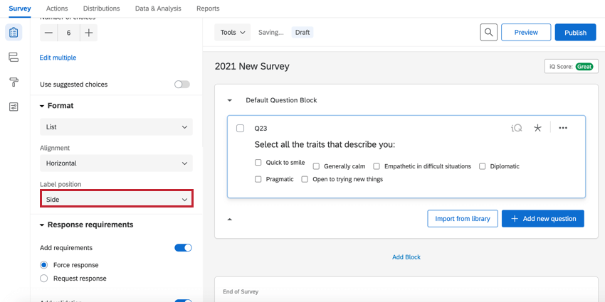](https://www.qualtrics.com/m/assets/support/wp-content/uploads//2021/02/SideLabelMC.png)

**Qtip:** On mobile and smaller desktop screens, this setting will revert back to vertical.

[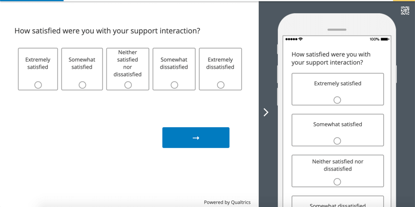](https://www.qualtrics.com/m/assets/support/wp-content/uploads//2019/11/preview-horizontal.png)

### Column

If a question has a lot of choices, you can split these choice into columns by selecting the **Column** option. Once you have this setting selected, a **Number of columns** field will appear where you can adjust the number of columns in your question.

[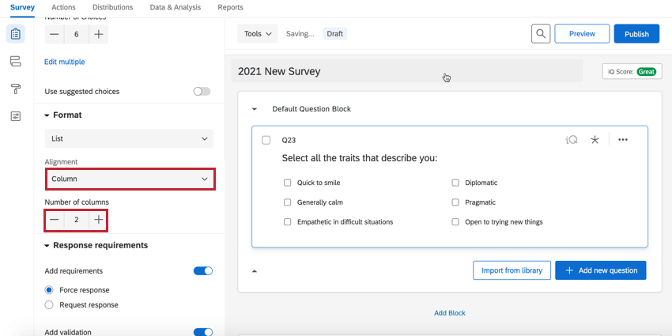](https://www.qualtrics.com/m/assets/support/wp-content/uploads//2021/02/ColumnsMC.png)

**Qtip:** Columns will not revert to vertical lists on mobile or smaller desktop screens.

* * *

Was this helpful?

YesNo

* * *

## Data Analysis

Once your responses have been collected, Qualtrics offers various methods to create reports both in and out of the platform. From the [Data & Analysis](/support/survey-platform/data-and-analysis-module/data-and-analysis-overview/ "Data & Analysis Overview") tab, you can view and manipulate your survey responses on an individual basis.

### Downloaded Data Format

For single answer variations, you’ll find one column in your dataset for the multiple choice question. Each choice in your question has a coded value, or number associated with the choice. The number for the selected choice is displayed in each participant’s row.

**Qtip:** For a refresher on how to check or change these coded values, refer to our [recode values](/support/survey-platform/edit-survey/question-options/recode-values/ "recode values") page.

For multiple answer variations, there are two data export formats based on [what export settings you use](https://www.qualtrics.com/support/survey-platform/data-and-analysis-module/data/download-data/export-options/#ExportOptionsDataTable).

If you select **Split multi-value fields into columns**, each choice will include its own column in the dataset. On each participant’s row, there will be a “1” in the columns of the choices they selected.

[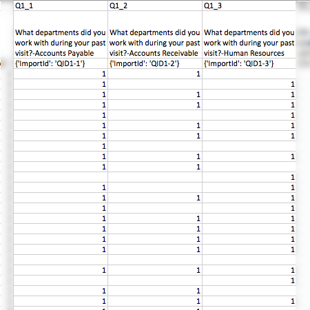](https://www.qualtrics.com/m/assets/support/wp-content/uploads/2016/04/MultipleChoice.png)

If you deselect **Split multi-value fields into columns**, your question will have only one column in your dataset, and the values of the selected choices will be comma-separated beneath it.

[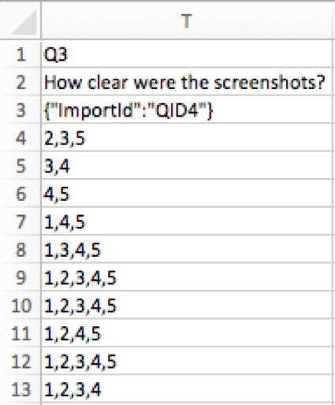](https://www.qualtrics.com/m/assets/support/wp-content/uploads/2017/08/multi8.png)

* * *

Was this helpful?

YesNo

* * *

## Graphs and Tables in Reports

From the [Reports](https://www.qualtrics.com/support/survey-platform/reports-module/results-section/reports-overview/ "Reports Overview") tab, you can view aggregate data with pre-made reports as well as create your own.

There are many visualization types available for multiple choice questions, [depending on the type of reports](https://www.qualtrics.com/support/survey-platform/reports-module/results-vs-reports/) you choose to build.

-   **[Results-reports](https://www.qualtrics.com/support/survey-platform/reports-module/results-section/reports-overview/):** [simple table](/support/results/visualizations/tables/simple-table/ "simple table"), [bar chart](/support/results/visualizations/charts/bar-chart/ "bar chart"), [line chart](/support/results/visualizations/charts/line-chart/ "Line Chart"), [pie chart](/support/results/visualizations/charts/pie-chart/ "pie chart"), [breakdown bar](/support/results/visualizations/breakdown-bar/ "breakdown bar"),  [statistics table](https://www.qualtrics.com/support/survey-platform/reports-module/results-section/visualizations/tables/statistics-table/), and [gauge chart](https://www.qualtrics.com/support/survey-platform/reports-module/results-section/visualizations/charts/gauge-chart/).
-   **[Advanced-reports](https://www.qualtrics.com/support/survey-platform/reports-module/reports-section/paginated-reports-overview/):** [data table](https://www.qualtrics.com/support/survey-platform/reports-module/reports-section/reports-visualizations/table-visualizations/data-table-visualization/), [bar chart](https://www.qualtrics.com/support/survey-platform/reports-module/reports-section/reports-visualizations/chart-visualizations/bar-chart-visualization/), [line chart](https://www.qualtrics.com/support/survey-platform/reports-module/reports-section/reports-visualizations/chart-visualizations/line-chart-visualization/), [pie chart](https://www.qualtrics.com/support/survey-platform/reports-module/reports-section/reports-visualizations/chart-visualizations/pie-chart-visualization/), [breakdown bar](https://www.qualtrics.com/support/survey-platform/reports-module/reports-section/reports-visualizations/chart-visualizations/breakdown-bar-visualization/), [statistics table](https://www.qualtrics.com/support/survey-platform/reports-module/reports-section/reports-visualizations/table-visualizations/statistics-table-visualization/), [gauge chart](https://www.qualtrics.com/support/survey-platform/reports-module/reports-section/reports-visualizations/chart-visualizations/gauge-chart-visualization/), and [results table](https://www.qualtrics.com/support/survey-platform/reports-module/reports-section/reports-visualizations/table-visualizations/results-table-visualization/).

Note that when a question is formatted with the multiple answer setting, many visualizations for that question will display choice count, which may a higher number than the total number of respondents since each respondent can select multiple answer choices. Be careful of the metrics you have set (in [results](https://www.qualtrics.com/support/survey-platform/reports-module/results-section/visualizations/visualizations-overview/#AdditionalStandardOptions) or [advanced-reports](https://www.qualtrics.com/support/survey-platform/reports-module/reports-section/reports-visualizations/reports-visualizations-overview/#Metric)).

* * *

Was this helpful?

YesNo

* * *

## FAQs

[Why are my recode values all out of order?](#faq-60) ×

Recode values are assigned in the order the answer choices are created. Before you start collecting responses, these values will reset to always be in sequential order as long as you haven’t edited your recode values yet. As soon as you select **Recode Values** to enable editing them, the order of the choices will be assigned to include re-ordering and deletion.  
  
After you collect your first response, the recode values won't automatically update to be in a sequential order so as to protect your collected data.  
  
So, if you make three options—we'll say Red, Yellow, and Blue—your recode values initially are 1, 2, and 3. If you delete Yellow and add Orange, Orange is the fourth option and has a recode value of 4. Your recode values are now 1, 3, and 4. If you move Red so that it’s the last listed option, your recode values are now 3, 4, and 1.  
  
However, you can change the [recode values](https://www.qualtrics.com/support/survey-platform/survey-module/question-options/recode-values/) at any time without affecting your data. You will see the updated values the next time you download your data or view your results.

[How do I allow text entry on my “Other” answer choice?](#faq-69) ×

1.  Click on the answer choice (as if you were going to edit the answer text).
2.  Click on the blue dropdown arrow that appears to the right of the choice.
3.  Select [**Allow Text Entry**](https://www.qualtrics.com/support/survey-platform/survey-module/editing-questions/formatting-answer-choices/#AllowTextEntry).

[Why did the Edit Multiple button disappear on my survey?](#faq-75) ×

The Edit Multiple button disappears when a survey collects at least 1 response. This is a protective measure, since deleting answer options may corrupt your collected data and the Edit Multiple feature makes it very easy to delete answer options. If you [copy a project](https://www.qualtrics.com/support/survey-platform/my-projects/organizing-your-projects/#ProjectActions) where this has happened, the survey copy will also have Edit Multiple disabled.  
  
Pausing response collection will not bring Edit Multiple back. However, if you import the survey questions into a new project via the **Import Questions From** button, the Edit Multiple button will return.

[What kind of project can I use this type of question in?](#faq-975) ×

For a full list of questions and their project compatibilities, see [this table.](https://www.qualtrics.com/support/survey-platform/survey-module/editing-questions/question-types-guide/question-types-overview/#Compatibility)