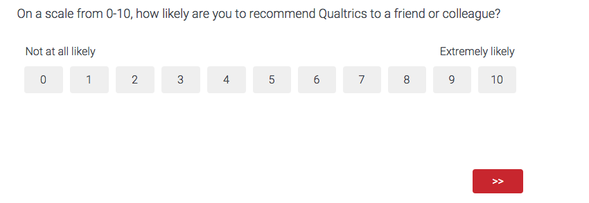
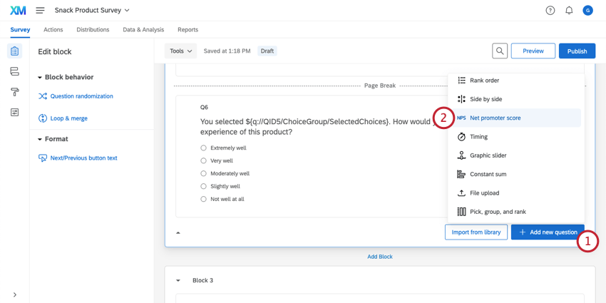
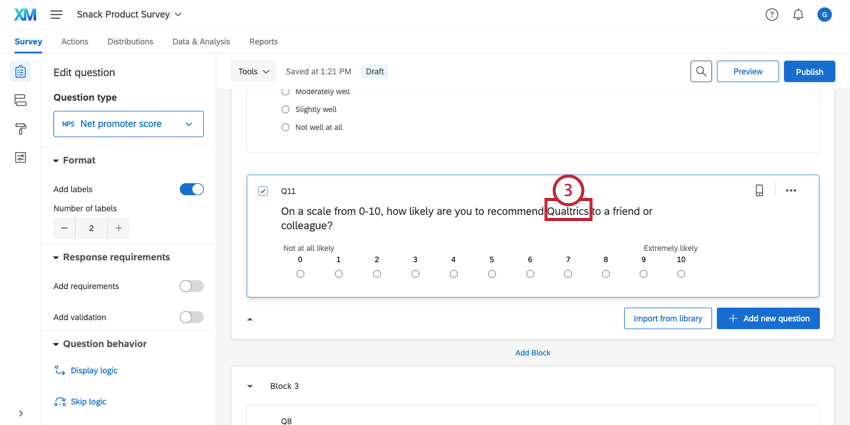
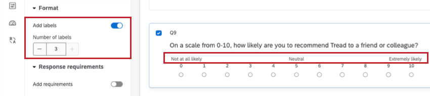
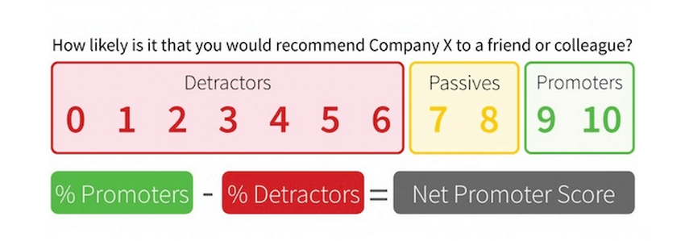
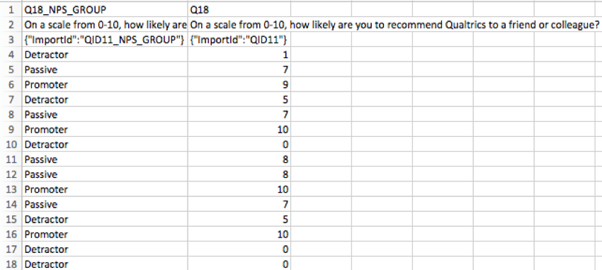
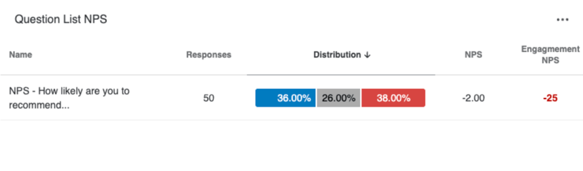
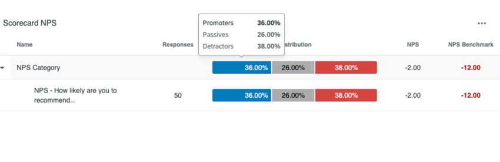
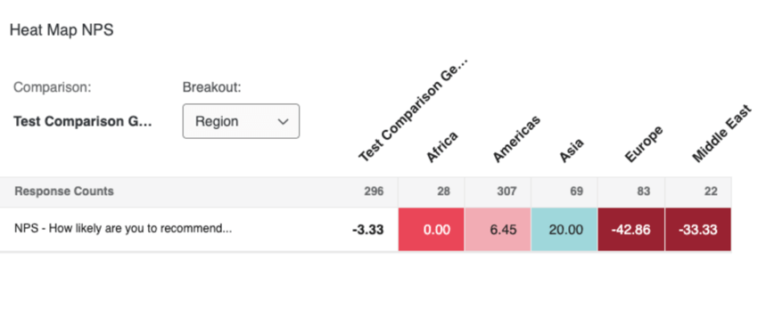
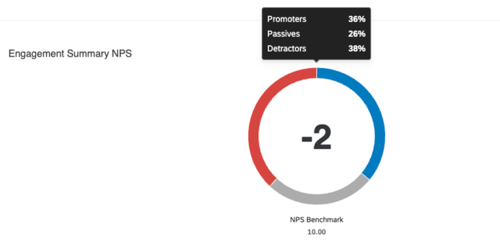

# Net Promoter Score® (NPS) Question

## About Net Promoter Score® Questions

[Net Promoter Score®](https://www.qualtrics.com/experience-management/customer/net-promoter-score/), commonly referred to as NPS, is a customer loyalty metric that gauges how willing a customer is to recommend a product or service. Developed by Fred Reichheld, founder of Bain & Company’s Loyalty Practice, the Net Promoter Score® is now used as an alternative or supplement to customer satisfaction measurement in thousands of organizations around the world.

In its most simple form, Net Promoter Score can be described with 1 simple question:

* * *

Was this helpful?

YesNo

* * *

## Setting Up Net Promoter Score®

For easy implementation, the Net Promoter Score is built directly into Qualtrics as a question type. To ensure consistency with Net Promoter Score theory, the  question type purposefully has limited editing options and is set at exactly 11 scale points.

1.  Click **Add new question**.
2.  Choose **Net promoter score®**.
3.  Click on the question text to replace **\[INSERT COMPANY NAME HERE\]** with the name of your company, product, or service.  
    

**Qtip:** You can add 1-3 labels to the Net Promoter Score’s scale, or remove them entirely. By default, two of these labels — “Not at all likely” and “Extremely likely” — are already in place, but can be rewritten as needed. For standardization, we recommend sticking with the 2 default labels.  

**Qtip**: For surveys using the [New Survey Taking Experience](https://www.qualtrics.com/support/survey-platform/survey-module/look-feel/simple-layout/), NPS questions will be defaulted to a horizontal format on small screens and mobile devices. To change the format, [adjust the setting in the Look and Feel menu](https://www.qualtrics.com/support/survey-platform/survey-module/look-feel/fonts-and-colors/#QuestionStyle).

* * *

Was this helpful?

YesNo

* * *

## Calculating Net Promoter Score®

The Net Promoter Score divides respondents into 3 categories based on the scale point they selected:

-   **Promoters (scale points 9 and 10):** Promoters are your customers who are loyal and enthusiastic about your organization and will continue buying and referring others.
-   **Passives (scale points 7 and 8):** Passives are generally satisfied customers, but lack the enthusiasm of promoters. This group is vulnerable to competitive offerings and not immune to defection.
-   **Detractors (scale points 0 through 6):** Detractors are often unhappy and can diminish your brand through negative word of mouth.

An entity’s Net Promoter Score is derived by taking the percentage of all respondents who are promoters and subtracting the percentage of respondents who are detractors.

**Qtip:** If you want to analyze your NPS® score on a scale different than the one above, try [bucketing](https://www.qualtrics.com/support/survey-platform/data-and-analysis-module/data/add-new-fields/bucketing-variable-creation/) to define new criteria for promoters, passives, and detractors.

* * *

Was this helpful?

YesNo

* * *

## Data Analysis

Once your responses have been collected, Qualtrics offers various ways you can analyze and report on your response data.

### Reports

Because they come with both a numeric score and an assigned group, Net Promoter Score questions are extremely versatile, so you can use many different kinds of charts and tables to report on their results.

In the [Reports](https://www.qualtrics.com/support/survey-platform/reports-module/reports-section/paginated-reports-overview/) tab, all visualizations except the heat map and word cloud are compatible with NPS questions.

In [Results Dashboards](https://www.qualtrics.com/support/survey-platform/reports-module/results-dashboards/results-dashboard-overview/), you can also choose from just about any widget. For example, you can display average numeric NPS using a [gauge chart](https://www.qualtrics.com/support/vocalize/widgets/chart-widgets/gauge-chart-widget/), or break out a [line chart](https://www.qualtrics.com/support/vocalize/widgets/chart-widgets/line-and-bar-chart-widgets/?parent=p00734) by NPS group.

### Downloaded Data Format

In the [downloaded dataset](https://www.qualtrics.com/support/survey-platform/data-and-analysis-module/data/download-data/export-data-overview/), a column is included for each Net Promoter Score question, listing the score given by each individual respondent and the corresponding NPS group that puts them in.

* * *

Was this helpful?

YesNo

* * *

## NPS Questions for EX Projects

In addition to standard survey projects, NPS questions can be used in the following [EX project types](https://www.qualtrics.com/support/employee-experience/projects/creating-a-project-ex/#TypesofEXProjects):

-   Ad Hoc Employee Research
-   Engagement
-   Lifecycle
-   Pulse

Overall, the question still functions the same with the same setup and data analysis capabilities. However, there are a few unique changes for NPS questions in an EX project:

-   NPS respondents are broken down into the following categories in EX:
    -   **Favorable**: Scale points 9 and 10.
    -   **Neutral**: Scale points 7 and 8.
    -   **Unfavorable**: Scale points 6 and below.
        
        **Qtip:** These categories are used to automatically set the dashboard [scale](https://www.qualtrics.com/support/employee-experience/creating-ee-project/dashboards-tab/dashboard-management/dashboard-settings/scales-ee/) for the NPS question.
        
-   You can display NPS data in the following EX dashboard widgets:
    -   [Question List](https://www.qualtrics.com/support/employee-experience/creating-ee-project/dashboards-tab/widgets-ee/analysis-widgets-ee/question-list-widget-ee/) (horizontal bar [variation](https://www.qualtrics.com/support/employee-experience/creating-ee-project/dashboards-tab/widgets-ee/analysis-widgets-ee/question-list-widget-ee/#Visualizations) only)  
        
    -   [Scorecard](https://www.qualtrics.com/support/employee-experience/creating-ee-project/dashboards-tab/widgets-ee/analysis-widgets-ee/scorecard-widget-ee/?parent=p001367) (horizontal bar [variation](https://www.qualtrics.com/support/employee-experience/creating-ee-project/dashboards-tab/widgets-ee/analysis-widgets-ee/scorecard-widget-ee/?parent=p001367#WidgetCustomization) only)  
        
    -   [Heat Map](https://www.qualtrics.com/support/employee-experience/creating-ee-project/dashboards-tab/widgets-ee/table-widgets-ee/heat-map-widget-ee/?parent=p001363)  
        
    -   [Engagement Summary](https://www.qualtrics.com/support/employee-experience/creating-ee-project/dashboards-tab/widgets-ee/other-widgets-ee/engagement-summary-widget-ee/?parent=p001376)  
        
        
        **Qtip:** Older dashboards may contain legacy versions of these widgets that are incompatible with NPS questions. NPS data can only be added to the updated version of the widgets. Please see [this resource](https://exdelivery.co1.qualtrics.com/jfe/form/SV_9NwuklC8f2V2XCC) for more information about how to identify widget types and update your older widgets.
        
        **Qtip:** You can also display NPS data in these widgets’ respective [report template visualizations](https://www.qualtrics.com/support/employee-experience/creating-ee-project/dashboards-tab/ex-report-template/ex-report-visualizations/list-of-report-template-visualizations-ex/?parent=p001396).
        
-   [Statistical significance](https://www.qualtrics.com/support/employee-experience/creating-ee-project/dashboards-tab/widgets-ee/table-widgets-ee/heat-map-widget-ee/?parent=p001363#SignificanceTesting) is supported for NPS metrics.
-   NPS questions are mapped as a Number Set [field type](https://www.qualtrics.com/support/vocalize/dashboard-settings-cx/dashboard-data/data-compatibility/#FieldTypes) in your dashboard data.

* * *

Was this helpful?

YesNo

* * *

## FAQs

[What kind of project can I use this type of question in?](#faq-975) ×

For a full list of questions and their project compatibilities, see [this table.](https://www.qualtrics.com/support/survey-platform/survey-module/editing-questions/question-types-guide/question-types-overview/#Compatibility)