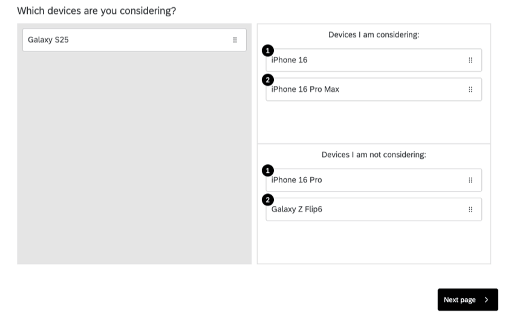
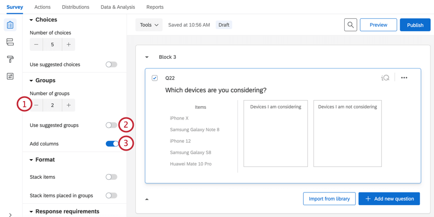
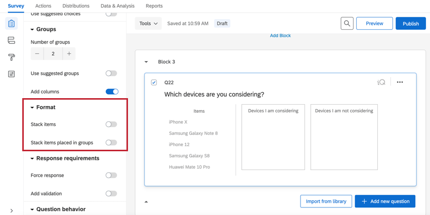
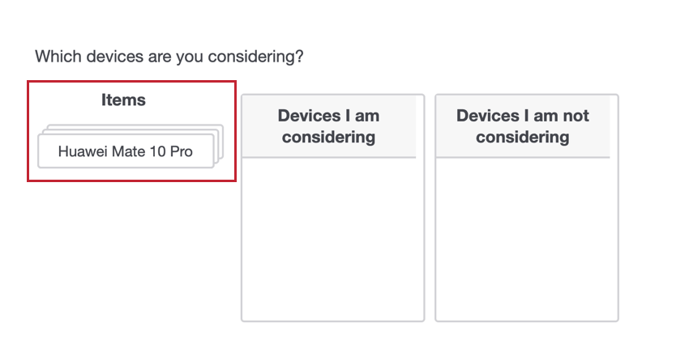
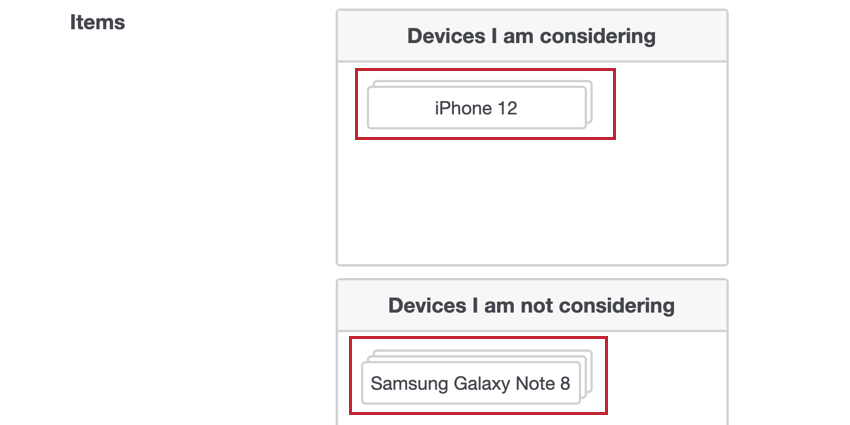
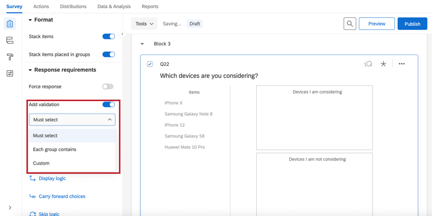
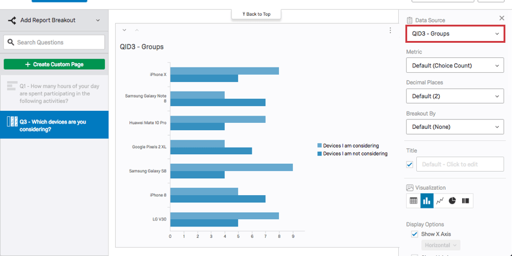
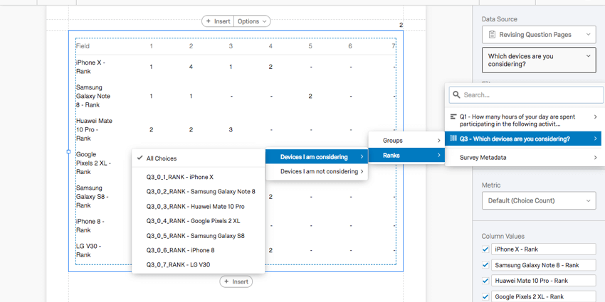
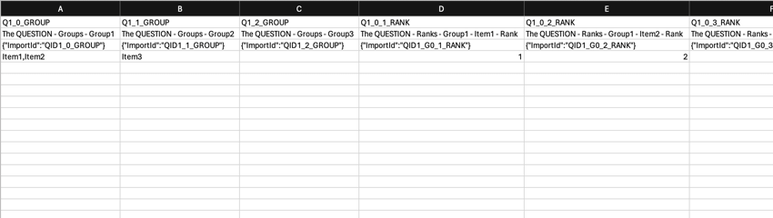

# Pick, Group, & Rank Question

## About Pick, Group, and Rank Questions

Pick, Group, and Rank questions allow respondents to drag and drop items into groups. Within each group, respondents can rank items by dragging and dropping them into place (as they would with a [Rank Order](/support/edit-survey/editing-questions/question-types-guide/standard-content/rank-order/ "Rank Order") question).

**Qtip:** For sorting activities, the ranking portion of this question can simply be ignored. Have respondents drag items into the groups without instructing them to rank the items, and then disregard the ranking data in your reports.

**Qtip:** Pick, group, and rank questions can be used in surveys and 360 projects, but no other [Employee Experience](https://www.qualtrics.com/support/employee-experience/projects/creating-a-project-ex/#TypesofEXProjects) projects. These questions aren’t compatible with [scoring](https://www.qualtrics.com/support/survey-platform/survey-module/survey-tools/scoring/).

* * *

* * *

## Variations

There is only 1 variation for the Pick, Group, and Rank question type, called Drag and Drop.

### Groups Options

By default, groups are displayed vertically, one beneath another. You can change your groups using the following options:

1.  **Number of groups**: Change the number of groups that respondents can drop items into.
2.  **Use suggested groups**: If using [suggested choices](https://www.qualtrics.com/support/survey-platform/survey-module/editing-questions/formatting-answer-choices/#AutomaticChoices), you can use Qualtrics’ suggested groups for those choices.
3.  **Add columns**: When enabled, groups will be organized into 2 side-by-side columns instead of being organized vertically.

### Format Options

By default, items are displayed one beneath another. For certain sorting activities, stacking these items into piles may be more appropriate. Stacking items can conserve space by stacking the choices rather than displaying them next to each other.  
  
When **Stack items** is enabled, your choice options will be presented in a stack.  
  
When **Stack items in groups** is enabled, grouped choices will be stacked on top of each other. Note that ranking isn’t possible when this option is selected.  

### Validation

In the **Response requirements** section, you can use the **Add validation** option to control how respondents answer the question. When adding [validation](https://www.qualtrics.com/support/survey-platform/survey-module/editing-questions/validation/), you have multiple options:

-   **Must select**: The respondent must select a certain amount of choices. You’ll define a range of how many items respondents must group in total. This means all items can be put in 1 group, so long as they meet the minimum/maximum requirements.
-   **Each group contains**: The respondent must put a certain amount of choices in each group. You’ll need to define how many items respondents must assign to each group.
-   **Custom**: Create [custom validation](https://www.qualtrics.com/support/survey-platform/survey-module/editing-questions/validation/#CustomValidation) for your question based on your own criteria.

* * *

* * *

## Data Analysis

Once your responses have been collected, Qualtrics offers various ways you can analyze your response data. From the [Reports tab](https://www.qualtrics.com/support/survey-platform/reports-module/results-vs-reports/), you can view aggregate data in pre-made reports as well as create your own reports from scratch. From the [Data & Analysis tab](https://www.qualtrics.com/support/survey-platform/data-and-analysis-module/data-and-analysis-overview/), you can view and manage individual respondents’ data.

### Visualizations

In the [Results](https://www.qualtrics.com/support/survey-platform/reports-module/results-section/reports-overview/) section of the Reports tab, there are 5 visualization types available for Pick Group and Rank questions: [Simple Table](/support/results/visualizations/tables/simple-table/ "Simple Table"), [Bar Chart](/support/results/visualizations/charts/bar-chart/ "Bar Chart"), [Line Chart](/support/results/visualizations/charts/line-chart/ "Line Chart"), [Pie Chart](/support/results/visualizations/charts/pie-chart/ "Pie Chart"), and [Breakdown Bar](/support/results/visualizations/breakdown-bar/ "Breakdown Bar"). For more information on these visualizations, visit the linked visualization support pages.

In the [Reports](https://www.qualtrics.com/support/survey-platform/reports-module/reports-section/paginated-reports-overview/) section of the Reports tab, the compatible visualizations are the [Bar Chart](https://www.qualtrics.com/support/survey-platform/reports-module/reports-section/reports-visualizations/chart-visualizations/bar-chart-visualization/), [Line Chart](https://www.qualtrics.com/support/survey-platform/reports-module/reports-section/reports-visualizations/chart-visualizations/line-chart-visualization/), [Statistics Table](https://www.qualtrics.com/support/survey-platform/reports-module/reports-section/reports-visualizations/table-visualizations/statistics-table-visualization/), and the [Data Table](https://www.qualtrics.com/support/survey-platform/reports-module/reports-section/reports-visualizations/table-visualizations/data-table-visualization/).

You can either choose the **Groups** as the data source, displaying how many times each item was sorted into each group, or you can choose **Rank** as the data source, displaying how many times each rank was assigned to each item.

### Downloaded Data Format

The downloaded dataset will include 1 column for each group and 1 additional column for each group and item unique combination.

The first column will indicate which group the participant placed the item in (labeled numerically, with “0” being the first group, “1” being the second, and so forth).

The second column will indicate what rank this item received within the group it was placed in.

  
In the above example, there are 3 items and 3 groups. Items 1 and 2 were placed into the first group and item 3 was placed into the second group. In the first group, item 1 was ranked above item 2.

* * *

* * *

## FAQs

[What kind of project can I use this type of question in?](#faq-975) ×

For a full list of questions and their project compatibilities, see [this table.](https://www.qualtrics.com/support/survey-platform/survey-module/editing-questions/question-types-guide/question-types-overview/#Compatibility)