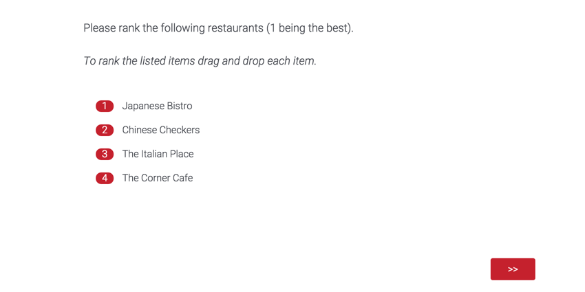
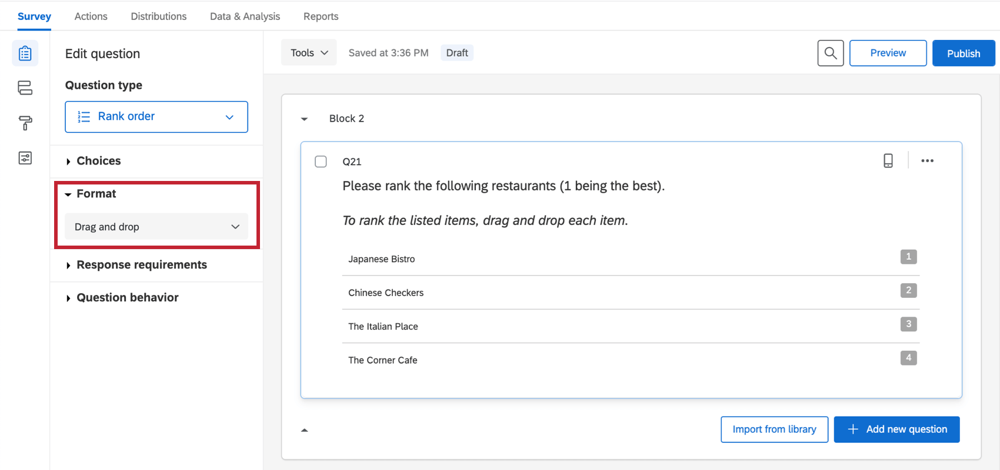
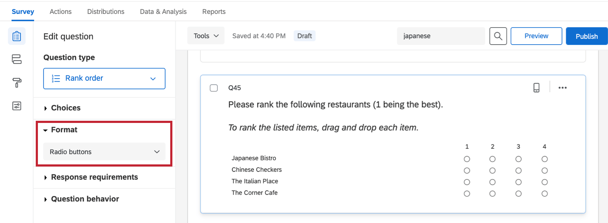
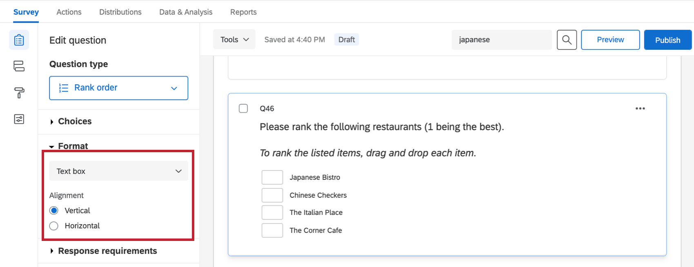
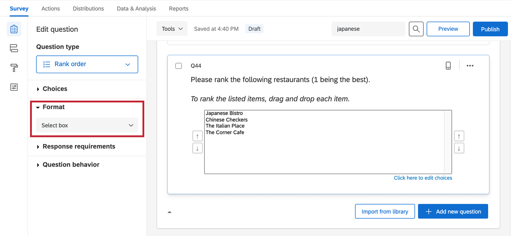
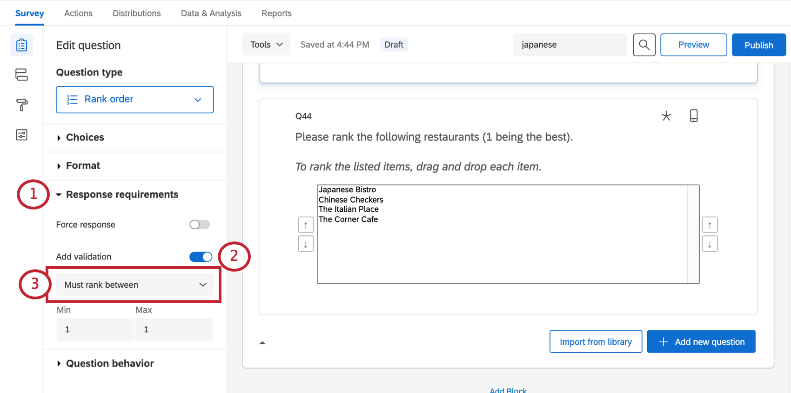
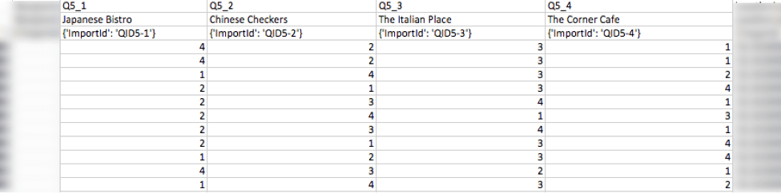

# Rank Order Question

## About Rank Order Questions

The rank order question type provides respondents the unique opportunity to rank a set of items against each other.

**Qtip:** Rank order questions can be used in surveys and 360 projects, but no other [Employee Experience](https://www.qualtrics.com/support/employee-experience/projects/creating-a-project-ex/#TypesofEXProjects) projects. Rank order questions are not compatible with [scoring](https://www.qualtrics.com/support/survey-platform/survey-module/survey-tools/scoring/).

* * *

Was this helpful?

YesNo

* * *

## Formats

4 different variations are available for the rank order question type. You can access these variations under the Format dropdown in the question editing pane.

### Drag and Drop

With the drag and drop type, respondents drag items into their preferred order. This variation is appropriate for shorter lists where you want respondents to rank each item.

**Qtip:** This is the only format compatible with the [New Survey Taking Experience](https://www.qualtrics.com/support/survey-platform/survey-module/look-feel/simple-layout/).

### Radio Buttons

With the radio button type, respondents select a rank for each item from columns of possible rankings.

### Text Box

With the text box type, respondents type in their preferred ranking for the provided options. Respondents can be forced to rank all options, some options, or only a select range of options by setting a [Validation Type](https://www.qualtrics.com/support/survey-platform/survey-module/editing-questions/question-types-guide/standard-content/rank-order/#Validation "Validation Type").

Change the **Alignment** of the text boxes by selecting horizontal or vertical.

### Select Box

The select box type is an alternative to drag and drop ranking. Respondents select items and then rank them by clicking the arrows to move each item up and down in the list.

To edit the choices for this type, click **Click here to edit choices** in blue on the bottom-right.

* * *

Was this helpful?

YesNo

* * *

## Validation

Some rank order variations include extra validation options to give you more control over how your respondents can rank items.

1.  Go to **Response requirements**.  
    
2.  Select **Add validation**.
3.  Choose from the following:
    -   **Must rank all:** Respondents must rank all items to proceed in the survey, or they can choose not to answer the question at all. This option is not available for the drag and drop [question format](https://www.qualtrics.com/support/survey-platform/survey-module/editing-questions/question-types-guide/standard-content/rank-order/#Variations).
    -   **Must rank between:** Respondents must rank a defined number of items (you’ll set the accepted range), or they can choose not to answer the question at all. This option isn’t available for the select box and drag and drop question formats.
    -   **Custom:** See [Custom Validation](https://www.qualtrics.com/support/survey-platform/survey-module/editing-questions/validation/#CustomValidation). This option is available for all question formats.

**Qtip:** All but the “select box” type of rank order also offer a [force response](/support/edit-survey/editing-questions/validation/#ForceResponse "Validation") option.

* * *

Was this helpful?

YesNo

* * *

## Data Analysis

Once your responses have been collected, Qualtrics offers various methods to create reports both in and out of the platform. In the [Results](https://www.qualtrics.com/support/survey-platform/reports-module/results-section/reports-overview/ "Reports Overview"), [Reports](https://www.qualtrics.com/support/survey-platform/reports-module/reports-section/paginated-reports-overview/), and [Results Dashboards](https://www.qualtrics.com/support/survey-platform/reports-module/results-dashboards/results-dashboard-overview/) sections, you can view aggregate data with pre-made reports as well as create your own. From the [Data & Analysis](/support/survey-platform/data-and-analysis-module/data-and-analysis-overview/ "Data & Analysis") tab, you can view and manipulate your survey responses on an individual basis.

### Visualizations

Rank order questions are compatible with the following [Results](https://www.qualtrics.com/support/survey-platform/reports-module/results-section/reports-overview/ "Reports Overview") visualizations:

-   [Simple table](/support/results/visualizations/tables/simple-table/ "Simple table")
-   [Bar chart](/support/results/visualizations/charts/bar-chart/ "Bar chart")
-   [Line chart](/support/results/visualizations/charts/line-chart/ "Line chart")
-   [Pie chart](/support/results/visualizations/charts/pie-chart/ "Pie chart")
-   [Breakdown bar](/support/results/visualizations/breakdown-bar/ "Breakdown bar")
-   [Statistics table](/support/results/visualizations/tables/statistics-table/ "Statistics table")
-   [Gauge chart](/support/results/visualizations/charts/gauge-chart/ "Gauge chart")

Rank order questions are also compatible with the following [Reports](https://www.qualtrics.com/support/survey-platform/reports-module/reports-section/paginated-reports-overview/) visualizations:

-   [Statistics table](https://www.qualtrics.com/support/survey-platform/reports-module/reports-section/reports-visualizations/table-visualizations/statistics-table-visualization/)
-   [Gauge chart](https://www.qualtrics.com/support/survey-platform/reports-module/reports-section/reports-visualizations/chart-visualizations/gauge-chart-visualization/)
-   [Bar chart](https://www.qualtrics.com/support/survey-platform/reports-module/reports-section/reports-visualizations/chart-visualizations/bar-chart-visualization/)
-   [Line chart](https://www.qualtrics.com/support/survey-platform/reports-module/reports-section/reports-visualizations/chart-visualizations/line-chart-visualization/)
-   [Pie chart](https://www.qualtrics.com/support/survey-platform/reports-module/reports-section/reports-visualizations/chart-visualizations/pie-chart-visualization/)
-   [Breakdown bar](https://www.qualtrics.com/support/survey-platform/reports-module/reports-section/reports-visualizations/chart-visualizations/breakdown-bar-visualization/)
-   [Results table](https://www.qualtrics.com/support/survey-platform/reports-module/reports-section/reports-visualizations/table-visualizations/results-table-visualization/)
-   [Data table](https://www.qualtrics.com/support/survey-platform/reports-module/reports-section/reports-visualizations/table-visualizations/data-table-visualization/)

For more information on these visualizations, visit the linked visualization support pages.

### Downloaded Data Format

The downloaded dataset for a rank order question includes a column for every item being ranked. In each column, you’ll see the ranking each participant awarded that particular item.

**Attention:** If respondents don’t interact with the rank order question (i.e., if they don’t drag and drop any options), the question will be recorded as unanswered.

* * *

Was this helpful?

YesNo

* * *

## FAQs

[Why did the Edit Multiple button disappear on my survey?](#faq-75) ×

The Edit Multiple button disappears when a survey collects at least 1 response. This is a protective measure, since deleting answer options may corrupt your collected data and the Edit Multiple feature makes it very easy to delete answer options. If you [copy a project](https://www.qualtrics.com/support/survey-platform/my-projects/organizing-your-projects/#ProjectActions) where this has happened, the survey copy will also have Edit Multiple disabled.  
  
Pausing response collection will not bring Edit Multiple back. However, if you import the survey questions into a new project via the **Import Questions From** button, the Edit Multiple button will return.

[What kind of project can I use this type of question in?](#faq-975) ×

For a full list of questions and their project compatibilities, see [this table.](https://www.qualtrics.com/support/survey-platform/survey-module/editing-questions/question-types-guide/question-types-overview/#Compatibility)