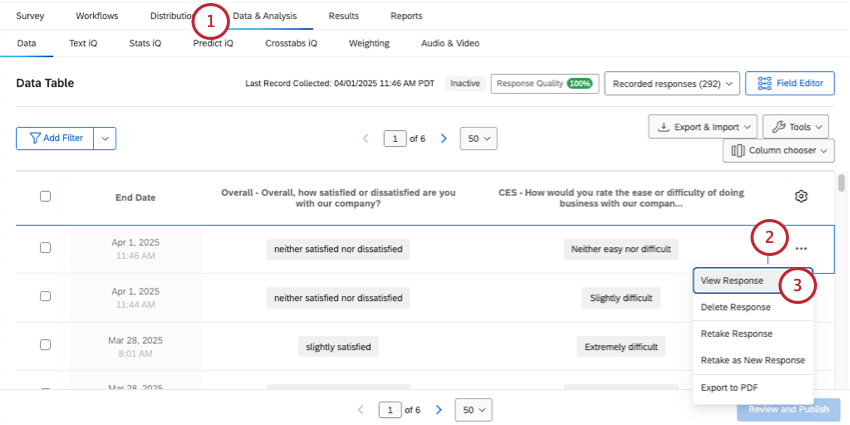
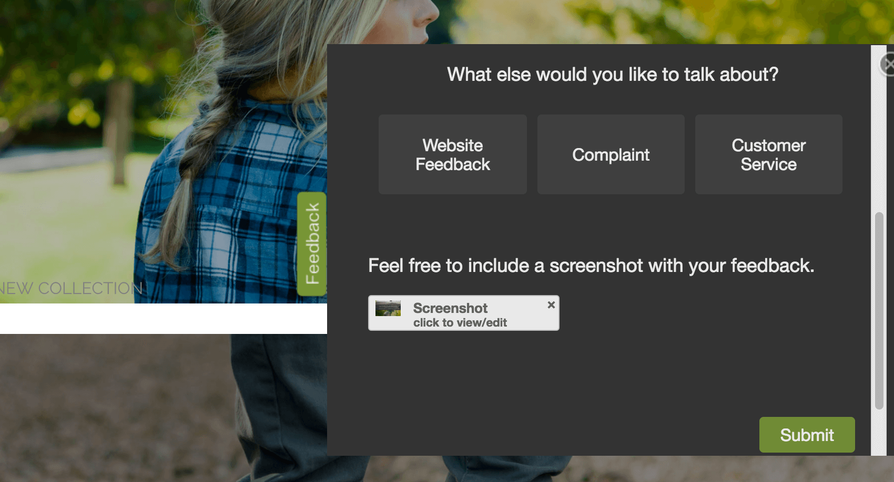

# Screen Capture

## About Screen Capture

**Attention**: In order to use the screen capture feature, Website & App Insights must be included in your license. If you are interested in Website & App Insights and do not have access, contact your [Account Executive](https://www.qualtrics.com/support/survey-platform/getting-started/help-and-feedback/#AEsandCSMs).

The screen capture question allows respondents to attach a screenshot of the website they see. The screen capture question works when embedded in an intercept and displayed on a website.

  
The screen capture question type lets respondents show what part of the site they’re referring to in their feedback, and lets the respondent highlight and cover up certain parts of their image. This makes it possible to see exactly what your website visitors are seeing when they give feedback on the site.

**Attention:** Screen capture only works on publicly accessible sites. Private, internal, and intranet pages won’t be able to use screen capture.

**Attention:** Screen capture is not compatible with pages that require Javascript to load, and will capture incomplete images. If you use an ad-blocker to disable the execution of Javascript, you can see what the screen capture question will record. In these cases, we recommend asking respondents to [upload their own screenshots](https://www.qualtrics.com/support/survey-platform/survey-module/editing-questions/question-types-guide/advanced/file-upload/).

* * *

Was this helpful?

YesNo

* * *

## Implementing the Screen Capture Question

To implement the screen capture, you will need to make sure that both the survey and intercept are set up correctly.

### Survey Setup

First, you’ll add the question directly to your survey.

1.  In your survey, click **Add** **new question**.  
    
2.  Choose **Screen capture**.
3.  Change the question text.  
    

### Creative and Intercept Setup

Next, go to your [Website & App Insights project.](https://www.qualtrics.com/support/website-app-feedback/creating-website-app-feedback-project/#ManagingSiteInterceptProjects) There are two ways you can set it up to work with your screen capture question:

1.  Use a creative with an [embedded target](https://www.qualtrics.com/support/website-app-feedback/creatives-tab/edit-creative-section/#NewElementToolbar). That way, the survey is embedded on the intercept and visible to visitors right away.  
    
2.  Or, if using a creative with a regular [target](https://www.qualtrics.com/support/website-app-feedback/creatives-tab/edit-creative-section/#NewElementToolbar), [set the intercept’s target](https://www.qualtrics.com/support/website-app-feedback/intercepts-tab/edit-intercept-section/editing-intercepts/#SelectingaTarget) to open in an embedded window. This can be done inside the intercept by accessing an [action set’s Advanced Options](https://www.qualtrics.com/support/website-app-feedback/intercepts-tab/edit-intercept-section/action-set-logic/advanced-action-set-logic/) and selecting **Open Target in an Embedded Window**.  
    

The respondent has to be able to take the survey directly on the webpage where we will be capturing the screen, or the screen capture question won’t work. If the survey is opened in a new window, the survey would not be able to capture the screen of the original webpage.

* * *

Was this helpful?

YesNo

* * *

## The Respondent’s Experience

Now, let’s take a look at how your responders will interact with the screen capture question when they take your survey.

1.  In the survey, the screen capture question will prompt respondents to **Capture Screen**.  
    
2.  After clicking **Capture Screen**, a new window will open with a screenshot of the webpage the respondent’s on.  
    
3.  Respondents can then do the following with the screenshot:
    -   **Block out information:** Block sensitive or irrelevant information. Click the black icon to create a black box. You can resize and drag this box.
    -   **Highlight information:** Highlight important parts of the screenshot. Click the yellow icon to get started.
4.  Once you’re finished, click the **Save** button.
5.  The respondent can view or annotate their screenshot by clicking on the image preview. They can also remove and resubmit the screenshot by clicking on the **X** within the preview.  
    
6.  Once the respondent is satisfied with the screen capture, they can submit the survey.

**Qtip:** If you notice a prompt to **Add File** instead of capturing the screen, you will need to make sure you have configured your intercept correctly to allow for screen capture functionality.

* * *

Was this helpful?

YesNo

* * *

## Viewing Captured Images

Now that you have added the screen capture question to your survey and collected some responses, it’s time to view the images your respondents attached. To do so, go to the survey project where the screen capture question is.

### Viewing Response Reports

View an individual response report for individual responses and view the images on these reports.

1.  Go to the **Data & Analysis** tab of the survey.  
    
2.  Click the 3 dots next to the response you want to see.
3.  Click **View Response**.
4.  On the response report, scroll to the Screen Capture question, and view the image. Click the link to see the image in a larger window.  
    

### Downloading Individual Screenshots from the Data & Analysis tab

You and [any collaborators with access to the data](https://www.qualtrics.com/support/survey-platform/my-projects/sharing-a-project/) can easily download uploaded files in the Data section.

1.  In the Data & Analysis tab, click **Column chooser**.  
    
2.  Hover your cursor over the screen capture question.
3.  Select **Id**.
4.  Click the hyperlinked Id to download the file.

### Exporting All  Screenshots

[Export your survey data](https://www.qualtrics.com/support/survey-platform/data-and-analysis-module/data/download-data/export-data-overview/) using the [User Submitted Files](https://www.qualtrics.com/support/survey-platform/data-and-analysis-module/data/download-data/export-formats/#UserSubmittedFiles) format.

This will give you a zipped folder named after the question number (e.g., Q1). Inside the zipped folder, each image is named after the [Response ID](https://www.qualtrics.com/support/survey-platform/data-and-analysis-module/data/download-data/understanding-your-dataset/#RespondentInformation) of the person who took it. You can download the Response IDs as reference to CSV or TSV.

### Screen captures in dashboards

If you’d like to report on your screen capture data in dashboards, you have a few options.

In a Results Dashboard, there will already be a table with a list of the screen capture files. [Learn more here](https://www.qualtrics.com/support/survey-platform/survey-module/editing-questions/question-types-guide/advanced/file-upload/#ResultsDashboards).

You can create the same kind of report in CX Dashboards, but it requires some setup. [Learn more here](https://www.qualtrics.com/support/vocalize/record-table-widget/#DisplayingFileLinksWidget).

* * *

Was this helpful?

YesNo

* * *

## FAQs

[What kind of project can I use this type of question in?](#faq-975) ×

For a full list of questions and their project compatibilities, see [this table.](https://www.qualtrics.com/support/survey-platform/survey-module/editing-questions/question-types-guide/question-types-overview/#Compatibility)