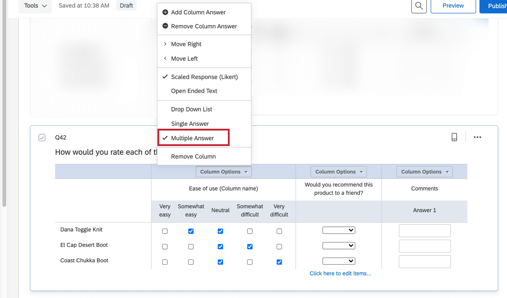

# Side by Side Question

## About Side by Side Questions

The side by side question allows you to ask multiple questions in 1 condensed table.

* * *

Was this helpful?

YesNo

* * *

## Side by Side Basics

Each column within a side by side question is treated as a separate question, possessing its own structure, format, and choices. Each row is an item in which respondents will answer the side by side questions.

### Statements

You can adjust the number of statements, or individual rows in the side by side question. Like with many other question types, you can use [suggested statements](https://www.qualtrics.com/support/survey-platform/survey-module/editing-questions/formatting-answer-choices/#AutomaticChoices), or click to type your own.

### Format

Under the Format header, you can choose to **Repeat headers**. This option works the same way it does in [matrix tables](https://www.qualtrics.com/support/survey-platform/survey-module/editing-questions/question-types-guide/standard-content/matrix-table/#AdditionalOptions).

### Column Options

In the question editing pane to the right of your side by side, you’ll see the option to add and remove columns.

**Qtip:** Have an answer or header that needs to be left blank? Select the text and press the Space key. This will give the label blank text.

Each column includes its own formatting options, found in the Column Options dropdown.

The basic options included in this list include the following:

-   **Add/Remove Column Answer:** Add or remove answer choices in the column. For example, the answer choices in the first column of the screenshot above are Easy, Neutral, and Difficult.
-   **Move Right/Left:** Move the column left or right to adjust the order the respondents see and answer them.
-   **Remove Column:** Delete the column and its answer options.

The remaining options change the column type and style and are discussed below.

* * *

Was this helpful?

YesNo

* * *

## Scaled Response Columns

To include a multiple choice type column within your side by side question, select **Scaled Response (Likert)** in the **Column Options**.

Three variations are available for the scaled response column type.

### Drop Down List

For each row, respondents can choose 1 item selected from a drop-down list.

To edit choices in a drop-down column, look for the blue **Click here to edit items** text at the bottom of the column, as indicated in the screenshot below. To add additional items, press the **Enter** key on your keyboard while editing choices.

### Single Answer

Respondents can choose 1 answer for each row. To edit the choices, click on the answer text beneath the column name.

### Multiple Answer

Respondents can choose multiple answers for each row.

To edit the answer choices, click on the answer text beneath the column name, just as you would for single answer columns displayed in the previous section.

* * *

Was this helpful?

YesNo

* * *

## Open Ended Text Columns

To include a text entry column within your side by side question, select **Open Ended Text** in the **Column Options**.

There are 4 size variations available for the open ended text column type. For **Short, Medium,** and **Long** text, each answer column will include a short, medium, or long text box. For **Essay** text, each answer column will include an essay-sized text box.

**Qtip:** Regardless of text box size, respondents will be able to type as much content as they need, unless text entry validation is added to the text box (see below).

### Text Entry Validation

Each open ended text column in your side by side question can include text entry validation rules to control what content respondents can type.

The following text entry validation rules are available:

-   **Force Response:** Respondents are required to provide an answer in each row of the column.
-   **Force Response Range:** Specify a minimum and maximum number of text boxes respondents must fill in.
-   **Minimum Length:** Answers provided must include no less than a specified number of characters.
-   **Maximum Length:** Answers provided must include no more than a specified number of characters.
-   **Character Range:** Answers provided must fit within a specified minimum and maximum length.
-   **Content Validation:** Answers provided must meet a specific content type, such as a valid email address or a US Postal Code.

## Data Analysis

Once your responses have been collected, Qualtrics offers various methods to create reports both in and out of the platform. From the [Reports](https://www.qualtrics.com/support/survey-platform/reports-module/results-section/reports-overview/ "Reports Overview") tab, you can view aggregate data with pre-made reports as well as create your own. From the [Data & Analysis](/support/survey-platform/data-and-analysis-module/data-and-analysis-overview/ "Data & Analysis Overview") tab, you can view and manipulate your survey responses on an individual basis.

### Visualizations

There are 7 visualization types available for side by side questions: [simple table](/support/results/visualizations/tables/simple-table/ "simple table"), [bar chart](/support/results/visualizations/charts/bar-chart/ "bar chart"), [line chart](/support/results/visualizations/charts/line-chart/ "line chart"), [pie chart](/support/results/visualizations/charts/pie-chart/ "pie chart"), [breakdown bar](/support/results/visualizations/breakdown-bar/ "breakdown bar"), [statistics table](/support/results/visualizations/tables/statistics-table/ "statistics table"), and [gauge chart](/support/results/visualizations/charts/gauge-chart/ "gauge chart"). For more information on these visualizations please visit the linked visualization support pages.

If your side by side question includes a text entry column, then that particular data will display with the text entry visualization types ([paginated table](/support/results/visualizations/tables/paginated-table/ "paginated table") and [word cloud](/support/results/visualizations/word-cloud/ "word cloud")) when it’s used for a visualization.

### Downloaded Data Format

The format of the downloaded data will vary depending on the column type.

**Qtip**: The format of the downloaded data is affected by the options you select when you export. See [Data Export Options](https://www.qualtrics.com/support/survey-platform/data-and-analysis-module/data/download-data/export-options/#ExportOptionsDataTable) for more information.

**Qtip:** If you’ve added [Export Tags](https://www.qualtrics.com/support/survey-platform/survey-module/question-options/recode-values/#QuestionExportTags) to your side by side, the names of export column may vary. See the linked export tags page for more on how this feature affects exports.

**Single Answer/Dropdown List:**

For single answer and dropdown list questions, your dataset will include 1 column for each row within the question. Each column in the dataset is labeled according to this numbering scheme: \[Question Number\]#\[Question Column Number\]\_\[Row Number\].

The data in your column depends on how you [export](https://www.qualtrics.com/support/survey-platform/data-and-analysis-module/data/download-data/export-options/#ExportOptionsDataTable) your data:

-   If you select “Export values” when you export your data, each cell will include a number representing the selected answer choice. For more information, see the [Recode Values](/support/survey-platform/edit-survey/question-options/recode-values/ "Recode Values") page.
-   If you select “Export labels” when you export your data, each cell will include the answer text of the option selected.

**Multiple Answer:**

For multiple answer columns within your side by side question, your dataset will include a column for each answer option in the column. Each column in the dataset is labeled according to this numbering scheme: \[Question Number\]#\[Question Column Number\]\_\[Row Number\]\_\[Answer Column Number\].

The data in your column depends on how you [export](https://www.qualtrics.com/support/survey-platform/data-and-analysis-module/data/download-data/export-options/#ExportOptionsDataTable) your data:

-   If you select “Export values” when you export your data, each cell will contain a “1” if the participant checked that answer and a blank if they did not.
-   If you select “Export labels” when you export your data, each cell will contain the answer text if the participant checked that answer and a blank if they did not.

**Open Ended Text:**

For open ended text columns within your side by side question, your dataset will include a column for each text box within the question. In that column, you’ll see the text each participant wrote in that text box.

If your question column includes more than one text box per row, each column in the dataset is labeled according to this numbering scheme: \[Question Number\]#\[Question Column Number\]\_\[Row Number\]\_\[Answer Column Number\].

If your question column includes just one text box per row, each column in the dataset is labeled according to this numbering scheme: \[Question Number\]#\[Question Column Number\]\_\[Row Number\].

* * *

Was this helpful?

YesNo

* * *

## FAQs

[How do I allow text entry on my “Other” answer choice?](#faq-69) ×

1.  Click on the answer choice (as if you were going to edit the answer text).
2.  Click on the blue dropdown arrow that appears to the right of the choice.
3.  Select [**Allow Text Entry**](https://www.qualtrics.com/support/survey-platform/survey-module/editing-questions/formatting-answer-choices/#AllowTextEntry).

[What kind of project can I use this type of question in?](#faq-975) ×

For a full list of questions and their project compatibilities, see [this table.](https://www.qualtrics.com/support/survey-platform/survey-module/editing-questions/question-types-guide/question-types-overview/#Compatibility)