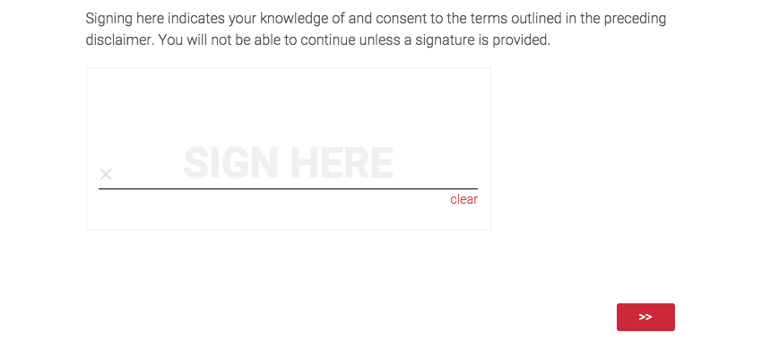
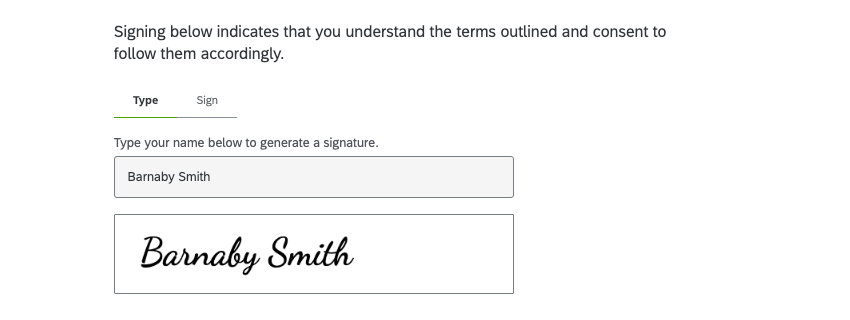
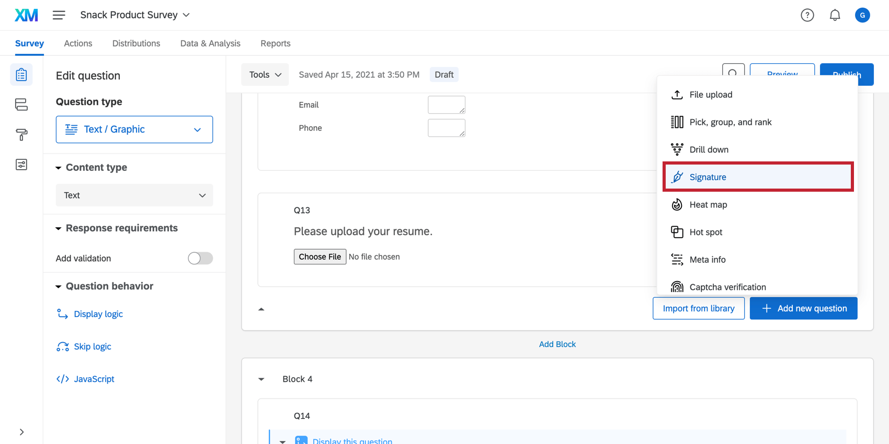
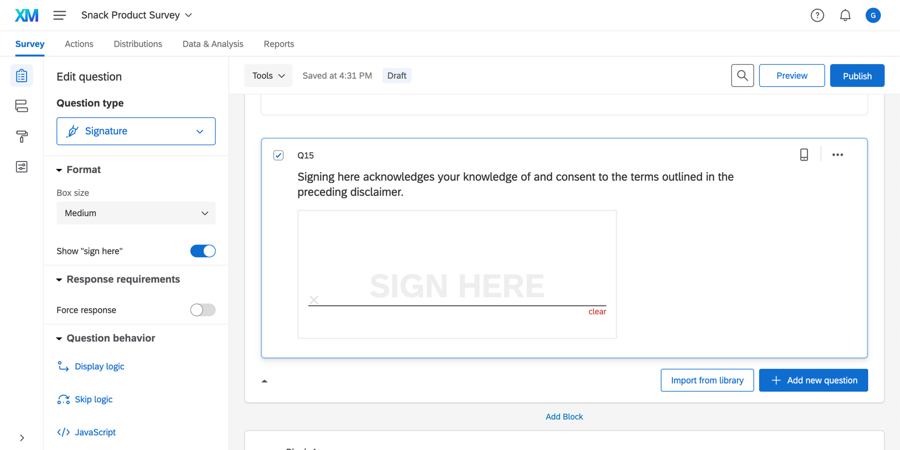
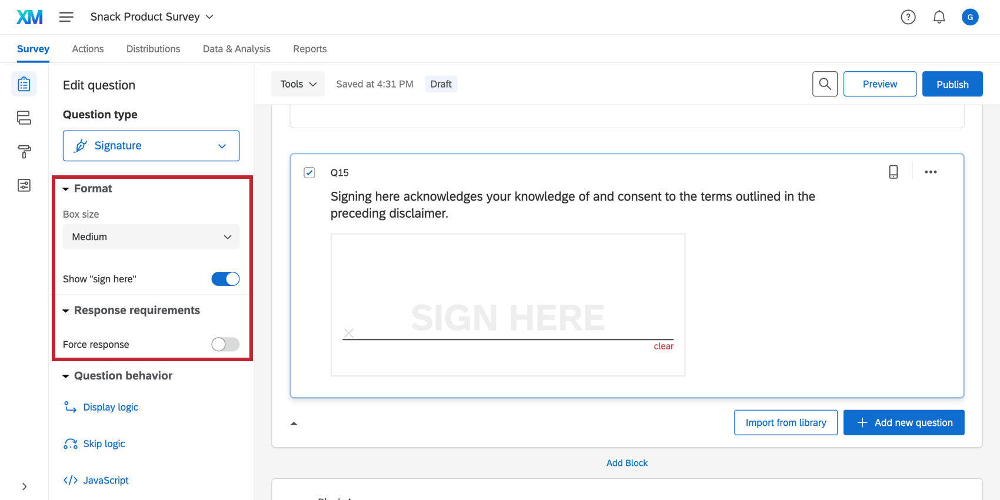
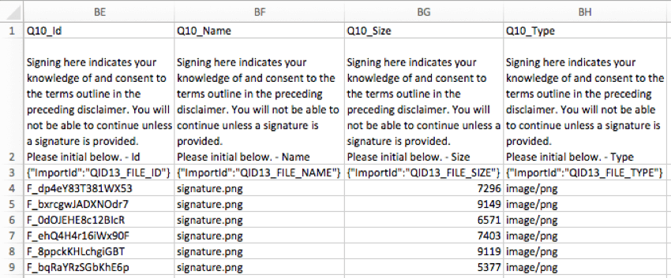

# Signature Question

## About Signature Questions

Signature questions let survey respondents draw their signature in a text box. On a desktop, respondents can use their mouse, and on a mobile device or other touch screens, respondents can use their finger.

**Qtip:** When used with the [New Survey Taking Experience](https://www.qualtrics.com/support/survey-platform/survey-module/look-feel/simple-layout), the signature question lets you switch between Type and Sign versions. Clicking **Type** allows respondents to type their full name, which then generates a signature for them.  

* * *

Was this helpful?

YesNo

* * *

## Setting Up a Signature Question

1.  Click **Add new question.**
2.  Choose **Signature**.  
    
3.  Enter your question text.  
    
    
    **Qtip:** We recommend adding your own legal text to let respondents know this is a representation of their legal signature.
    

* * *

Was this helpful?

YesNo

* * *

## Signature Question Options

The signature question has limited customization options. These options are found in the question editing pane on the left of a selected signature question.

-   **Box size:** Increase or decrease the size of the signature box.
-   **Show “sign here”:** You can toggle the “sign here” text on or off.
-   **[Force response](/support/survey-platform/edit-survey/editing-questions/validation/ "Validation"):** Use this setting to force respondents to answer the question in order to view the rest of the survey.

* * *

Was this helpful?

YesNo

* * *

## Data Analysis

Once your responses have been collected, Qualtrics offers various methods to create reports and analyze your data.

**Attention:** Image files of signatures are included as part of your data. The [Uploaded files access](https://www.qualtrics.com/support/survey-platform/survey-module/survey-options/survey-protection/#SecureParticipantsFiles) in your survey options can affect who can see these images and download them. If you cannot access the image URL from your data export, it is because you are not the survey owner and the survey owner has restricted access. See [Uploaded files access](https://www.qualtrics.com/support/survey-platform/survey-module/survey-options/survey-protection/#SecureParticipantsFiles) for more information and steps for owners to give other users access.

### Downloaded Signature Data

In the [exported dataset](https://www.qualtrics.com/support/survey-platform/data-and-analysis-module/data/download-data/export-data-overview/), a few columns are included for signature data: the Id, Name, Size, and Type of file.

When you [display the Id column](https://www.qualtrics.com/support/survey-platform/data-and-analysis-module/data/recorded-responses/#ChoosingColumns) and click a specific ID, you’ll download the individual signature. Keep in mind this only works if you have [permission to access the file](https://www.qualtrics.com/support/survey-platform/survey-module/survey-options/survey-protection/#SecureParticipantsFiles).

### ZIP Download

Rather than downloading your uploaded files in spreadsheet form, you can download a ZIP file with all the files uploaded by your respondents. When [exporting your responses](https://www.qualtrics.com/support/survey-platform/data-and-analysis-module/data/download-data/export-data-overview/), just choose the [User Submitted Files](https://www.qualtrics.com/support/survey-platform/data-and-analysis-module/data/download-data/export-formats/#UserSubmittedFiles) format.

**Qtip:** Depending on the number files that have been uploaded, this ZIP file may be quite large and could take a while to download.

### Reporting on signature questions

A lot of the reporting available to signature questions is similar to what’s available for file upload questions. See [File Upload Data Analysis](https://www.qualtrics.com/support/survey-platform/survey-module/editing-questions/question-types-guide/advanced/file-upload/#DataAnalysis) for more details on how to use signatures in reports.

* * *

Was this helpful?

YesNo

* * *

## FAQs

[What kind of project can I use this type of question in?](#faq-975) ×

For a full list of questions and their project compatibilities, see [this table.](https://www.qualtrics.com/support/survey-platform/survey-module/editing-questions/question-types-guide/question-types-overview/#Compatibility)