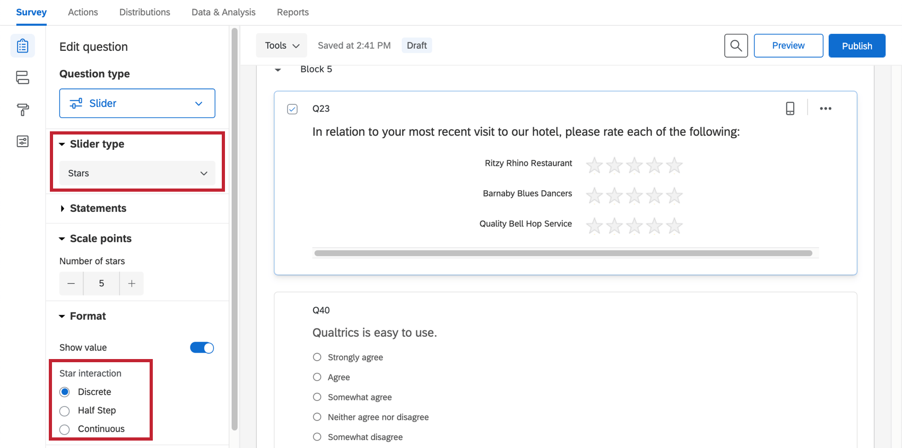
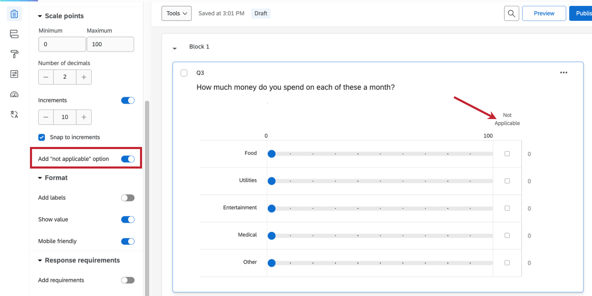

# Slider Question

## About Slider Questions

You can use the slider question type as a more interactive alternative to the matrix table question. Rather than simply selecting a scale point, respondents drag a bar to indicate their preference level.  

**Qtip:** Sliders score a little different than other questions, using multipliers instead of set scale points. If you’re interested in adding a slider to your scoring category, read up on [Scoring a Survey](https://www.qualtrics.com/support/survey-platform/survey-module/survey-tools/scoring/#ScoringASurvey).

**Qtip:** Slider questions can be used in surveys and 360 projects, but no other [Employee Experience](https://www.qualtrics.com/support/employee-experience/projects/creating-a-project-ex/#TypesofEXProjects) projects.

* * *

Was this helpful?

YesNo

* * *

## Types

You can choose from 3 slider question types: bars, sliders, and stars.

**Qtip:** If you want to add a starting position to the slider, add a [default choice](https://www.qualtrics.com/support/survey-platform/survey-module/question-options/add-default-choices/). Keep in mind if respondents don’t move the slider out of the starting position that this default choice will be their answer.

### Sliders

With the sliders variation, respondents drag a slider handle to indicate their preference level. This type works similarly to the bars variation.

### Bars

With the bars variation, respondents drag a bar to indicate their preference level.

### Stars

With the stars variation, respondents choose a star rating in each row. Stars are most commonly used in satisfaction questions.

The **Star interaction** options  let you choose whether the star rating scale is:

-   **Discrete:** Respondents can only select whole stars.
-   **Half Step:** Respondents can select whole or half star ratings.
-   **Continuous:** Respondents can select any portion of a star.

**Qtip:** Respondents can select “0” stars on a slider question by doing the following: set the Interaction to Continuous to be able to directly select “0” stars or click and drag (swipe on mobile) to select “0” stars for any Interaction setting.

* * *

Was this helpful?

YesNo

* * *

## Additional Slider Settings

Depending on the type of slider you’ve selected, you will see some of the following options in the question editing pane.

### Statements

The number of statements in a slider corresponds to the number of sliders, or rows. As with many question types, you can type your own options, or use [suggested choices](https://www.qualtrics.com/support/survey-platform/survey-module/editing-questions/formatting-answer-choices/#AutomaticChoices).

### Minimum, Maximum, and Number of Decimals

Use minimum value and maximum value to determine the endpoints for your scale. If desired, you can also modify the number of decimals to determine the level of precision respondents have when answering your question.

**Example:** With 2 decimal places selected, respondents could select 4.82. With 0, they would only be able to select 4 or 5.

### Increments

Under **Scale points**, you can adjust increments on your slider. These are the dots that divide the increments on your scale.

**Example:** The question pictured below has a max of 100 and 10 increments. This puts markers on the question at increments of 10, 20, 30, and so on.

With **Snap to increments** selected, respondents’ selections must fall on a grid line. For example, respondents answering the question above could answer 10 or 20, but not 11.

**Qtip:** Selecting **Snap to increments** will change the way your data is displayed in the Results tab. Instead of showing only the average selected value, you’ll see the number of times each score was given.

### Not Applicable

With this option, respondents can opt out of answering certain rows on your slider question, even when [force response](/support/edit-survey/editing-questions/validation/#ForceResponse "Validation") is turned on. To use this, go to **Scale points** and click **Add “not applicable” option**.

The Not Applicable column always appears to the far-right. You can change the name of this column by clicking the label and typing a new name.

When respondents select this answer, it will be marked as blank in the dataset and treated the same as seen but unanswered questions.

### Labels

For some questions, having additional labels on top of your slider scale points can help respondents choose an appropriate answer. To enable these, open **Format** and select **Add labels**. You’ll then be able to adjust how many you’d like to display.

If you’d like to select from pre-written labels, try enabling **Use suggested labels**. To learn about the options available, see [Suggested Choices](https://www.qualtrics.com/support/survey-platform/survey-module/editing-questions/formatting-answer-choices/#AutomaticChoices).

### Show Value

To show the value the respondent has selected next to the scale, go to **Format** and choose **Show value**.

**Qtip:** Some of the more advanced survey themes do not allow this feature as it is shown above. Instead, the value appears above the scale as the respondent drags the bar or slider.

### Mobile Friendly

Slider questions on mobile devices may not display very well by default. The slider question will reformat on mobile screens so that all the necessary information fits if you go to **Format** and select **Mobile Friendly**.

For more information on mobile compatibility for your surveys, visit our [Mobile Survey Optimization](/support/survey-platform/edit-survey/more-edit-survey/mobile-survey-optimization/ "Mobile Device Look and Feel") support page.

### Response Requirements

With [Force Response](https://www.qualtrics.com/support/survey-platform/survey-module/editing-questions/validation/#ForceResponse) turned on, respondents must answer each row of the slider question. Note that regardless of starting position, respondents will need to move each slider bar at least slightly for the question to count as answered.

You can also select [Request Response](https://www.qualtrics.com/support/survey-platform/survey-module/editing-questions/validation/#RequestResponse). When respondents don’t answer a question, the survey asks if they’re sure they want to leave this content unanswered before allowing them to proceed.

* * *

Was this helpful?

YesNo

* * *

## Data Analysis

Once your responses have been collected, Qualtrics offers various methods to create reports both in and out of the platform. In the [Results](https://www.qualtrics.com/support/survey-platform/reports-module/results-section/reports-overview/ "Reports Overview") and [Reports](https://www.qualtrics.com/support/survey-platform/reports-module/reports-section/paginated-reports-overview/) sections, you can view aggregate data with pre-made reports as well as create your own. From the [Data & Analysis](/support/survey-platform/data-and-analysis-module/data-and-analysis-overview/ "Data & Analysis Overview") tab, you can view and manipulate your survey responses on an individual basis.

### Visualizations

Sliders are compatible with the following [Reports](https://www.qualtrics.com/support/survey-platform/reports-module/reports-section/paginated-reports-overview/) visualizations:

-   [Statistics table](https://www.qualtrics.com/support/survey-platform/reports-module/reports-section/reports-visualizations/table-visualizations/statistics-table-visualization/)
-   [Gauge chart](https://www.qualtrics.com/support/survey-platform/reports-module/reports-section/reports-visualizations/chart-visualizations/gauge-chart-visualization/)
-   [Bar chart](https://www.qualtrics.com/support/survey-platform/reports-module/reports-section/reports-visualizations/chart-visualizations/bar-chart-visualization/)
-   [Line chart](https://www.qualtrics.com/support/survey-platform/reports-module/reports-section/reports-visualizations/chart-visualizations/line-chart-visualization/)
-   [Results table](https://www.qualtrics.com/support/survey-platform/reports-module/reports-section/reports-visualizations/table-visualizations/results-table-visualization/)
-   [Data table](https://www.qualtrics.com/support/survey-platform/reports-module/reports-section/reports-visualizations/table-visualizations/data-table-visualization/)

In Results Dashboards, [sliders are treated as Numeric data](https://www.qualtrics.com/support/survey-platform/reports-module/results-dashboards/results-dashboards-widgets/#QuestionFieldTypes). That means they work with [any widget](https://www.qualtrics.com/support/survey-platform/reports-module/results-dashboards/results-dashboards-widgets/) that allows numeric data.

The less discrete data that is collected for the slider, the more choices respondents will enter, and the less likely that the visualizations other than the statistics table and gauge chart will be able to display your slider’s data. For example, if you have your slider set to a max of 5 with **Discrete** selected, the bar chart will work just fine because it only has 5 scale points to display data for.

For more information on these visualizations, please visit the linked visualization support pages.

### Downloaded Data Format

In the [downloaded dataset](https://www.qualtrics.com/support/survey-platform/data-and-analysis-module/data/download-data/export-data-overview/), a column will be included for each slider bar provided within your question. For each row in the column, the value will either be the number they selected, or blank if they skipped the question. If you included a “Not Applicable” option on the question, respondents who selected this will have a blank space where their answer should be.

* * *

Was this helpful?

YesNo

* * *

## FAQs

[What kind of project can I use this type of question in?](#faq-975) ×

For a full list of questions and their project compatibilities, see [this table.](https://www.qualtrics.com/support/survey-platform/survey-module/editing-questions/question-types-guide/question-types-overview/#Compatibility)