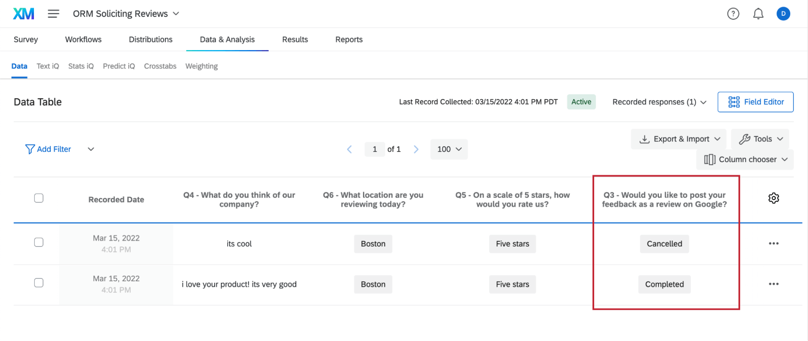

# Solicit Reviews Question

## About the Solicit Reviews Question

Building a robust catalog of ratings and reviews is important for building your business’s reputation and drawing in new customers. You can make it easier than ever for customers to amplify their voice by letting them leave a review on a trusted source – such as Google, Facebook, or G2 – from right inside a Qualtrics survey.

As a condition of using this feature, you agree to comply with our [Terms and Conditions](https://www.qualtrics.com/support/integrations/online-reputation-management/solicit-reviews-question/#TermsandConditions).

**Qtip:** This feature is not included in every license. Please contact [Account Services](https://www.qualtrics.com/support/getting-started-qualtrics/support-portal/product-technical-support/#AccountServices) if you are interested in getting access to this feature.

* * *

Was this helpful?

YesNo

* * *

## Getting Started

To use this feature, your survey needs to be on the [New Survey Taking Experience](https://www.qualtrics.com/support/survey-platform/survey-module/look-feel/simple-layout/?utm_medium=LookandFeel&utm_source=product&utm_campaign=ExperienceFirstUpdatesPhase2). See more about what features are compatible and how to switch to this layout on the linked support page.

If you are soliciting Google reviews, it can help if a [Brand Administrator](https://www.qualtrics.com/support/survey-platform/getting-started/help-and-feedback/#QualtricsAdministrator) [creates a reputation management project](https://www.qualtrics.com/support/integrations/online-reputation-management/setting-up-a-reputation-management-project/#Creating) and [successfully connects it to the Google app](https://www.qualtrics.com/support/integrations/online-reputation-management/setting-up-a-reputation-management-project/#SocialDataCollector) before following the next steps.

* * *

Was this helpful?

YesNo

* * *

## Adding the Solicit Reviews Question to a Survey

In order to solicit reviews from right inside a Qualtrics survey, you need to add a special kind of question, then set it up so it connects to the correct review page.

**Qtip:** If you are adding this functionality to an existing survey, keep in mind that the Solicit Reviews question is where respondents will enter their review. Content they enter into other questions in the survey will not be pulled into their review [unless you use autofill](https://www.qualtrics.com/support/integrations/online-reputation-management/solicit-reviews-question/#Autofill).

1.  [Create a survey](https://www.qualtrics.com/support/survey-platform/my-projects/creating-a-project/#CreatingANewProject) or select an existing one.
2.  [Set this survey to the Simple layout](https://www.qualtrics.com/support/survey-platform/survey-module/look-feel/simple-layout/?utm_medium=LookandFeel&utm_source=product&utm_campaign=ExperienceFirstUpdatesPhase2#ApplyingtheLayout).  
    
3.  Return to the survey builder.  
    
4.  Click **Add new question**.
5.  Select **Solicit reviews**.
6.  Under **Review app or service**, choose the service where you’d like survey respondents to be able to post reviews. Select one from the following:  
    
    
    -   Better Business Bureau (BBB)
    -   Google
    -   Facebook
    -   G2 Crowd
    -   Consumer Affairs
7.  The next step varies based on the company you chose.

### Next Steps: Google

Google Reviews are divided by location, so you need to specify the location your respondents should leave a review for using a place ID. See how you can find these IDs in [Getting Place IDs](https://www.qualtrics.com/support/integrations/online-reputation-management/solicit-reviews-question/#GooglePlaceIDs).

You can also set up [autofill](https://www.qualtrics.com/support/integrations/online-reputation-management/solicit-reviews-question/#Autofill), which helps the respondent carry other survey response content into the review website of choice.

### Next Steps: Better Business Bureau (BBB), Facebook, G2 Crowd, or Consumer Affairs

Add a link to your company’s profile on the chosen website. This determines where your respondents are redirected when they click the link shown in the preview.

You can also set up [autofill](https://www.qualtrics.com/support/integrations/online-reputation-management/solicit-reviews-question/#Autofill), which helps the respondent carry other survey response content into the review website of choice.

* * *

Was this helpful?

YesNo

* * *

## Autofill Review Content

Autofill will take a review that the respondent typed in a Qualtrics survey and automatically fill it into the third party company’s review platform. It can be useful if you’ve already asked the respondent for their thoughts, and want to make it easier for them to carry these over into a more official review of your company.

**Qtip:** Respondents have a chance to edit their review on another platform before they submit it. This means the response they added to the survey and the review they left on a corporate site may not exactly match.

### Survey Design

This section has some basic guiding principles on how to format your survey to work with autofill functionality.

User responses work best in the form of a [text entry question](https://www.qualtrics.com/support/survey-platform/survey-module/editing-questions/question-types-guide/standard-content/text-entry/?parent=p001132). Note that the format of the text entry question is up to you.  
Make sure any questions you add that you want to carry into the review are on a **separate page** from the solicit reviews question. Learn more about how to [add page breaks](https://www.qualtrics.com/support/survey-platform/survey-module/editing-questions/add-page-break/).

**Qtip**: In the case of Google reviews, you can also map a star rating from the survey. Since you cannot use slider questions with the simple layout, we recommend using a [multiple choice question](https://www.qualtrics.com/support/survey-platform/survey-module/editing-questions/question-types-guide/standard-content/multiple-choice/). This can be phrased as a number scale, a satisfaction question, or whatever you’d like. Make sure the [recode values](https://www.qualtrics.com/support/survey-platform/survey-module/question-options/recode-values/?parent=p0073) are correct for each choice and maintain a 1-5 scale.

### Autofill Setup

1.  [Create a solicit reviews question and set it up](https://www.qualtrics.com/support/integrations/online-reputation-management/solicit-reviews-question/#AddingaQuestion).  
    
2.  Under **User response from**, find your text entry question.
3.  Select the full, exact question text, e.g., “Please provide feedback on our company.” **Do not select the option that says “Question Text.”**

**Attention**: Autofilling responses directly into Google reviews is currently not possible. Respondents will need to copy and paste their review into Google.

* * *

Was this helpful?

YesNo

* * *

## Getting Google Place IDs

Google uses Place IDs to identify unique locations in their database. For each location you add to your organization in Google Reviews, there will be a Place ID.

The easiest method to gather your Google Place IDs is to connect a reputation management project to your Google Business account, then export a comma-separated (CSV) spreadsheet of all of your IDs.

1.  Make sure you’ve [created a reputation management project and connected Google as the source](https://www.qualtrics.com/support/integrations/online-reputation-management/reputation-management-projects/connecting-to-google-places-rm/#SettingUpYourProjects).
2.  Open your reputation management project.
3.  Stay in the **Reputation Management** tab.  
    
4.  Click the options menu and select **Download CSV list of all my Google locations**.

This will export a CSV file with all of the Place IDs inside it.

**Qtip:** You can also manually search for individual IDs using Google’s [documentation](https://developers.google.com/maps/documentation/places/web-service/place-id). This method works well for an organization with a small number of locations, but is **not** recommended if you have multiple locations.

* * *

Was this helpful?

YesNo

* * *

## Dynamically Assigning Google Place IDs

You can only assign one [Google Place ID](https://www.qualtrics.com/support/integrations/online-reputation-management/solicit-reviews-question/#GooglePlaceIDs) to one [question](https://www.qualtrics.com/support/integrations/online-reputation-management/solicit-reviews-question/#AddingaQuestion) at a time. However, you can assign Place IDs dynamically using embedded data and piped text.

If you have the Place ID saved as embedded data, you can add the [piped text](https://www.qualtrics.com/support/survey-platform/survey-module/editing-questions/piped-text/piped-text-overview/) for this embedded data in your question. This field can be named whatever you want, but we recommend something like “GooglePlaceID.”

However, now you need to make sure the “GooglePlaceID” field has the correct information in it.

### Methods for Matching Place IDs to Locations

-   **Dynamic Location Updates:** If you have a lot of locations that could change over time, use supplemental data and a location directory. See [Customizing Surveys with Supplemental Data](https://www.qualtrics.com/support/common-use-case/analyzing-results/corexm-analysis/location-data/#CustomizingSurveyswithSupplementalData). This option gives you the ability to customize the survey experience for the respondent based on answers they provided. That means that if you follow these steps, you can use location data with [display logic](https://www.qualtrics.com/support/survey-platform/survey-module/question-options/display-logic/), [branch logic](https://www.qualtrics.com/support/survey-platform/survey-module/survey-flow/standard-elements/branch-logic/), and [piped text](https://www.qualtrics.com/support/survey-platform/survey-module/editing-questions/piped-text/piped-text-overview/). You also won’t have to manually add all of the location information to the survey itself; instead, the survey will use the place ID to automatically pull in anything you want to know, such as the location name, city, region, address, and more.
    
    **Qtip:** The reason you create both a directory and a supplemental data source (SDS) is that the directory can save a lot of location data and be edited as needed, while the SDS links this information to the survey and makes logic and piped text work. If you don’t think you’ll ever need to update your location directory, you don’t have to create the directory and can skip the [workflow steps](https://www.qualtrics.com/support/common-use-case/analyzing-results/corexm-analysis/location-data/#CustomizingSurveyswithSupplementalData).
    
-   **Query Strings and Contact Lists:** If you know ahead of time where the customer is located, pass the location itself into the survey [through a URL](https://www.qualtrics.com/support/survey-platform/survey-module/survey-flow/standard-elements/passing-information-through-query-strings/) or a [contact list](https://www.qualtrics.com/support/iq-directory/lists-tab/creating-mailing-lists/#RequiredFields), then use branch logic to match locations to Google Place IDs.
    
    **Qtip:** If your location data is already saved as embedded data in your survey, you can use this location data to set Google Place IDs. Set up a branch for each location and set the appropriate embedded data underneath it.
    
    
    
-   **Manual Survey Assignment:** Ask for a location right in the survey and assign it an ID. This is explained more below, under **Asking for the Location in the Survey**.

### Asking for the Location in the Survey

1.  Add a [multiple choice question](https://www.qualtrics.com/support/survey-platform/survey-module/editing-questions/question-types-guide/standard-content/multiple-choice/) where respondents choose a location.
2.  Make sure the multiple choice question and the solicit review question are in different blocks. The multiple choice question should come before the solicit reviews question.
3.  Go to the [survey flow](https://www.qualtrics.com/support/survey-platform/survey-module/survey-flow/survey-flow-overview/).  
    
4.  [Add a branch](https://www.qualtrics.com/support/survey-platform/survey-module/survey-flow/standard-elements/branch-logic/#AddingABranch) between the location question and solicit reviews question blocks.
5.  Edit the condition so that **one** of the locations must be selected.
6.  Inside this branch, [add an embedded data element](https://www.qualtrics.com/support/survey-platform/survey-module/survey-flow/standard-elements/embedded-data/#CreatingAnEmbeddedDataElement).
7.  Add a field for the Google Place ID.
    
    **Qtip:** You can name this field whatever you want. We recommend something like “GooglePlaceID.”
    
8.  Set this field equal to the Google Place ID for this location.
    
    **Example:** In step 4, we said only people who chose the Boston location should go down this branch. We set the GooglePlaceID embedded data equal to the Place ID for our Boston location.
    
9.  Duplicate the branch so you have as many branches as you have locations.  
    
10.  Edit the condition and the GooglePlaceID for each branch so each branch covers a unique location.
    
    **Example:** We have 5 locations, in the cities of Boston, Seattle, New Orleans, Philadelphia, and New York City. We would make 5 branches, one for each of the locations just listed.
    

**Qtip:** Make sure the name of the Google Place ID embedded data in the survey flow exactly matches the one in the piped text of the solicit reviews question. That means using the exact same spelling and spacing. (I.e., it must be GooglePlaceID in both places.)

* * *

Was this helpful?

YesNo

* * *

## What Survey Takers See

This section covers what survey-takers see when this question is set up correctly.

Once the respondent gets to the solicit reviews question, they will see the logo of the review service you chose. Beneath this logo will be a link to review your company at the profile link you provided. This link will open in a new browser tab.

If you included [autofill](https://www.qualtrics.com/support/integrations/online-reputation-management/solicit-reviews-question/#Autofill), respondents will see the autofill content. There will be a button to copy the text and another to open the profile in a new window.

  
Survey-takers in either scenario will not complete the survey unless they return to this tab to submit their survey response.

* * *

Was this helpful?

YesNo

* * *

## Understanding the Impact of Soliciting Reviews

The solicit reviews question saves some information to help you understand the impact of having this review functionality in your survey. This is saved under the solicit reviews question itself, so you can view this by displaying columns on Data & Analysis or by exporting data.

The following is a list of possible statuses. Remember that if this solution is set to Google Reviews, an embedded widget appears, whereas if you select another company, this question will redirect respondents to another page. See [What Survey Takers See](https://www.qualtrics.com/support/integrations/online-reputation-management/solicit-reviews-question/#WhatSurveyTakersSee).

-   **Empty Value:** For all review apps. The respondent has third party cookies enabled on their browser and skipped the question without taking any action.
-   **Redirect Used:** For review apps other than Google, the question was displayed and the respondent clicked to redirect. Since there is not a way to track actual completion once a respondent leaves the Qualtrics platform, it is open whether the respondent proceeded to leave a review in another window or not.
-   **Fallback Used:** For Google Reviews only. The redirect-based solution was displayed and the respondent clicked to redirect. Since there is not a way to track actual completion once a respondent leaves the Qualtrics platform, it is open whether the respondent proceeded to leave a review in another window or not.
-   **Error:** For Google Reviews only. The Google widget was displayed, but an issue was detected that prevented the respondent from leaving a review.
    
    **Qtip:** The question does not record the origin of the error. You may want to check that the [Google Place IDs](https://www.qualtrics.com/support/integrations/online-reputation-management/solicit-reviews-question/#MappingGooglePlaceIDs) are set up correctly in your survey.
    
-   **Fallback Shown:** For Google Reviews only. The respondent saw the question, but has third party cookies disabled, so they see the redirect option instead of the ability to leave a review right in the question. They did not click the redirect.

* * *

Was this helpful?

YesNo

* * *

## Other Best Practices

### Hiding the Question When There’s No Google Place ID

If some locations or respondents don’t have a Google Place ID, the solicit reviews question will not display correctly. It is better in these cases to hide the solicit reviews question from the respondent.

Add [display logic](https://www.qualtrics.com/support/survey-platform/survey-module/question-options/display-logic/) to your solicit reviews question. Add a condition based on the embedded data “GooglePlaceID,” and select “Is Not Empty.” This means the question will only display if the Google Place ID has a value.

### Publicly reply to reviews

Publicly responding to reviews boosts your customer service satisfaction and your public perception, whether it’s to thank a customer for taking the time to share their positive feedback, or to ask for more details so issues can be resolved.

If your company is already responding to reviews, we recommend ensuring they are aware and staffed for the new volume you’ll receive by using this feature. If you are not already responding, Qualtrics makes it easy to start using the [Online Reviews widget](https://www.qualtrics.com/support/integrations/online-reputation-management/online-reputation-dashboards/#SocialTicker).

### Only ask certain respondents for reviews

You can decide which respondents you want to ask to leave reviews by adding [display logic](https://www.qualtrics.com/support/survey-platform/survey-module/question-options/display-logic/) to the [solicit reviews](https://www.qualtrics.com/support/integrations/online-reputation-management/solicit-reviews-question/#AddingaQuestion) question.

**Example:** Your survey includes a question asking respondents if they’d like to contact your team to escalate an issue. Immediately asking these customers for a review could yield a poor experience, such as multiple teams who saw the complaint reaching out separately to help the same respondent.

**Warning:** Only asking for reviews from respondents who gave positive feedback is **not permitted.** See our [Terms and Conditions](https://www.qualtrics.com/support/integrations/online-reputation-management/solicit-reviews-question/#TermsandConditions) and [Blog Post](https://www.qualtrics.com/blog/review-gating/) for more details.

* * *

Was this helpful?

YesNo

* * *

## Terms and Conditions

By using the Solicit Reviews question type, you agree to solicit reviews in accordance with applicable law, including Section 5(a) of the Federal Trade Commission Act (15 U.S.C. § 45). You agree that you will not only solicit reviews that are positive. You also agree to comply with the terms and conditions established by the respective review site.

* * *

Was this helpful?

YesNo

* * *

## FAQs

[Is there a way for me to see a respondent’s full response within Results Dashboards?](#faq-812) ×

To see a full response, add a [Record Grid widget](https://www.qualtrics.com/support/vocalize/widgets/table-widgets/record-grid-widget/) and select **Show full response when clicked**.

[Will survey takers be able to edit the rating or review content before publishing?](#faq-813) ×

Yes. Respondents will see the draft review and then can edit it before publishing.

[What if the recipient has already left a Google review?](#faq-814) ×

The survey will show the last review they left, and they can choose to edit it further.

[Does the solicit reviews question have to be on its own page?](#faq-815) ×

If you are [autofilling review content](https://www.qualtrics.com/support/integrations/online-reputation-management/solicit-reviews-question/#Autofill), the question needs to be on a separate page from the questions it is taking information from. This is due to how [piped text](https://www.qualtrics.com/support/survey-platform/survey-module/editing-questions/piped-text/piped-text-overview/) works.

[Can one survey be used to solicit reviews for multiple locations?](#faq-816) ×

Yes. This works for one location or multiple locations, although you will have to do [some survey setup](https://www.qualtrics.com/support/integrations/online-reputation-management/solicit-reviews-question/#MappingGooglePlaceIDs) to enable it.

[Does this solution work for my industry/organization type?](#faq-817) ×

This solution works for any organization that would like to set up [Google Business Profiles](https://support.google.com/business/answer/9798848?hl=en); for some industries, this includes not just the organization, but also the individual service provider (learn more about industry considerations [on Google's documentation](https://support.google.com/business/topic/11497548?hl=en&ref_topic=4539639)). Every business profile comes with the unique Place ID needed to power the solicit reviews question.

[Do survey takers need to be logged in to publish a review?](#faq-872) ×

Yes. For Google, the survey taker will complete the login process within the widget itself, after which they can finish publishing their review. 

[What kind of project can I use this type of question in?](#faq-975) ×

For a full list of questions and their project compatibilities, see [this table.](https://www.qualtrics.com/support/survey-platform/survey-module/editing-questions/question-types-guide/question-types-overview/#Compatibility)