# Text Entry Question

## About Text Entry Questions

Text entry questions allow you to collect open-ended responses from your respondents.

[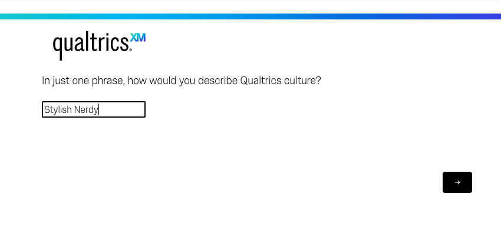](https://www.qualtrics.com/m/assets/support/wp-content/uploads//2021/02/text-entry-question-1.png)

**Qtip:** By default, the maximum number of characters permitted in a single text entry field is 20,000. However, you can change the character limit to be less than 20,000 if you apply [custom validation](https://www.qualtrics.com/support/survey-platform/survey-module/editing-questions/question-types-guide/standard-content/text-entry/#TextEntryValidation) to the question.

* * *

Was this helpful?

YesNo

* * *

## Variations

The text entry question has several variations that change the size and type of the text box. You can access these variations under **Text Type** in the question editing pane.

### Single Line

The single line variation provides respondents with a 1 line text box. While respondents can write responses well beyond the limits of the box, the single line format encourages a more succinct answer.

[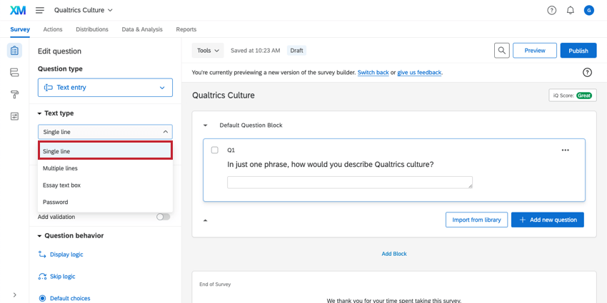](https://www.qualtrics.com/m/assets/support/wp-content/uploads//2021/02/text-entry-question-2.png)

### Multiple Lines and Essay Text Box

The multiple lines and essay text box variations provide respondents with multiple lines, encouraging respondents to provide a longer response. As you can see below, this change is not reflected in the editor, but in the preview of the question.

[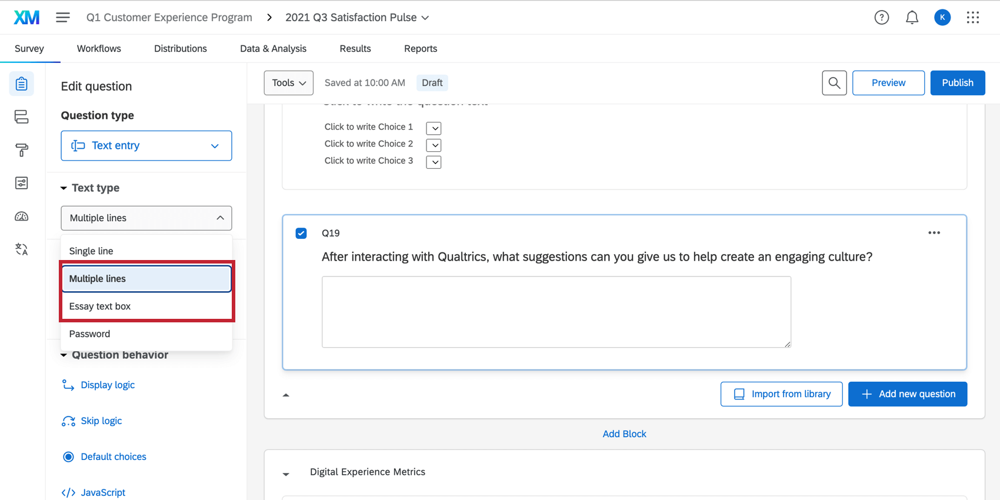](https://www.qualtrics.com/m/assets/support/wp-content/uploads//2015/04/TextEntryMultipleLinesUpdate.png)

[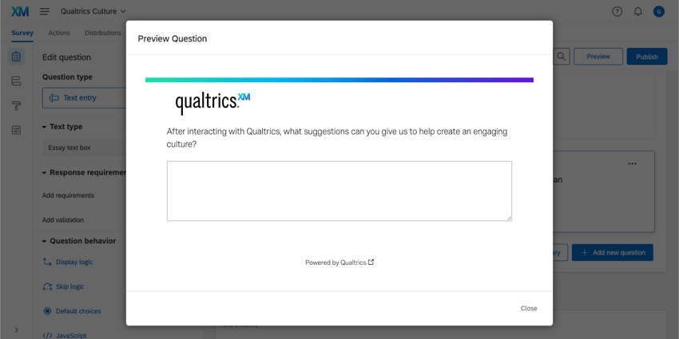](https://www.qualtrics.com/m/assets/support/wp-content/uploads//2021/02/text-entry-question-4.png)

**Qtip:** “Essay text box” and “Multiple lines” refers to a default size that will be set, so long as you do not resize the text boxes. If you click and drag the handle on the bottom-right of the text box, you may make essay text box and multiple line text boxes as tall and as wide as you need to, making these two variations interchangeable. Note that once you resize a text box, you cannot reset it to its default size except by manual resizing.

### Password

The password variation provides a single line text box. Any characters typed into the text box are disguised by dots.

[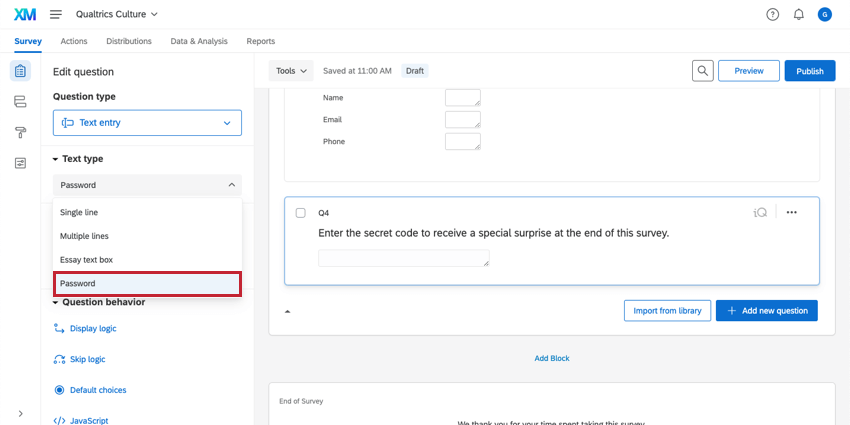](https://www.qualtrics.com/m/assets/support/wp-content/uploads//2021/02/text-entry-question-5.png)

[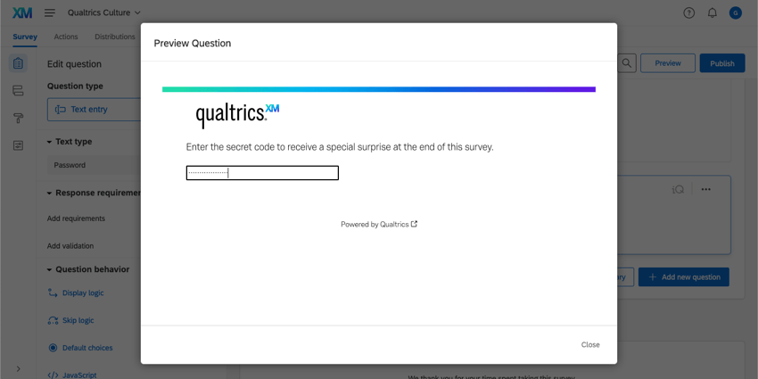](https://www.qualtrics.com/m/assets/support/wp-content/uploads//2021/02/text-entry-question-6.png)

**Qtip:** Want to save individual passwords for users? Want the survey to check that the participants have the right passwords before they can respond? Consider using an [authenticator](/support/edit-survey/survey-flow/authenticator/authenticator-overview/ "Authenticator Overview") instead.

### Autocomplete

Autocomplete is a text entry variation that draws on a list of preexisting answers to provide recommendations to respondents of what they should answer. Autocomplete works a bit different from other text entry types, so it requires a specific setup. To learn more, see [Autocomplete Questions](https://www.qualtrics.com/support/survey-platform/survey-module/editing-questions/question-types-guide/standard-content/autocomplete-questions-supplemental-data/?parent=p001132).

* * *

Was this helpful?

YesNo

* * *

## Conversational Feedback

**Attention**: This feature is only available to users on the new [simplified pricing and packaging plans](https://www.qualtrics.com/blog/qualtrics-pricing-packaging/) or customers who actively participated in the Preview Program for this feature. For more information, see [Qualtrics Public Preview](https://www.qualtrics.com/support/getting-started-qualtrics/qualtrics-public-preview/). If you have questions about your Qualtrics pricing and packaging plan, reach out to [Account Services](https://www.qualtrics.com/support/getting-started-qualtrics/support-portal/product-technical-support/#AccountServices).

**Qtip**: You must have either the **AI Adaptive followup – Basic** or the **AI Adaptive followup –** **Advanced** [permission](https://www.qualtrics.com/support/survey-platform/sp-administration/managing-users/user-permissions/) and the **Use AI Adaptive Followup – Advanced** [third party organization setting](https://www.qualtrics.com/support/survey-platform/sp-administration/artificial-intelligence-ai-administration/#OrganizationAISettings) enabled in order to use this feature.

Conversational feedback uses artificial intelligence to create follow-up questions based on what respondents put into your text entry question.

**Attention:** At this time, conversational feedback can only be used for surveys with English or English (UK) as the [base language](https://www.qualtrics.com/support/survey-platform/survey-module/survey-tools/translate-survey/#BaseLanguage). Additionally, conversational feedback cannot be used in [EX projects](https://www.qualtrics.com/support/employee-experience/projects/creating-a-project-ex/#TypesofEXProjects).

**Qtip**: While you can add more than one follow-up question to your survey, a single survey taker will only be eligible to receive up to 2 follow-ups per survey. If a survey taker has already been asked a question with 2 follow-ups enabled, then when they get to the next question with a follow-up, the follow-up will not trigger.

1.  Under Conversational feedback, click the switch next to **Include Follow-up question**.  
    [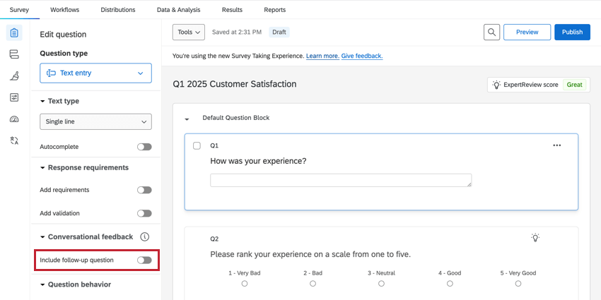](https://www.qualtrics.com/m/assets/support/wp-content/uploads//2015/04/ConversationalFeedback_1.png)
2.  Enter the name of your company. If you’d like to ensure your company name is not displayed to respondents during the survey, click the checkbox next to **Omit company name from survey questions.  
    [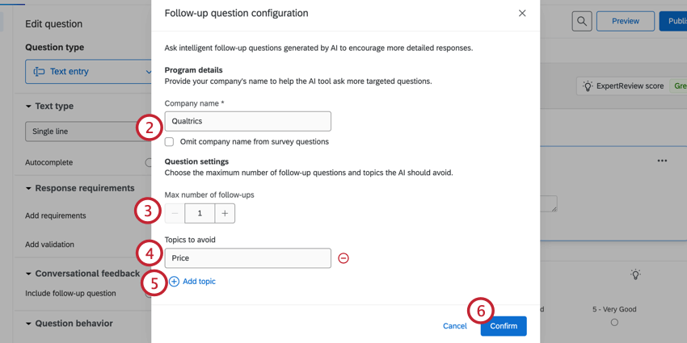](https://www.qualtrics.com/m/assets/support/wp-content/uploads//2015/04/ConversationalFeedback_2.png)  
    **
3.  Select the maximum number of follow-up questions that a respondent can receive. You can select up to 2.
4.  Enter any topics you would like to avoid.
    
    **Attention**: You must have advanced conversational feedback enabled to add a second follow-up and topics to avoid. For more information, see the section below.
    
    **Qtip**: Do not add more than one topic to each topic line. Topics can be phrases describing what you would like to avoid, and are not limited to key words.
    
5.  Click **Add topic** to add more topics. If you’d like to delete a topic, click the minus sign ( **–** ) next to that topic.
6.  Click **Confirm**.
7.  To apply display logic to the follow-up question, click **Display logic**.  
    [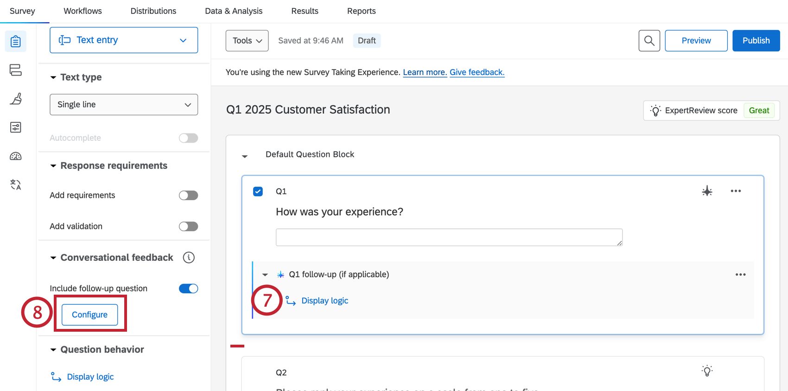](https://www.qualtrics.com/m/assets/support/wp-content/uploads//2015/04/ConversationalFeedback_5.png)
8.  To edit your follow-up question settings, click **Configure**.

**Example**: Conversational feedback works best when asking a specific, detailed text entry question. For example, the question “How was your experience at Qualtrics.com” will provide a better opportunity for follow-up questions than the question “Tell us more”.

**Qtip**: All Javascript tags and images are ignored by the AI when providing a follow up question.

### Enabling Advanced Conversational Feedback

With advanced conversational feedback enabled, you can set up two follow-up questions instead of just one. You can also add topics that you want the AI to avoid when generating follow-up questions. In order to enable advanced conversational feedback, you must have the following permissions and settings enabled:

-   Turn on the AI Adaptive followup – Advanced [user permission](https://www.qualtrics.com/support/survey-platform/sp-administration/managing-users/user-permissions/).
-   Turn on the Use AI Adaptive Followup – Advanced [third party organization setting](https://www.qualtrics.com/support/survey-platform/sp-administration/artificial-intelligence-ai-administration/#OrganizationAISettings).

**Qtip**: For help enabling this feature, reach out to your [Brand Administrator](https://www.qualtrics.com/support/survey-platform/getting-started/help-and-feedback/#QualtricsAdministrator).

* * *

Was this helpful?

YesNo

* * *

## Text Entry Validation

Text entry [validation](https://www.qualtrics.com/support/survey-platform/survey-module/editing-questions/validation/#CustomValidation), found under the **Response requirements** in the editing pane, is unique compared to other types of [question validation](/support/edit-survey/editing-questions/validation/ "Validation").

[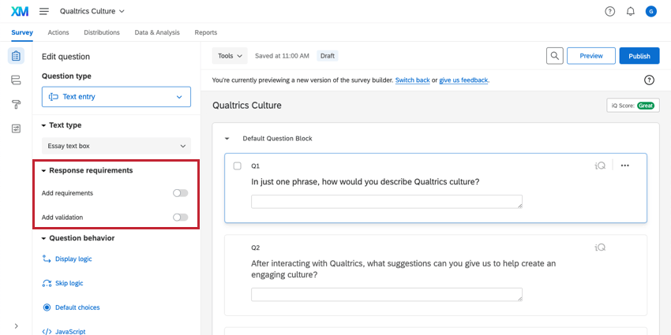](https://www.qualtrics.com/m/assets/support/wp-content/uploads//2021/02/text-entry-question-7.png)

[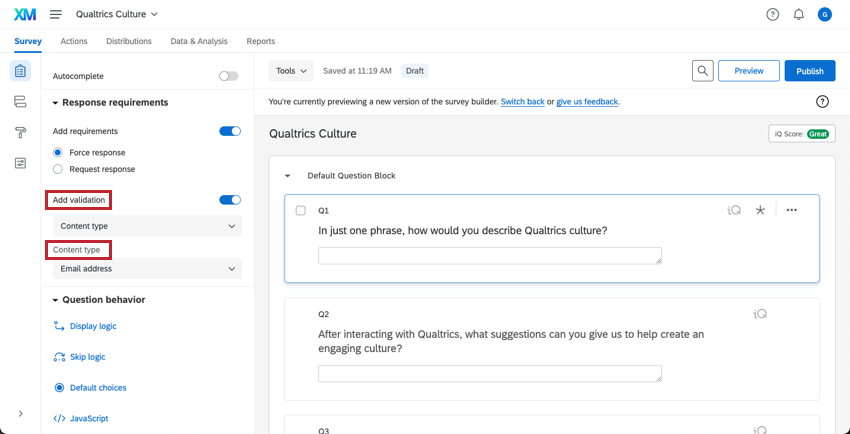](https://www.qualtrics.com/m/assets/support/wp-content/uploads//2021/02/text-entry-question-9.png)

Once you toggle **Add validation** to the blue “on” setting in this area, you can specify the exact type of response you want (e.g., set **Content type** to only accept answers in the format of an email address) or a specific length for the response (e.g., 200 characters). Respondents will not be able to move past the question until a correctly formatted response has been entered.

[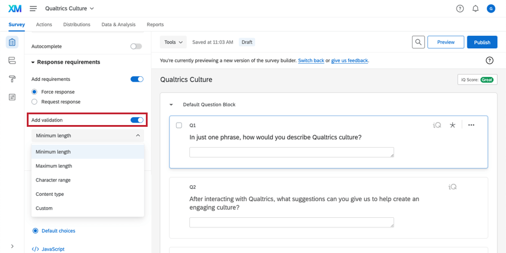](https://www.qualtrics.com/m/assets/support/wp-content/uploads//2021/02/text-entry-question-8.png)

**Qtip:** To select from the content type option, first click **Content type** under **Add validation**.

**Attention:** **Content validation** is only available for single line text entry questions as well as [multiple choice](https://www.qualtrics.com/support/survey-platform/survey-module/editing-questions/question-types-guide/standard-content/multiple-choice/) questions with text entry enabled.

* * *

Was this helpful?

YesNo

* * *

## Data Analysis

Once your responses have been collected, Qualtrics offers various methods to create reports and analyze your data.

### Text iQ

You can analyze your text responses using [Text iQ](https://www.qualtrics.com/support/survey-platform/data-and-analysis-module/text-iq/text-iq-functionality/) to surface sentiment, topics, and other enrichments on the content of your responses. These results can then be displayed in a report or a dashboard.

### Reporting

In [results dashboards](https://www.qualtrics.com/support/survey-platform/reports-module/results-dashboards/results-dashboard-overview/), there are 3 widgets available for text entry questions: [word cloud](https://www.qualtrics.com/support/vocalize/widgets/other-widgets/word-cloud-widget/), [response ticker](https://www.qualtrics.com/support/vocalize/widgets/other-widgets/response-ticker-widget/), and [record table](https://www.qualtrics.com/support/vocalize/record-table-widget/?parent=p00745).

In [reports](https://www.qualtrics.com/support/survey-platform/reports-module/reports-section/paginated-reports-overview/?parent=p00269), you can use the [word cloud](https://www.qualtrics.com/support/survey-platform/reports-module/reports-section/reports-visualizations/other-visualizations/word-cloud-visualization/?parent=p00290) and [results table](https://www.qualtrics.com/support/survey-platform/reports-module/reports-section/reports-visualizations/table-visualizations/results-table-visualization/?parent=p00286) visualizations.

### Downloaded Data Format

Each text entry box in your survey will be shown as a column in your downloaded data. For most variations, there will be only one text box and so only one column for the question in your file. For the [form field](https://www.qualtrics.com/support/survey-platform/survey-module/editing-questions/question-types-guide/standard-content/form-field-question/), there are multiple text boxes, and so there will be multiple columns.

[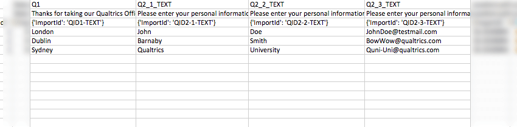](https://www.qualtrics.com/m/assets/support/wp-content/uploads/2016/04/TextEntry.png)

### Conversational Feedback Data

The following [columns](https://www.qualtrics.com/support/survey-platform/data-and-analysis-module/data/recorded-responses/#ChoosingColumns) will be added to your dataset for each [conversational feedback question](https://www.qualtrics.com/support/survey-platform/survey-module/editing-questions/question-types-guide/standard-content/text-entry/#ConversationalFeedback):  
[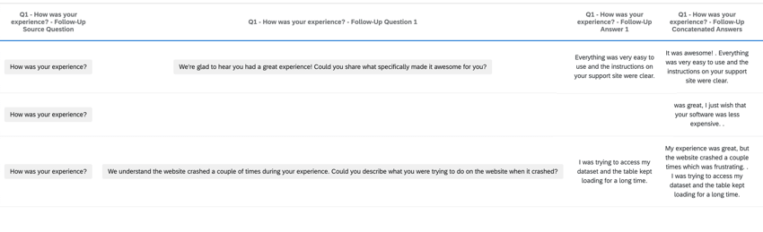](https://www.qualtrics.com/m/assets/support/wp-content/uploads//2015/04/ConversationalFeedback_4.png)

-   **Q# – {Question Text} – Follow-Up Transcript**: The source question, source response, follow-up questions, and follow-up question responses.
    
    **Qtip:** Display this data in a [response ticker widget](https://www.qualtrics.com/support/vocalize/widgets/other-widgets/response-ticker-widget/) to follow the conversation, allowing you to read each response at a time.
    
-   **Q# – {Question Text} – Follow-Up Concatenated Answers**: The source question response and follow-up response, combined together into a single text response.
    
    **Qtip:** Analyze this field for [Text iQ topics](https://www.qualtrics.com/support/survey-platform/data-and-analysis-module/text-iq/topics-in-text-iq/?parent=p001261) and [text enrichments](https://www.qualtrics.com/support/survey-platform/data-and-analysis-module/text-iq/actionability/?parent=p001261).
    
-   **Q# = {Question Text} – Follow-Up Question:** The follow-up question that was created in response to the answer of text entry data.
-   **Q# = {Question Text} – Follow-Up Answer**: The response to the follow-up question that was generated.

* * *

Was this helpful?

YesNo

* * *

## FAQs

[What kind of project can I use this type of question in?](#faq-975) ×

For a full list of questions and their project compatibilities, see [this table.](https://www.qualtrics.com/support/survey-platform/survey-module/editing-questions/question-types-guide/question-types-overview/#Compatibility)