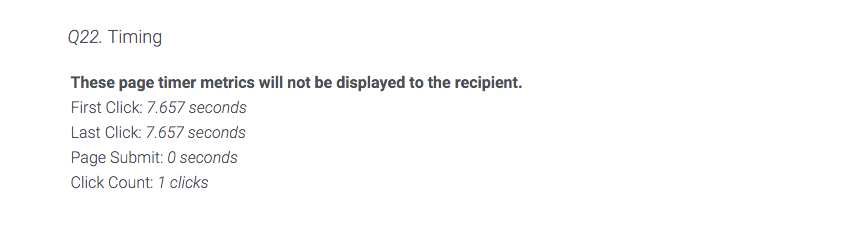
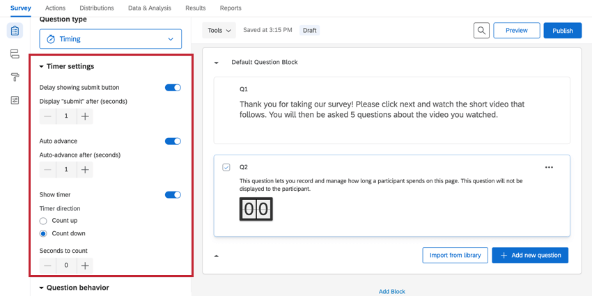
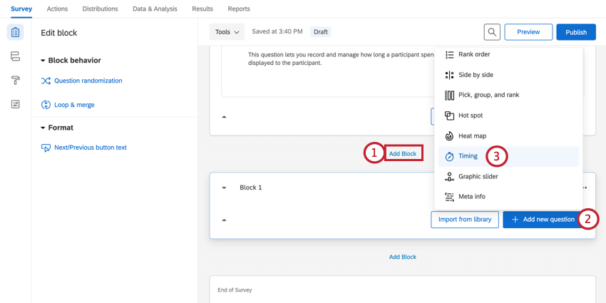
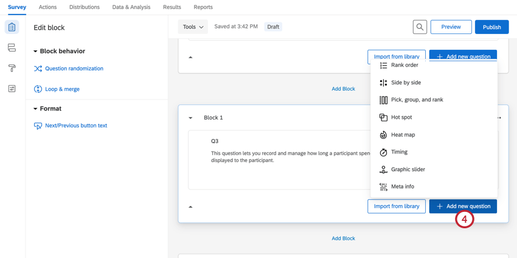
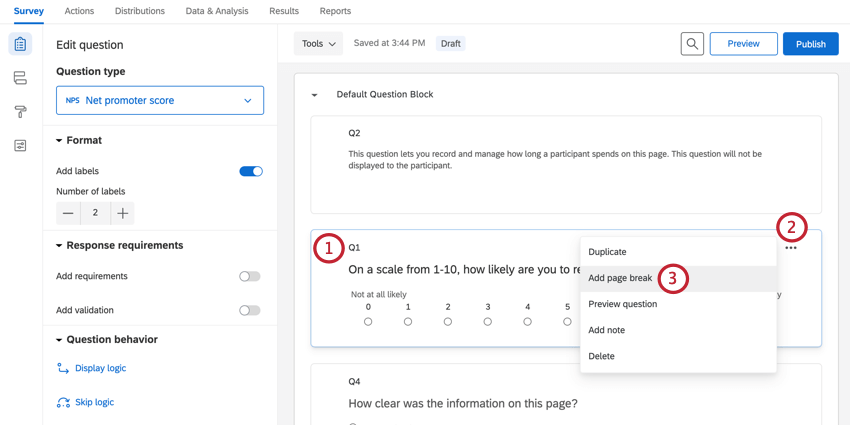
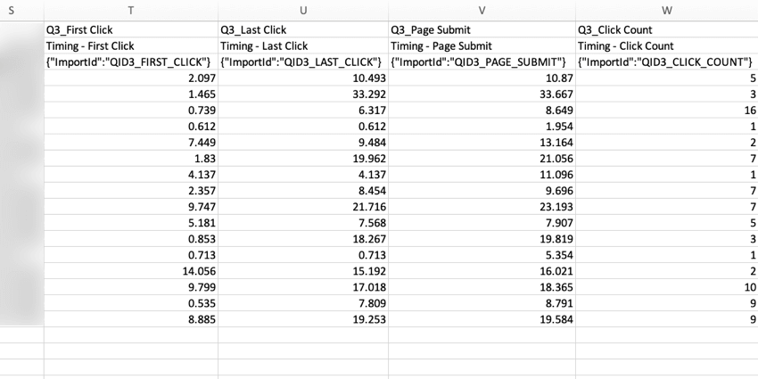

# Timing Question

## About Timing Questions

The timing question is a hidden question that can be added on any page of your survey to track and manage the time a respondent spends on that page.

Most users employ timing in conjunction with other questions. For example, if you have a video respondents need to watch, you might use a timing question to hide the next button until the respondent has had enough time to complete the video. Or with a matrix table question, you might record how long a respondent is spending on the page, and if they don’t spend long enough, use a [branch](/support/edit-survey/survey-flow/standard-elements/branch-logic/ "Branch Logic") element to [screen them out](/support/edit-survey/survey-flow/screen-out-management/ "Screen-Out Management") of the survey.

**Qtip:** Need to time the entire survey instead of a single page? Simply [add an embedded data element](/support/edit-survey/survey-flow/standard-elements/embedded-data#SettingValuesFromOtherSources "Embedded Data") to your Survey Flow named Q\_TotalDuration. This field will automatically track the seconds a respondent takes to complete the survey. This includes time with the survey open, and time spent away from the survey if the user closes out of the survey and returns.

* * *

Was this helpful?

YesNo

* * *

## Timing Options

A timing question can be added at any point in your survey. This question will be hidden from respondents, and it will record 4 main metrics:

-   **First Click:** How many total seconds the page was visible before the respondent clicks the first time.
-   **Last Click:** How many total seconds the page was visible before the respondent clicks the last time (not including clicking the next button).
-   **Page Submit:** How many total seconds pass before the respondent clicks the next button (i.e., the total amount of time the respondent spends on the page).
-   **Click Count:** How many total times the respondent clicks on the page.

**Qtip:** These metrics will be additive if the respondent is viewing the page multiple times, either through the use of a [back button](https://www.qualtrics.com/support/survey-platform/survey-module/survey-options/survey-experience/#AddingABackButton) or by exiting and reopening the survey. For example, let’s say a respondent submits a page after 20 seconds, goes back to that page using the back button, and then submits the page again after 30 seconds. Their recorded Page Submit time will be 50 seconds.

In addition to recording these counts, the following options are available in the question editing pane.

### Delay showing submit button

You can use this option to hide the next button for a certain number of seconds, preventing respondents from progressing through the survey. After enabling this option, a **Display “submit” after (seconds)** option will appear where you can determine how long a respondent must be on a page before the next button appears. This counter resets if the respondent exits and reopens the survey or navigates to a different page and then returns to this page.

When disabled, the next button is displayed to the respondent, allowing them to continue the survey as they please.

### Auto Advance

You can use this option to automatically move respondents to the next page of the survey after a certain number of seconds. After enabling this option, an **Auto-advance after (seconds)** option will appear where you can determine how long the respondent can spend on the page before it auto advances. This counter resets if the respondent exits and reopens the survey or navigates to a different page and then returns to this page.

When disabled, respondents may take as long on the page as they like.

### Show Timer

With this option, a timer is displayed to respondents to help them know how long they are spending on that page of the survey. You can then determine whether the timer counts up or counts down. If counting down, you can choose the number it counts down from.

* * *

Was this helpful?

YesNo

* * *

## Timing a Question or a Set of Questions

To keep track of the time spent on a particular question or on a set of questions, you will need to isolate the timing question on the same page as the questions of interest. There are 2 ways to do this.

### Using Blocks as Page Breaks

1.  Click **Add Block**.  
    
2.  Click **Add new question.**
3.  Select **Timing.**
4.  Inside the same block, click **Add new question** to add the question(s) you are interested in timing. Make sure that you only add questions you are interested in timing in this block.  
    

### Using Manual Page Breaks

1.  Build out all of your survey content in 1 block. Then select the question the page break will go beneath by checking the box next to the question number.  
    
2.  Click the 3 dots in the top right corner of the question.
3.  Select **Add page break**.
4.  Repeat steps 1 through 3 for as many page breaks as you need to add within a block. Each page break section you want to monitor should have its own timing question.

**Qtip:** [Question randomization](https://www.qualtrics.com/support/survey-platform/survey-module/block-options/question-randomization/#SettingUpQuestionRandomization) will disable any page breaks you have set up, and so are not recommended for use with timing questions. Page breaks set in the [Look & Feel](https://www.qualtrics.com/support/survey-platform/survey-module/editing-questions/add-page-break/#AddingPageBreaksAutomatically) also do not work well with timing questions.

* * *

Was this helpful?

YesNo

* * *

## Data Analysis

Once your responses have been collected, Qualtrics offers various methods to create reports both in and out of the platform. From the [Data and Analysis](https://www.qualtrics.com/support/survey-platform/data-and-analysis-module/data/recorded-responses/) tab, you can view and manipulate your survey responses on an individual basis.

### Download Data Format

Timing information is displayed in the downloaded data-set showing the 4 recorded metrics, rounded to the nearest millisecond, for each participant.

  

* * *

Was this helpful?

YesNo

* * *

## FAQs

[What kind of project can I use this type of question in?](#faq-975) ×

For a full list of questions and their project compatibilities, see [this table.](https://www.qualtrics.com/support/survey-platform/survey-module/editing-questions/question-types-guide/question-types-overview/#Compatibility)