# Tree Testing Question

## About Tree Testing Questions

Tree testing is a research method that is used to measure the efficacy of your website’s structure (also called a “tree”) by asking users to find items based on the website’s information architecture and terminology. The tree testing question enables you to analyze your website’s navigation and update your website to make it easier for users to find what they’re looking for.  
[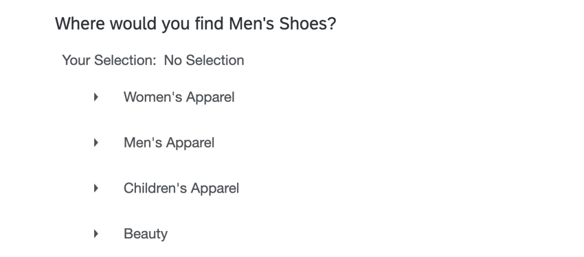](https://www.qualtrics.com/m/assets/support/wp-content/uploads//2024/01/tree-testing-example.png)

**Qtip:** This question type is only compatible with [survey projects](https://www.qualtrics.com/support/survey-platform/survey-module/editing-questions/question-types-guide/question-types-overview/#Compatibility) using the [New Survey Taking Experience](https://www.qualtrics.com/support/survey-platform/survey-module/look-feel/simple-layout/).

* * *

Was this helpful?

YesNo

* * *

## Customizing a Tree Testing Question

**Qtip:** If you receive a “Data validation failure” when saving your tree testing question, then the question is too large. To resolve this error, you can try reducing the number of nodes and levels in your tree. Alternatively, you can split your tree testing question into multiple questions.

This section covers how to customize a tree testing question so it matches your website’s structure. For general instruction on adding and editing questions in a survey, see [Creating Questions](https://www.qualtrics.com/support/survey-platform/survey-module/editing-questions/creating-questions/?parent=p0030).

1.  Click on the question text to begin writing your question. We recommend adding instructions for survey takers on how to respond to the question.  
    [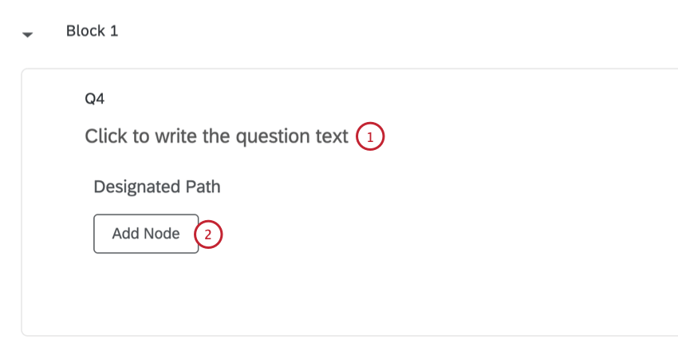](https://www.qualtrics.com/m/assets/support/wp-content/uploads//2024/01/tree-testing-1-2.png)
2.  Click **Add Node** to add the top-level categories of your website. You can add as many nodes as needed.
    
    **Qtip:** You can also press the Enter key on your keyboard to add another node at the same level.
    
3.  Type your website categories in the **Enter a value** boxes.  
    [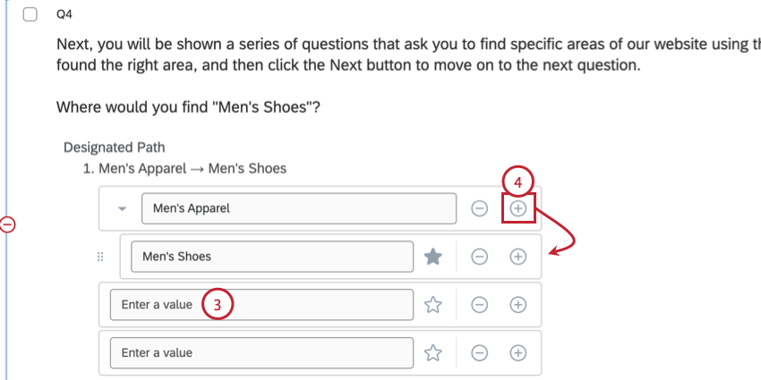](https://www.qualtrics.com/m/assets/support/wp-content/uploads//2024/01/tree-testing-3-4.png)
4.  You can add child nodes nested under your top-level nodes by clicking the plus sign ( **+** ) to the right of a node.
    
    **Qtip:** If needed, you can add additional layers of nesting by clicking the plus sign to the right of a nested node.
    
5.  To remove a node, click the minus sign ( **–** ) to the right of it.  
    [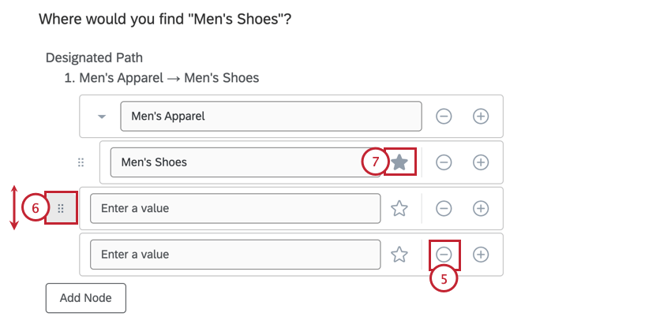](https://www.qualtrics.com/m/assets/support/wp-content/uploads//2024/01/tree-testing-5-7.png)
    
    **Attention:** If you delete a node with nested nodes, all nested nodes will also be deleted.
    
6.  You can rearrange nodes by clicking the icon to the left of it and then dragging your mouse to where you want to move it.
7.  To designate the correct path, click the star icon to the right of the path. You can designate multiple correct paths if needed.
    
    **Qtip:** You can only select nodes that do not have any child nodes.
    

**Attention:** The following features are not compatible with tree testing questions:

-   [**Carry forward choices**](https://www.qualtrics.com/support/survey-platform/survey-module/question-options/carry-forward-choices/): If you would like to use the same set of nodes for multiple questions, [copy](https://www.qualtrics.com/support/survey-platform/survey-module/editing-questions/creating-questions/?parent=p0030#CopyingQuestions) the question and then [edit](https://www.qualtrics.com/support/survey-platform/survey-module/editing-questions/formatting-questions/?parent=p0030) the copied question.
-   **Node translations**: You cannot translate tree testing nodes like other survey question answer choices. To support translations, make a [copy](https://www.qualtrics.com/support/survey-platform/survey-module/editing-questions/creating-questions/?parent=p0030#CopyingQuestions) of the question for each language and then use [display logic](https://www.qualtrics.com/support/survey-platform/survey-module/question-options/display-logic/?parent=p0073) or [branch logic](https://www.qualtrics.com/support/survey-platform/survey-module/survey-flow/standard-elements/branch-logic/) to [show the correct version](https://www.qualtrics.com/support/survey-platform/survey-module/survey-tools/translate-survey/#CustomContentforEachLanguage) of the question to respondents [based on their language](https://www.qualtrics.com/support/survey-platform/survey-module/survey-tools/translate-survey/#SpecifyingTheParticipantLanguage).

### Additional Customization Options

The following customization options are available for a tree testing question:[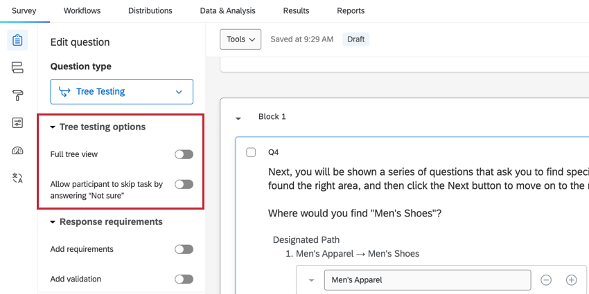](https://www.qualtrics.com/m/assets/support/wp-content/uploads//2024/01/tree-testing-options.png)

-   **Full tree view**: When enabled, the entire tree will be visible to survey respondents. When disabled, the respondent will only see the area of the tree they select. Choose the format that best matches how menus are shown on your website.
    
    **Example:** The images below show how this option affects the survey taking experience.[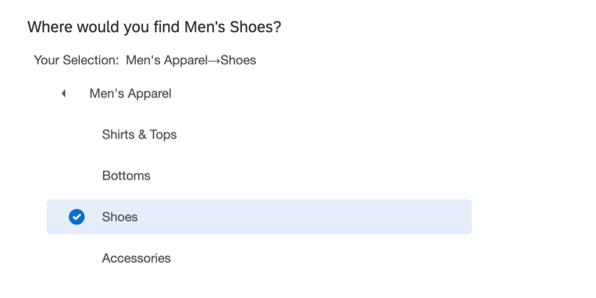](https://www.qualtrics.com/m/assets/support/wp-content/uploads//2024/01/tree-testing-no-full.png)  
    In the first image, this option is disabled, so only the current level and its nested nodes are displayed.  
    [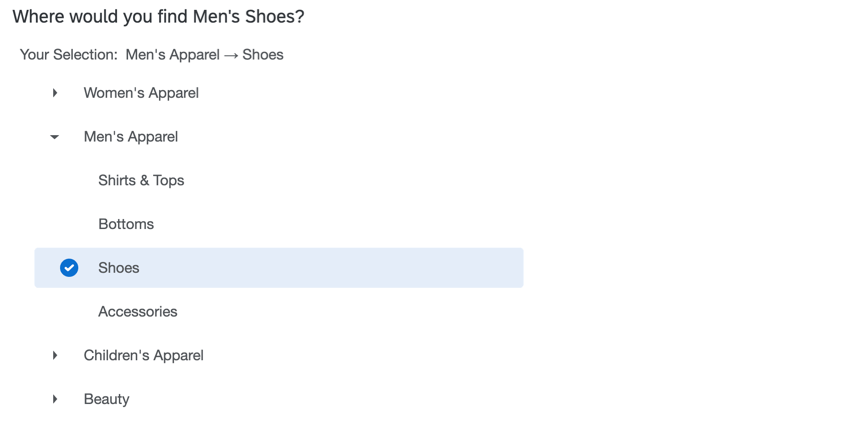](https://www.qualtrics.com/m/assets/support/wp-content/uploads//2024/01/tree-testing-full.png)  
    In the second image, this option is enabled, so all levels are displayed even when they are not selected.
    
-   **Allow participant to skip task by answering “Not sure”**: When enabled, this option adds a “Not sure” option to the question for respondents to select if they can’t find the right answer.  
    [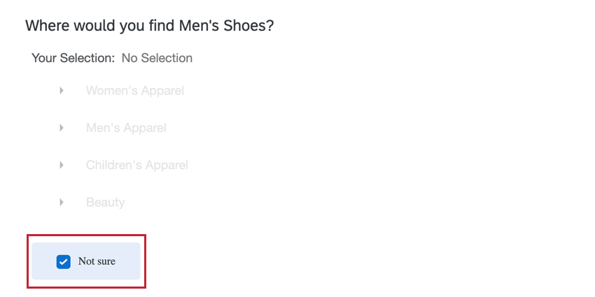](https://www.qualtrics.com/m/assets/support/wp-content/uploads//2024/01/tree-testing-not-sure.png)
    
    **Qtip:** You can use this option with the [force response](https://www.qualtrics.com/support/survey-platform/survey-module/editing-questions/validation/?parent=p0030#ForceResponse) option to require that users either select a node or the “not sure” option before continuing the survey.
    

### Calculating Time Spent Responding

You can calculate the respondent’s time spent answering this question by adding a [timing question](https://www.qualtrics.com/support/survey-platform/survey-module/editing-questions/question-types-guide/advanced/timing/) to the same page as each individual tree testing question. See [Timing a Question](https://www.qualtrics.com/support/survey-platform/survey-module/editing-questions/question-types-guide/advanced/timing/#TimingSetsofQuestions) for step-by-step instructions.

* * *

Was this helpful?

YesNo

* * *

## Data Analysis

Once your responses have been collected, Qualtrics offers various methods to create reports both in and out of the platform. This section covers how to view your collected data and display the results using Qualtrics dashboards.

### Data & Analysis

You can view the raw data for your survey by navigating to the [Data & Analysis tab](https://www.qualtrics.com/support/survey-platform/data-and-analysis-module/data-and-analysis-overview/). The following data fields are available for each response with a tree testing question.[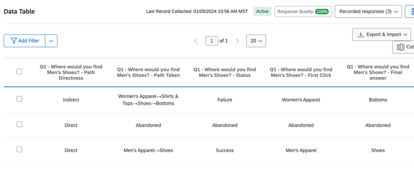](https://www.qualtrics.com/m/assets/support/wp-content/uploads//2024/01/tree-testing-dataset.png)

-   **Status**: Indicates if the respondent reached the correct option. Possible values include:
    -   **Success**: The final option selected matches the correct option provided by the researcher, regardless of the path taken to get there.
    -   **Failure**: The final option selected does not match the correct option provided by the researcher
    -   **Abandoned**: The survey respondent selected the “Not sure” option. This value will also display for the “Path Taken,” “First Click,” and “Final answer” fields.
    -   **Blank**: If you have no data for this field, then the survey taker skipped the question without answering it, or the question was not displayed to the respondent.
-   **Path Directness:** Indicates if the respondent navigated directly to their final choice or not. Possible values include:
    -   **Direct**: ​​The survey taker took a direct path (no back-tracking) to their final choice (even if it was wrong). For example: Node 2 > Node 2b > Node 2b1.
    -   **Indirect**: The survey taker back-tracked or took multiple paths before selecting an option. For example: Node 2 > Node 2b > Node 2b1 >Node 2c > Node 2c3.
-   **Path Taken**: The actual path that respondent took (e.g., Men’s > Shirts > Men’s > Bottoms > Shorts).
-   **First Click:** Indicate the first top-level node the respondent clicked. This will always be the first node listed in the “Path Taken” data field.
-   **Final answer**: The final node the respondent selected. This will be the last child node listed in the “Path Taken” data field.
    
    **Qtip:** If a child node was never selected, then this field will be blank.
    

### CX Dashboards

**Qtip:** If you use the [Tree Testing guided solution](https://www.qualtrics.com/support/common-use-case/xm-solutions/guided-solutions/#StrategicUX), then your dashboard will be automatically built for you.

To analyze tree testing data in a [CX](https://www.qualtrics.com/support/vocalize/getting-started-vocalize/vocalize-introduction/) dashboard, all associated data fields need to be [changed](https://www.qualtrics.com/support/vocalize/dashboard-settings-cx/dashboard-data/data-compatibility/#AssigningFieldTypes) to “text set” fields. Once your fields are remapped, you can display your data in different dashboard widgets.

If you want to combine different tree testing questions into the same widget, create a [measure group](https://www.qualtrics.com/support/vocalize/dashboard-settings-cx/dashboard-data/advanced-fields/field-groups/#MeasureGroups) for each metric.[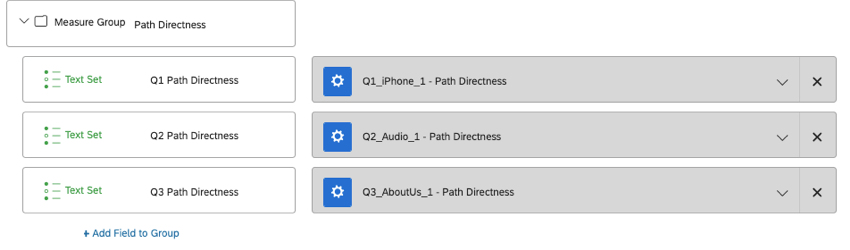](https://www.qualtrics.com/m/assets/support/wp-content/uploads//2024/01/tree-testing-measure-group.png)

### Results Dashboards

You can also view tree testing data in a [results dashboard](https://www.qualtrics.com/support/survey-platform/reports-module/results-dashboards/results-dashboard-overview/), but you will first need to remap your tree testing fields by creating [custom fields](https://www.qualtrics.com/support/survey-platform/data-and-analysis-module/data/add-new-fields/manual-variables/#FieldTypes) in the Data & Analysis tab. When mapping a field, create a new [manual field](https://www.qualtrics.com/support/survey-platform/data-and-analysis-module/data/add-new-fields/manual-variables/#CreatingANewCustomField), and then choose “text set” for your [field type](https://www.qualtrics.com/support/survey-platform/data-and-analysis-module/data/add-new-fields/manual-variables/#FieldTypes).  
[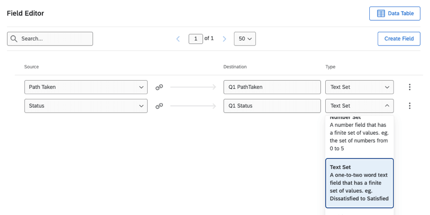](https://www.qualtrics.com/m/assets/support/wp-content/uploads//2024/01/tree-testing-data-recode.png)

### Widget Examples

After remapping your fields, you can analyze your data in a CX or results dashboard.

Below are a few widget ideas to get you started:

-   Use a [table widget](https://www.qualtrics.com/support/vocalize/widgets/table-widgets/table-widget/) to display the overall percentage of respondents who reached the correct destination for each path. This widget can only be created in CX dashboards since it uses measure groups.  
    [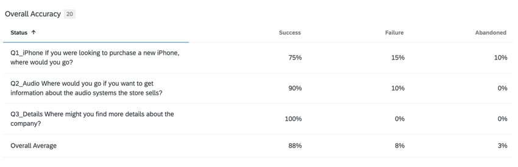](https://www.qualtrics.com/m/assets/support/wp-content/uploads//2024/01/overall-accuracy.png)
-   Use a [table widget](https://www.qualtrics.com/support/vocalize/widgets/table-widgets/table-widget/) to display the percentage of respondents who reached each path directly and indirectly. This widget can only be created in CX dashboards since it uses measure groups.  
    [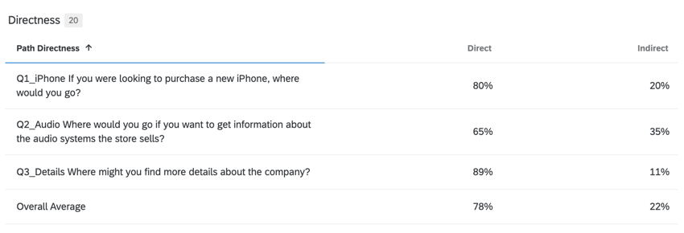](https://www.qualtrics.com/m/assets/support/wp-content/uploads//2024/01/path-directness.png)
-   Use a [bar chart widget](https://www.qualtrics.com/support/vocalize/widgets/chart-widgets/line-and-bar-chart-widgets/) to display distribution of first clicks for a given path. This widget can be created in both CX dashboards and results dashboards.  
    [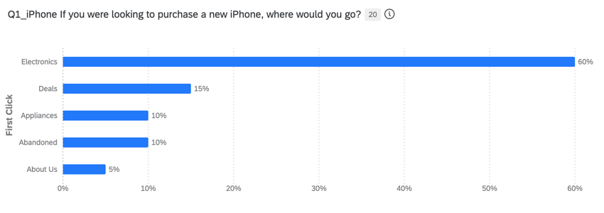](https://www.qualtrics.com/m/assets/support/wp-content/uploads//2024/01/first-click-graph.png)
-   Use a [bar chart widget](https://www.qualtrics.com/support/vocalize/widgets/chart-widgets/line-and-bar-chart-widgets/) to display the percentage of respondents who took each possible path. This widget can be created in both CX dashboards and results dashboards.  
    [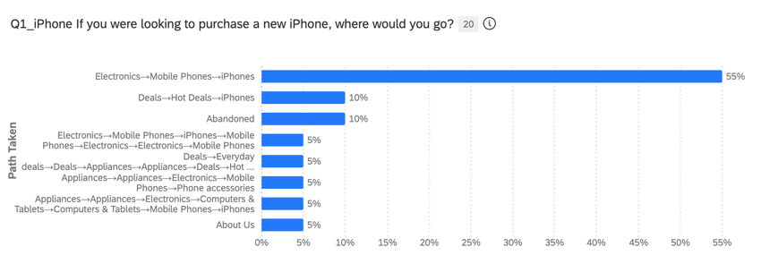](https://www.qualtrics.com/m/assets/support/wp-content/uploads//2024/01/path-percentages.png)

* * *

Was this helpful?

YesNo

* * *