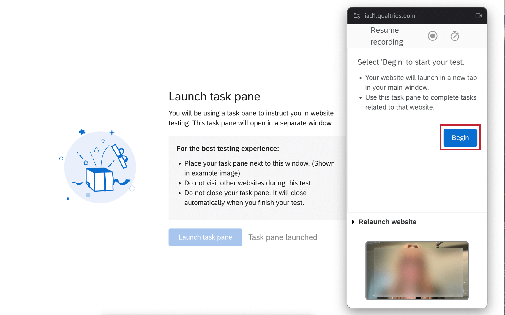
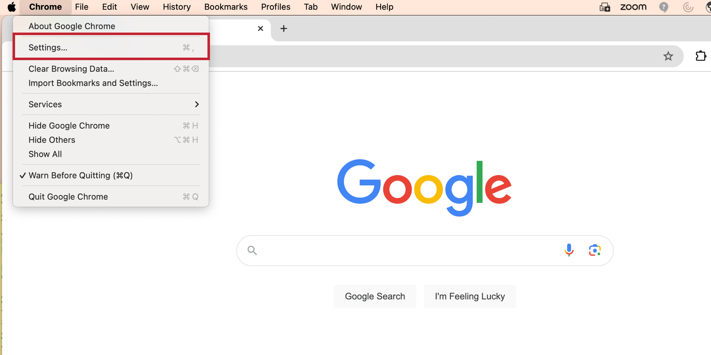
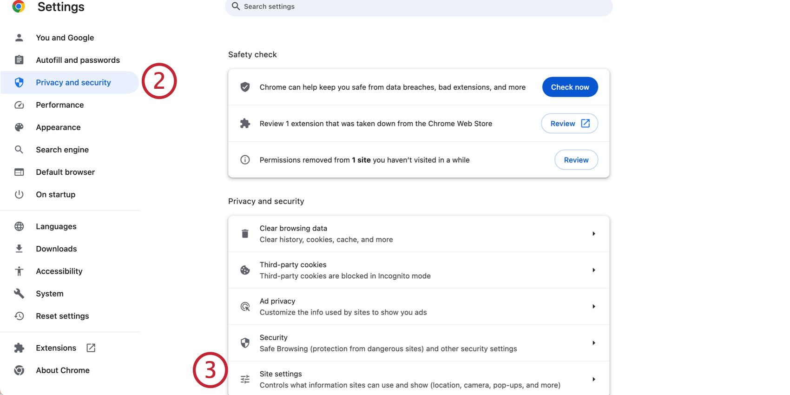

# Unmoderated User Testing Question

## About Unmoderated User Testing Questions

The unmoderated user testing question type allows survey participants to record and upload a video or audio recording that answers questions about the prototype or live website that they are presented with.

**Attention**: The unmoderated user testing question is only available for surveys using the [New Survey Taking Experience](https://www.qualtrics.com/support/survey-platform/survey-module/look-feel/simple-layout/).

**Qtip**: The unmoderated user testing question is not compatible with [mobile devices](https://qualtrics.com/support/survey-platform/survey-module/mobile-survey-optimization/).

**Qtip**: The unmoderated user testing question is only available to UX customers. If you’re interested in getting access to this feature, please reach out to your [Account Executive](https://www.qualtrics.com/support/survey-platform/getting-started/help-and-feedback/#AEsandCSMs) or [Account Services](https://www.qualtrics.com/support/getting-started-qualtrics/support-portal/product-technical-support/#AccountServices).

* * *

Was this helpful?

YesNo

* * *

## Enabling the Unmoderated User Testing Question

Before you can use this question type, you need to have the right user permissions. A [Brand Administrator](https://www.qualtrics.com/support/survey-platform/getting-started/help-and-feedback/#QualtricsAdministrator) can give you the permissions you need. Remember that you must have a UX license before you can use this feature.

-   You need the [**Unmoderated User Testing** permission](https://www.qualtrics.com/support/survey-platform/sp-administration/managing-users/user-permissions/#Extensions) to create this type of question.
-   You need the [**Access Data & Analysis: Audio & Video** permission](https://www.qualtrics.com/support/survey-platform/sp-administration/managing-users/user-permissions/#GeneralPermissions) in order to [view and edit responses to the question.](https://www.qualtrics.com/support/survey-platform/survey-module/editing-questions/question-types-guide/specialty-questions/unmoderated-user-testing-question/#DataAnalysis)

* * *

Was this helpful?

YesNo

* * *

## Setting Up an Unmoderated User Testing Question

**Attention**: The [Allow respondents to finish later](https://www.qualtrics.com/support/survey-platform/survey-module/survey-options/survey-experience/#AllowingRespondentsToSaveProgress) setting **must** be enabled from the [Responses](https://www.qualtrics.com/support/survey-platform/survey-module/survey-options/survey-experience/#AllowingRespondentsToSaveProgress) section of the survey options before collecting data.

1.  Add a new question.  
    
    
    **Qtip**: [Add page breaks](https://www.qualtrics.com/support/survey-platform/survey-module/editing-questions/add-page-break/) before and after the unmoderated user testing question.
    
2.  Select Unmoderated User Testing from the drop-down.
3.  Select the **Source**.
    
    -   Prototype.
        
        **Qtip**: Prototypes can be from Figma, AdobeXD, or InVision.
        
    -   Website.
        
        **Attention**: When the source is a website, respondents must use the Google Chrome or Microsoft Edge browser.
        
    -   Youtube video.
    -   Google Drive link.
    -   PDF.
    -   Qualtrics.
4.  Insert the link for your prototype into the **Link** box. Links must be complete and begin with “https://”.
    
    **Qtip**: Make sure to hide the Figma UI by adding the query string “&hide-ui=1” to the end of your Figma link. This will make it so that the respondent cannot access the Figma link when taking the survey.
    
5.  Add the tasks that you would like the participant to complete during the testing question.
    
    **Attention**: While there is no limit for the number of tasks, the session is limited to 20 minutes. Be sure that the number of tasks can be reasonably completed within that time.
    
    **Qtip**: It may be a good idea to add an informative task at the end. For example, one that tells participants to wait until their video uploads and then return to the survey.
    
    **Qtip:** To delete a task, click the ( **–** ) button to the right of the task.
    
6.  Optionally, click **Reorder tasks** to change the order of your tasks.
7.  Edit your tasks, if you’d like.
    -   Click the ( **–** ) button next to your task to delete it.
    -   Click the three–dot menu to edit your task using the [rich content editor](https://www.qualtrics.com/support/survey-platform/survey-module/editing-questions/rich-content-editor/rich-content-editor-overview/).
        
        **Qtip**: Some components in the rich text editor are not compatible with [survey translations](https://www.qualtrics.com/support/survey-platform/survey-module/survey-tools/translate-survey/) in some languages.
        
8.  To require respondents to use the front facing camera to record their answer, enable **Require front facing camera**. This feature is disabled by default.
9.  Select a randomization option, if you’d like.
    -   **Randomize all but first**: Randomize all tasks except for the first one.
    -   **Randomize all**: Randomize all tasks.
    -   **Randomize subset**: Randomize some of the tasks. If you select this option, you will also select which tasks you would like to randomize from the drop-down below.
10.  Navigate to [Survey options](https://www.qualtrics.com/support/survey-platform/survey-module/survey-options/survey-experience/).  
    
11.  Enter the **Responses** section.
12.  Turn on **Allow respondents to finish later**.

We recommend making the Unmoderated User Testing question type required to ensure that respondents complete that portion of the study. Customize other [response requirements](https://www.qualtrics.com/support/survey-platform/survey-module/editing-questions/validation/) and [question behavior](https://www.qualtrics.com/support/survey-platform/survey-module/question-options/question-options-overview/), if you’d like.

**Qtip:** Figma does not allow passwords for embedded content. If you’d like to password-protect your prototype, [remove the password from Figma](https://help.figma.com/hc/en-us/articles/5726720100247-Add-password-protection-to-files-and-prototypes#01H8JAFJS218JTP979N9KK9G4X) and [add a password to the survey](https://www.qualtrics.com/support/survey-platform/survey-module/survey-options/survey-protection/#SettingASurveyPassword) instead.

**Qtip:** You cannot change the text of the “Go to study” button that appears in the unmoderated user testing question.

* * *

Was this helpful?

YesNo

* * *

## Respondent Experience

When you get to the unmoderated user testing question, you will see a question prompt along with a **Go to study button**. Click this button to get started.

Review the instructions and confirm that you are willing to share your screen. When you’re ready, click **Share screen**. Your browser will ask you for permission as well.

**Attention**: Your browser may ask you for permission to access your microphone and camera. Click **Allow** to give Qualtrics permission to these features. If you do not allow access to your microphone and/or camera, you may receive a “NotAllowedError” that will prevent you from recording a video or audio response.  

Check that your microphone is working correctly before clicking **Continue**. If the front facing camera is required, you will also be prompted to check your video. To change the default microphone / camera, use the drop-down.

When you’ve completed your tasks, you will be prompted to click **Finish**. Once your recording has been saved, you will return to the survey. Click **Next page** to continue.

**Qtip**: You can record up to 20 minutes of footage.

The respondent experience is slightly different depending on the prototype being studied. For information on specific prototypes, see the subsections below.

### Respondent Experience for Prototypes

Tasks will be displayed on the right underneath **Study Tasks**. Follow the instructions for each task by engaging with the prototype. To hide the task pane, click the icon in the upper-right corner.

Click the pause button to pause the recording. To view the timer, click the stopwatch icon.

### Respondent Experience for Live Websites

Click **Launch task pane** to begin the unmoderated user testing.

The task pane will appear as a pop-up window in the survey. This window will stay on top of the live website window until the session is completed. Click **Begin** to start the unmoderated user testing tasks.

Click the pause button to pause the recording. To view the timer, click the stopwatch icon.

* * *

Was this helpful?

YesNo

* * *

## Data & Analysis

Your responses from the unmoderated user testing question will be in the [Audio & Video Editor](https://www.qualtrics.com/support/survey-platform/data-and-analysis-module/viewing-clipping-video-responses/) in the Data & Analysis tab. From here you can view transcripts, make clips from audio and video responses, build highlight reels, and leverage AI-driven insights to identify themes in your video responses. For more information, see [Audio & Video Editor](https://www.qualtrics.com/support/survey-platform/data-and-analysis-module/viewing-clipping-video-responses/).

* * *

Was this helpful?

YesNo

* * *

## Troubleshooting

If you receive the NotAllowedError, your browser or computer settings are preventing Qualtrics from accessing your camera or microphone. Enable your browser or computer permissions before using the unmoderated user question.

**Qtip**: Your browser or operating system may differ from what is shown. For more support, seek out other resources on how to enable these settings.

### Google Chrome Settings

1.  Go to the Chrome settings.  
    
2.  Go to the **Privacy and security** settings.  
    
3.  Click **Site settings**.
4.  Enable site permissions for Camera, Microphone, and Pop-Ups.  
    

### Mac OS Settings

1.  Go to system settings.
2.  Go to the Privacy & Security settings.  
    
3.  Enable permissions for Camera, Microphone, and Screen recording.

* * *

Was this helpful?

YesNo

* * *

## FAQs

[What kind of project can I use this type of question in?](#faq-975) ×

For a full list of questions and their project compatibilities, see [this table.](https://www.qualtrics.com/support/survey-platform/survey-module/editing-questions/question-types-guide/question-types-overview/#Compatibility)