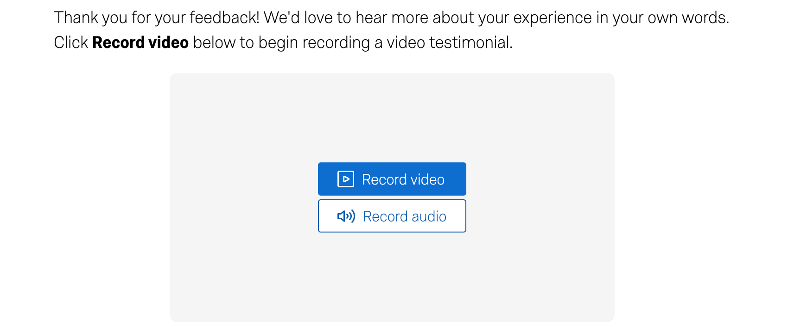
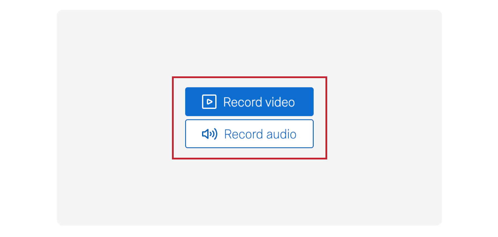

# Video Response Question

## About Video Response Questions

**Attention:** Video interactions count differently towards your total license interactions. You can use the [Interaction Usage report](https://www.qualtrics.com/support/survey-platform/sp-administration/summary-report/#Interaction) to monitor usage across your license. Contact your [Technical Success Manager](https://www.qualtrics.com/support/survey-platform/getting-started/help-and-feedback/#AEsandCSMs) with questions about usage and your license’s limit.

The video response question allows survey takers to record and upload a video or audio recording from their device. Once you’ve collected video responses, you can [analyze your videos for topic and sentiment insights](https://www.qualtrics.com/support/survey-platform/data-and-analysis-module/viewing-clipping-video-responses/), assemble videos into [slideshow reels](https://www.qualtrics.com/support/survey-platform/data-and-analysis-module/viewing-clipping-video-responses/#Reels), and [display videos and associated data in dashboards](https://www.qualtrics.com/support/vocalize/widgets/static-widgets/video-slideshow-widget/).

**Qtip:** To use the video response question successfully, your respondents must take your survey on a device that can record video.

* * *

* * *

## Enabling the Video Response Question

Before you can use this question type, you need to have the right user permissions. A [Brand Administrator](https://www.qualtrics.com/support/survey-platform/getting-started/help-and-feedback/#QualtricsAdministrator) can give you the permissions you need.

-   You need the [**Video Response** permission](https://www.qualtrics.com/support/survey-platform/sp-administration/managing-users/user-permissions/#GeneralPermissions) to create this type of question.
-   You need the [**Access Data & Analysis: Audio & Video** permission](https://www.qualtrics.com/support/survey-platform/sp-administration/managing-users/user-permissions/#GeneralPermissions) in order to [view and edit responses to the question](https://www.qualtrics.com/support/survey-platform/data-and-analysis-module/viewing-clipping-video-responses/).

* * *

* * *

## Recording Audio Only

By default, your respondents can record video responses to your question. If you’d like to give respondents the option to record audio-only responses, you can enable **Option to record audio only**.

* * *

* * *

## Recording Time Limits

By default, your respondents can record a video that is up to 3 minutes long. If you’d like to force respondents to stick to a certain video length, you can enable the **Recording time limit** option. Then, specify the minimum and maximum video lengths in seconds.

-   **Minimum length**: You can enter 0 if you do not want to force a minimum length. When taking your survey, respondents will not be able to stop recording their video until the minimum length is met.
-   **Maximum length**: The largest value you can enter is 600 seconds. When taking your survey, the video will automatically stop recording once the maximum length is met.

**Qtip:** If using recording time limits, we recommend you let your survey respondents know in the [question text](https://www.qualtrics.com/support/survey-platform/survey-module/editing-questions/formatting-questions/#EditingQuestionText) so they can tailor their response when recording their video.

* * *

* * *

## Respondent Experience

This section covers the experience of creating a video or audio recording as a survey respondent.

When you come to the video question, you will see a question prompt along with a blue **Record video** button. Click this button to get started.

Some questions may also have the option to only record audio. Click **Record audio** to get started.

Your browser may ask you for permission to access your microphone and camera. Click **Allow** to give Qualtrics permission to access these features.

**Qtip:** If you do not allow Qualtrics to access your microphone and camera, then you will not be able to record a video or audio response.

Once you’ve given Qualtrics permission to access your microphone and camera, get ready to record your video or audio response. Click the white circle to get started.  

The circle will have a red square inside it while you are recording. You can record a video or audio recording up to 3 minutes in length. When you are done with your video, click the button again to stop recording. You can also click **Cancel recording** to stop recording.  

**Qtip:** If the survey builder added a minimum time limit, you will not be able to click the recording button until the limit is reached. If the survey builder has added a maximum time limit, then the recording will automatically stop recording once the limit is reached.

After you’ve recorded your video or audio response, you can review it to make sure it’s exactly to your liking. Click the **Play** button to play your recording, and click the bar along the bottom to jump to different points in the recording. If you’d like to redo your video or audio recording, click **Delete recording** and a new recording will start immediately. Note that your original recording will be lost.

* * *

* * *

## Keyboard Shortcuts

The video response question is compatible with keyboard shortcuts that help navigate the question efficiently.

-   **toggle play/pause**: space
-   **scrub forward 5s**: right or up arrows
-   **scrub backward 5s**: left or down arrows
-   **scrub forward 15s**: page up
-   **scrub backward 15s**: page down
-   **scrub to start of video**: home
-   **scrub to end of video**: end

* * *

* * *

## FAQs

[What kind of project can I use this type of question in?](#faq-975) ×

For a full list of questions and their project compatibilities, see [this table.](https://www.qualtrics.com/support/survey-platform/survey-module/editing-questions/question-types-guide/question-types-overview/#Compatibility)

[How do I add imported video and audio data to my dashboard?](#faq-1082) ×

[Imported video and audio projects'](https://www.qualtrics.com/support/survey-platform/my-projects/imported-video-and-audio-projects/) data can only be added to a [data model](https://www.qualtrics.com/support/vocalize/mapping-cx-dashboard-data/data-modeler-cx/creating-a-data-model-cx/). They **are not compatible** with [data mappers.](https://www.qualtrics.com/support/vocalize/dashboard-settings-cx/dashboard-data/dashboard-data-overview/)  
  
On the other hand, [survey projects](https://www.qualtrics.com/support/survey-platform/getting-started/survey-platform-overview/) with [video questions](https://www.qualtrics.com/support/survey-platform/survey-module/editing-questions/question-types-guide/specialty-questions/video-response-question/) can be mapped to both data models and data mappers.